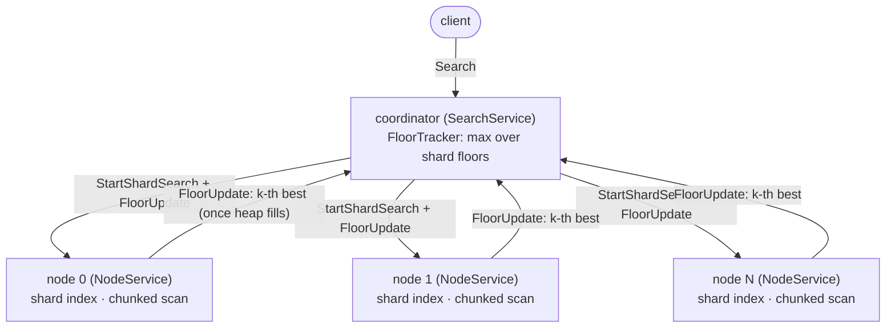
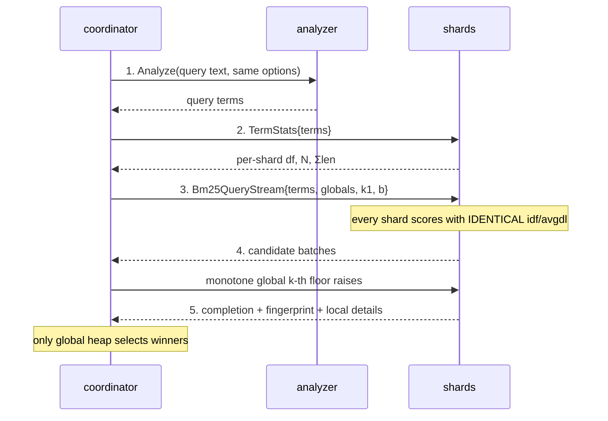

# pipestream-search

Provider-neutral distributed lexical, vector, and hybrid search. The product
owns BM25, CEL selection, document semantics, fusion, generations, and public
quality claims. Vector engines plug in behind one descriptor/configuration
contract. The shipped `embedded-turbovec` adapter provides exhaustive
TurboQuant scoring and collaborative live-floor streaming.

New here? The user manual is [docs/manual/README.md](docs/manual/README.md).

## Repository map

| Repository | Role | Depends on |
|---|---|---|
| [RyanCodrai/turbovec](https://github.com/RyanCodrai/turbovec) | Upstream vector index library: 4-bit TurboQuant encoding, SIMD top-k search | — |
| [ai-pipestream/turbovec](https://github.com/ai-pipestream/turbovec), branch `turbovec-pipestream-s20` | Patch fork carrying the seedable top-k floor, live-floor streaming collector, and mapped-image reader. Rebased onto upstream `main`; explicit TQ+ calibration is now upstream | upstream `main` |
| [ai-pipestream/turbovec-grpc](https://github.com/ai-pipestream/turbovec-grpc) | Network and sharding facade for the local turbovec engine | fork branch `turbovec-pipestream-s20` |
| [Pipestream Search](https://github.com/ai-pipestream/protomolt-search) (this repository) | Full search product: distributed vector, BM25, CEL selection, hybrid ranking, document semantics, persistence, and operations | fork branch `turbovec-pipestream-s20` |
| [ai-pipestream/grpc-opennlp-analysis](https://github.com/ai-pipestream/grpc-opennlp-analysis) | Text-analysis sidecar: sentence/token spans, term vectors, static embeddings, served over gRPC | — |

The in-repository [`protomolt-analyzer`](crates/protomolt-analyzer) crate is
the portable Rust lexical core. It runs the product's whitespace, Porter,
normalization, and term-vector contract in-process on servers and native
clients. OpenNLP remains the provider for embeddings, sentence and model
analysis, and analyzer options outside that native subset. See
[Native lexical analysis](docs/native-analysis.md) for the exact boundary and
Android/iOS build checks.

The [`protomolt-search-embedded`](crates/protomolt-search-embedded) package
runs the same public `SearchService` contract over private local shards through
an in-process coordinator. It binds and dials no sockets, forces the native
analyzer, and supports create/open, protobuf-mapped ingest, vector ingest,
delete/replace, `Query`, `QueryStream`, health, and flush on Android, iOS, and
desktop. Its coordinator reaches shards through an in-process link
(`src/link.rs`), the same handlers the network serves, so the crate links
no HTTP/2, hyper, or Tokio networking — a `cargo tree` gate in its tests
keeps it that way. See
[Embedded and mobile Protomolt Search](docs/embedded-mobile.md).
The proposed [device-shard contract](docs/device-shards.md) describes shared
searches with indexes retained on iOS and Android phones and the remaining
transport, embedding, and availability work.

The current embedded adapter pins the fork branch recorded in `Cargo.toml` and
uses TurboVec's current `.tv` persistence format. Provider images are opaque to
the product and are selected by manifest/config identity, never by extension.
See [the Pipestream Search migration note](docs/pipestream-search-migration.md)
for renamed surfaces, compatibility aliases, and rebuild impact.

Engine internals and measured numbers: [docs/optimizations.md](docs/optimizations.md).
The implemented public query contract is [docs/query-api.md](docs/query-api.md):
selection first, candidate-scoped boosts second, then a named-signal composite
scorer, with multi-key sort and collapse over the result. Query-time synonyms
and did-you-mean are [docs/synonyms.md](docs/synonyms.md); the per-hit
explain tree is [docs/explain.md](docs/explain.md). [`SearchService.QueryStream`](docs/streaming-query.md) adds exact
provisional replacement revisions and an explicit terminal certificate.
`DENSE_EXECUTION_MODE_AUTO` chooses a dense traversal only through the
generation-bound policy in
[docs/dense-execution-policy.md](docs/dense-execution-policy.md): exhaustive
providers resolve to `EXACT`, a configured ANN provider only at a measured
point, and the response reports which.
A cased A/B column costs no second analysis:
[docs/dual-cased.md](docs/dual-cased.md) — `AddDocumentsRequest.cased_field`
takes the body's cased identity from the same pass, sidecar or native.
Sealed segments serve their vector images from disk through memory maps,
bit for bit the heap scores, and the coordinator refuses a fleet that scores
in two provider states before any shard is asked:
[docs/mmap-vectors.md](docs/mmap-vectors.md).
Block-max pruning, designed for the lexical leg and measured dead on the
vector leg: [README-block-max.md](README-block-max.md) (overview) and
[docs/block-max.md](docs/block-max.md) (design doc).
The reproducible cross-engine gate is
[deploy/opensearch-challenge](deploy/opensearch-challenge/README.md); it records
quality, latency, throughput, resources, startup, and crash recovery without
turning a synthetic run into a marketing claim.

The network binary retains three roles (`node`, `coordinator`, `both`). Plain
node lists are static; versioned shard maps hot-swap atomically. The embedded
package uses the same node and coordinator implementations without a network
listener.

## Quickstart: dockerized end-to-end demo (CourtListener)

A one-command installer that syncs real data and exercises the whole stack:
CourtListener bulk opinions (public S3) → [rustfs](https://rustfs.com)
object store → Rust extraction → chunk + static-embedding via the
[grpc-opennlp-analysis](https://github.com/ai-pipestream/grpc-opennlp-analysis)
sidecar (GraalVM native, Model2Vec table) → a 4-shard pipestream-search
cluster → an automated search-verification gate. No Python anywhere.

```bash
cd deploy/court-e2e
cp .env.example .env            # defaults work out of the box
./e2e.sh                        # or ./e2e.sh --clean to wipe and reseed
```

`e2e.sh` exits 0 only after indexing ~50k opinions (~500k chunks) across
4 shards and passing both gates: a vector self-match through the
coordinator and a distributed BM25 query. On success the cluster stays
up — coordinator on `localhost:50050`, rustfs console on
`localhost:19001`. Details, scale knobs, and architecture:
[deploy/court-e2e/README.md](deploy/court-e2e/README.md).

Query it with any gRPC client generated from
[search.proto](proto/ai/protomolt/search/v1/search.proto) — `Query` or
`QueryStream` for the public contract, plus `Search` (vector top-k with floor
sharing), `Bm25Search` (distributed lexical), and `HybridSearch` (cascade,
RRF, or score-blend fusion) — or with the
bundled probe tool:

```bash
docker run --rm --network court-e2e_default -v court-e2e_corpus-data:/corpus \
  --entrypoint court_query court-e2e-pipeline \
  --nodes=node1:50051,node2:50051,node3:50051,node4:50051 \
  --analysis-addr=http://analysis:50051 --embeddings=/corpus/embeddings.bin \
  --probe-ids=12345 --docs-per-shard=128500
```

## Design



Floor flow for one query:

1. The coordinator opens a bidi `SearchShard` stream to every node and
   sends `StartShardSearch { query, k, request_id }`.
2. Each node scans its shard **in chunks** of `chunk_blocks` SIMD blocks
   (default 64 blocks = 2048 vectors). Each chunk is a
   `search_with_options` call restricted to that chunk's slot range by an
   allowlist mask, seeded with the best floor known at that moment
   (`initial_threshold`).
3. Once a node's running top-k heap is full, it publishes its k-th best
   after each chunk (`FloorUpdate` node → coordinator). The coordinator
   tracks the max over all shards and broadcasts every raise to all nodes
   (`FloorUpdate` coordinator → node). Nodes apply the raised floor to the
   next chunk.
4. Each node ends its stream with `SearchShardDone { hits, stats }` — its
   local top-k plus scan counters. The coordinator merges the shard lists
   (score descending; ties by stable vector id) and answers the
   client.

Chunking exists because turbovec's scan is a single synchronous call with a
call-time-fixed floor; scanning in masked chunks gives the floor flow
intra-query reactivity without patching the kernel. The union of the masked
chunk ranges is exactly the whole shard, so chunking alone changes nothing
about results.

## The lossless invariant, and why it holds

**Claim.** Pruning candidates that score below the max published floor can
never drop a true global top-k hit.

**Why.** A floor published by a shard is that shard's current k-th best,
emitted only once the shard holds k candidates. The k-th best of any subset
of the corpus is a lower bound on the k-th best of the whole corpus: the
global top-k picks the best k of the union, so its k-th entry scores at
least as high as the k-th entry of any shard's top-k. Therefore every
published floor ≤ the true global k-th best, and so is the max over
published floors. Any candidate scoring strictly below that max also scores
below the global k-th best — at least k other candidates beat it — so it
cannot belong to the global top-k. Candidates scoring exactly at the floor
are kept (turbovec's threshold is inclusive and the k-th-best seeding keeps
boundary ties), so tie scenarios are safe too.

The same argument covers the node's *local* floor (its own heap's k-th
best): it is a lower bound on the shard's final k-th best, hence on the
global one.

Empirically: `tests/lossless.rs` builds a 20k-vector corpus (dim 128,
4-bit), fits calibration on a sample, builds 3 shard indexes plus one
monolithic index with the same seeded calibration, and asserts the
coordinator's top-10 equals the monolithic top-10 **exactly** — same ids,
bitwise-same scores, same order — for several queries, with floor sharing
on and off. `tests/node_loopback.rs` injects a floor mid-scan over real
gRPC and asserts identical results.

## Why scores are comparable across shards at all

Scores are mergeable across shards only when the provider says they share one
scoring identity. `NodeService.GetVectorBackend` reports the provider,
version, metric, quality contract, capabilities, and scoring fingerprint.
`ConfigureVectorBackend` accepts provider-owned opaque state before ingest.
For `embedded-turbovec`, that state contains the fitted TQ+ parameters, so a
given vector is encoded consistently across shard layouts. The product does
not interpret those bytes.

## Running

```bash
cargo build --release

# Single-process demo: both roles, random demo corpus (calibration fitted
# on a 20% sample and seeded), one self-issued search at the end.
./target/release/pipestream-search --role=both \
    --demo-vectors=20000 --dim=128 --bit-width=4 --allow-plaintext \
    --nodes=127.0.0.1:50051 --demo-query

# A real shard node over a persisted embedded-TurboVec image.
./target/release/pipestream-search --role=node \
    --vector-backend=embedded-turbovec --index=/data/shard-0.tv \
    --slot-offset=0 --node-listen=0.0.0.0:50051

# A coordinator over three nodes.
./target/release/pipestream-search --role=coordinator \
    --coord-listen=0.0.0.0:50050 \
    --nodes=node0:50051,node1:50051,node2:50051
```

### Clustered TurboVec backend

The product coordinator can treat a complete `turbovec-grpc` collection as
its vector backend. The recommended distributed shape embeds that crate's
coordinator library in the Pipestream Search process, so there is no localhost
gRPC hop before the real shard fan-out:

```toml
role = "coordinator"
nodes = ["search-node0:50051", "search-node1:50051"] # BM25, columns, documents

[clustered_turbovec]
nodes = [
  "vector-node0:51051 shard-id-0 12",
  "vector-node1:51051 shard-id-1 9",
]
state = "/var/lib/pipestream-search/turbovec-topology.json"
```

An independently managed coordinator remains available when its lifecycle or
authorization must be separate:

```toml
[clustered_turbovec]
coordinator = "http://turbovec-coordinator:50050"
```

Both transports execute the same `turbovec-grpc::CoordinatorService`
candidate-stream contract. Cluster shards must carry stable labels equal to
Pipestream Search document ids. The adapter carries product filters as packed
stable-label bitmap ranges, sends conflated inclusive floor raises, and
requires an exhaustive completion certificate from every shard. Small
candidate-scoped rescoring sets use explicit labels.
`ClusterHealth` reports the selected transport, reachability, servable state,
row count, and topology generation.

This increment serves exact vector `Search`, dense public selections, and
candidate-scoped dense boosts. Parent collapse and every hybrid mode also use
the provider stream while keeping lineage, product-shard ownership, fusion,
and public ordering in Pipestream Search. The vector collection is built and
mutated through `turbovec-grpc`; Pipestream Search does not duplicate those
writes.
See [the clustered backend design](docs/clustered-turbovec.md).

### Cluster configuration file

For real deployments the binary reads a TOML file (`--config cluster.toml`,
or `PIPESTREAM_SEARCH_CONFIG`). Precedence: **CLI flag > env var > config file >
default**. Every flag takes `--key=value` or `--key value`.

```toml
role = "both"                                  # node | coordinator | both
coord_listen = "0.0.0.0:50050"
nodes = ["host-a:50051", "host-b:50051"]      # fan-out order = tie-break order
chunk_blocks = 64                              # scan chunk size (SIMD blocks)
floor_sharing = true
bm25_stream = true                              # exact lexical candidates; false is the unary A/B route
floor_delta = 0.0                              # min raise before a floor publishes (0 = every raise)
vector_backend = "embedded-turbovec"            # default provider for shards
shard_deadline_ms = 0                          # per-shard query deadline (0 = none)
hedge_delay_ms = 0                             # hedge slow shards to their replica after this (0 = failover only; set above healthy p99)
max_message_mib = 64                           # gRPC message cap (both directions)

[[shards]]                                     # shards this process serves
listen = "0.0.0.0:50051"                       # one NodeService listener per shard
index = "/data/turbovec/shard-0.tv"
slot_offset = 0                                # global id base for this shard

[[shards]]
listen = "0.0.0.0:50052"
index = "/data/turbovec/shard-1.tv"
slot_offset = 20000
```

The plain coordinator `nodes` list and each node's `[[shards]]` set are static.
A `shard_map` is generation-stamped and hot-reloaded atomically; requests pin
one immutable generation, and routed ingest requires the expected generation.
Single-shard shorthand
(`--index`, `--demo-vectors`, `--node-listen`, `--slot-offset`) overrides
the file's `[[shards]]` entirely.

### Operability

- **Pooled connections.** The coordinator keeps one lazily-established
  HTTP/2 channel per node address; every concurrent query multiplexes
  over it, and it reconnects on its own after a node restart.
- **Health.** `NodeService.Health` reports one shard's shape (vector
  count, dim, bit width, BM25 docs, ingest/build activity);
  `SearchService.ClusterHealth` fans it out to every primary and replica
  and reports per-target reachability without failing on down nodes.
- **Replicas, failover, and hedging.** A shard-map entry may name a
  `replica` serving the same data. On a primary error the coordinator
  fails over to it; with `hedge_delay_ms` set, a shard still running
  when the delay expires gets a second identical search on its replica
  and the first success wins. Search is exact, so either copy returns
  identical results. Hedging is stall insurance, not a latency
  optimization: set the delay ABOVE the healthy p99, or the timer fires
  on ordinary bottleneck shards and the duplicate scan compounds the
  saturation it was meant to escape. Measured both ways in Round 5 of
  TEST_RESULTS.md — a 26–37% p99 improvement against a stalled node, a
  25–40% throughput loss when hedging a healthy bandwidth-bound fleet.
- **Replica catch-up.** With a shard map containing replicas,
  `replica_sync_ms` defaults to 1000 and tails each primary's fully clocked WAL
  into its replica. Cursors persist beside the map by default. A WAL generation
  rotation requires installing the new base snapshot rather than guessing at
  missing history.
- **Durable control authority.** Optional `ClusterControl` leases nodes,
  reconciles failure-domain/capacity-aware placement, schedules compaction and
  split/merge work, and publishes only complete generation-stamped topologies.
  See [docs/cluster-control.md](docs/cluster-control.md).
- **Deadlines.** `shard_deadline_ms` bounds one query's whole per-shard
  attempt (primary plus any hedge); a shard that exceeds it fails the
  query with DEADLINE_EXCEEDED instead of stalling it.
- **Floor delta.** `floor_delta` suppresses floor publishes that improve
  the last published floor by less than the delta — fewer messages on
  real networks at a sliver of pruning reactivity, results unchanged.

## k-sweep benchmark harness

`sweep` is a second binary that builds a deterministic corpus, serves it as
N shards on loopback (real gRPC), and sweeps k with floor sharing on and
off, reporting candidates collected and wall medians/p90 per mode — the
harness for measuring how sharing's payoff varies with k. It also asserts
sharing never changes results at any k.

```bash
cargo run --release --example sweep -- \
    --vectors=60000 --dim=128 --shards=3 \
    --k=10,100,1000,10000 --queries=20 \
    --chunk-blocks=64 --modes=on,off
```

`--write-indexes DIR` additionally persists the shards as `.tv` files and
prints ready-to-paste `[[shards]]` config entries — this is how the indexes
for a real deployment are produced (shared calibration baked in).

`partition_bench` is the layout counterpart: one segment-layout shard with a
`year` column, the same cases on the bucket layout and after a partitioned
`CompactShard`, each with segment pruning on and off, asserting identical
answers throughout. Numbers and the command line:
[docs/benchmarks/partition-pruning-2026-09.md](docs/benchmarks/partition-pruning-2026-09.md).

## BM25 lexical search (hybrid half)

Each shard also carries a **BM25 postings index** next to its vector index:
term → postings (doc id, tf, occurrence offsets in original-text
coordinates), per-doc lengths and corpus totals, plus a doc store of raw
texts (the highlight source). Term identity is supplied by one of two
interchangeable providers. The in-process Rust provider implements the
production `ingest`/`folded` and `cased` analyzer specs. The
[grpc-opennlp-analysis](https://github.com/ai-pipestream/grpc-opennlp-analysis)
sidecar supplies the wider OpenNLP surface, including embeddings and
model-backed layers. Its proto is vendored at
`proto/ai/pipestream/opennlp/analysis/v1/analysis.proto`; see the file header.
Both providers support original-text UTF-16 coordinates. The portable Rust
analyzer and sidecar can also return UTF-8 byte offsets to direct callers.
Protomolt Search explicitly requests and persists UTF-16 offsets so one index
generation cannot mix coordinate systems.

Glossary-backed phrase and entity search is an additive product capability:
ordinary body terms preserve recall, a dedicated phrase field stores only
explicit registered concepts, and an optional map column exposes concepts and
OpenNLP NER identities to CEL and facets. `PhraseSearch` adds only the strongest
phrase signal per document, so nested concepts do not stack. See
[`docs/phrase-search.md`](docs/phrase-search.md) for vocabulary format,
configuration, scoring, mobile use, WAL durability, and the required reindex
boundary.

Phrase and proximity queries (`PhraseMatch` on `Bm25Search` and on the
single lexical leaf of `Query`) are served by two opt-in per-field
payloads: a derived bigram column (`--bigram-fields=body`) answers
two-term exact phrases as one term, and token positions
(`--position-fields=body`) answer longer phrases and slop exactly at the
shared heap gate. Positions are token ordinals from the ingest analysis,
never character offsets, and a field that declared neither refuses the
query by name. See [`docs/phrase-proximity.md`](docs/phrase-proximity.md)
for the format, the routing table, the measured cost, and the reindex
boundary.

Prefix terms (`TermPrefix` on `Bm25Search`, on a `QueryField`, and on the
single lexical leaf of `Query`) expand against each shard's byte-sorted
term directory and refuse past a cap naming the count, never truncating.
Facet and map dictionaries are written in byte order too, so CEL string
ordering (`court < "b"`) and `startsWith` compile to one ordinal range;
a file with an older first-seen dictionary serves equality and refuses
ordering by name. See [`docs/prefix-terms.md`](docs/prefix-terms.md).
The same sorted dictionary serves autocomplete: `Suggest` returns the
terms under a prefix ranked by df summed over the shards, exactly the
monolithic answer, and refuses past `max_scan` naming the count. See
[`docs/suggest.md`](docs/suggest.md).

Server-side highlighting (`HighlightSpec` on `Bm25Search` and on the
lexical `Query` leaf) returns sentence-bounded snippets per hit with the
occurrence spans merged, cut by the shard from the stored text and the
sentence spans it kept at ingest (`--sentence-fields=body`); no analyzer
runs on the query path, offsets are UTF-16 units of the original text,
and a field without spans refuses sentence mode by name (window mode
cuts at whitespace instead). See [`docs/highlighting.md`](docs/highlighting.md).

Collections (`[[collections]]` in the config file, `collection` on every
public request) let one cluster serve many datasets with no shared state
between them: each collection has its own shard set, topology,
statistics, calibration, analysis backend, and control plane, and a node
serves only one (`--collection`, checked at ingest, in the WAL
manifest, and in health). Unknown names refuse, and an unnamed request
gets to a named collection only through a configured default. See
[`docs/collections.md`](docs/collections.md).

Segments are the default layout of a new persisted shard
(`docs/immutable-segments.md`): the catalog under `<index>.segments/` plus
a heap tail that each flush (or `--seal-tail-docs`) seals into a new
immutable segment; queries read every segment and the tail as one shard
with global statistics, chained block-max cursors, and union
dictionaries. `--layout=single-image` keeps the one-file layout, existing
single-image shards keep theirs, and nothing converts on open.

Security (`docs/security.md`): `--tls-cert`/`--tls-key` put every
listener on TLS (rustls; plaintext is then refused, and off loopback it
needs `--allow-plaintext`), node listeners require a client certificate
from `--tls-client-ca`, cluster control demands one per call, the
coordinator presents `--tls-client-cert` to its nodes, `--bearer-tokens`
declares public principals with `max_k`, concurrency, and ingest-rate
quotas that refuse by name, and `--udp-hmac-key` signs the UDP floor and
cancel datagrams.

Select native analysis with `--analysis-addr=native` or
`analysis_addr = "native"`. A single-shard `both` process propagates that
setting to its shard. Multi-shard node configurations set `analysis_addr` on
each shard. An absent backend remains an error.

**Ingest** (`NodeService.AddDocuments`, client-streaming): the node carries
the whole call through one analyzer stream. Native analysis uses bounded
in-process channels; OpenNLP uses `AnalyzeStream` and its server-side flow
control. Results are applied in arrival order. A sidecar that predates the
stream RPC is refused rather than silently downgraded. Either provider builds
the same postings and stores the raw text. Doc
ids share the shard's positional id space with vectors (next id =
max(vectors, docs)). Analysis options pass through (`AnalysisSpec`:
tokenizer/stemmer/term-vector mode+source/normalizer rungs, as the
sidecar's enum numbers). Unsupported native options fail explicitly. Per-shard
`analysis_addr` in the config; unset means UNAVAILABLE.

**Query** (`SearchService.Bm25Search`) — distributed correctness via global
statistics followed by an exact candidate stream:



Shard-local BM25 stats would make scores incomparable across shards; the
global-stats fan-out is what keeps distributed ranking identical to a
monolithic index (proven exactly by
`tests/bm25_search.rs::distributed_bm25_matches_monolithic_exactly`, and
`shard_local_stats_would_differ` guards the regression). The stream is default
on for flat and fused multi-field BM25; `--bm25-stream=false` provides an exact
legacy-unary A/B route. Phrase-aware BM25 remains unary. Hits carry
per-term occurrence offsets; fetch raw text with
`NodeService.GetDocuments` to highlight. BM25 k1/b are configurable
(`bm25_k1`/`bm25_b`, defaults 1.2/0.75) and sent to every shard with the
query so scoring is uniform.

**Block-max pruning** (see `docs/block-max.md`): the v5 `.bm25` format
stores per-term doc/occurrence/skip runs with two-level impact blocks
(Lucene-style block-max), and scoring skips postings that provably
cannot reach the running floor — bit-identical results, measured up to
~70x on high-df terms at k=10. `Bm25SearchRequest.min_score` seeds the
whole fleet with a floor the client already holds (e.g. a previous
query's `kth_best`, re-issued after appends); `min_score` and `kth_best`
are additive, optional, and 0 means unseeded. `--block-max=false`
(`PIPESTREAM_SEARCH_BLOCK_MAX`) forces the exhaustive scorer for A/B; results are
identical either way. `cluster_sweep --bm25-terms` sweeps the
`{seeding} x {block-max}` factorial with a hit-signature gate. The coordinator
owns the only authoritative global lexical heap, and it answers only after
every shard returns `completed=true` with the same non-empty scoring
fingerprint. See [docs/block-max.md](docs/block-max.md) for the proof and wire
contract.

**Persistence**: postings + doc store live in `<index path>.bm25` (custom
versioned binary format, atomic write), flushed with `Flush` and on
graceful shutdown, loaded at startup when present.

### Live interop with grpc-opennlp-analysis

Verified against the native sidecar rather than the test mock. The vendored
proto is byte-identical to upstream (drift-checked with `diff` before the
run). Setup:

```bash
# 1. the sidecar (native binary, no models needed)
PORT=59101 .../grpc-opennlp-analysis/build/native/nativeCompile/grpc-opennlp-analysis &

# 2. a pipestream-search node+coordinator pointed at it
pipestream-search --role=both --index=/tmp/tv-live/shard-0.tv \
    --node-listen=127.0.0.1:50051 --coord-listen=127.0.0.1:50050 \
    --nodes=127.0.0.1:50051 --analysis-addr=127.0.0.1:59101 &

# 3. ingest + query + highlight (example in this repo)
cargo run --release --example ingest_demo -- \
    --node=127.0.0.1:50051 --coordinator=127.0.0.1:50050
```

`examples/ingest_demo.rs` ingests 4 documents with a real spec (WHITESPACE
tokenizer, PORTER stemmer, MODE_FULL, SOURCE_STEMS), prints the TermStats
(terms in the postings are real OpenNLP Porter stems), runs Bm25Search,
and slices one highlighted span out of the stored raw text. Captured
output:

```text
ingested 4 documents (total 4, first global id 0)

TermStats (df per term — Porter stems as stored in the postings):
  dog        df=2
  bark       df=2
  run        df=1
  runner     df=1
  fox        df=2
  kitchen    df=1
  (shard docs: 4, total doc length: 35)

query "dogs barking":
  doc 1 score 1.4367  dog@[9,12)  bark@[13,18)
  doc 0 score 1.3703  dog@[4,8)  bark@[13,20)
  highlight: doc 1 span [9,12) of "A single dog barks at every passing runner" = "dog" (term "dog")

query "running":
  doc 0 score 1.1901  run@[35,42)
  highlight: doc 0 span [35,42) of "The dogs are barking loudly at the running foxes" = "running" (term "run")

query "fox":
  doc 0 score 0.6851  fox@[43,48)
  doc 2 score 0.6851  fox@[32,35)
  highlight: doc 0 span [43,48) of "The dogs are barking loudly at the running foxes" = "foxes" (term "fox")
```

This output distinguishes the sidecar from the mock: "dogs"/"barking"
land as stems `dog`/`bark`, "foxes" as `fox` — and doc 2's capitalized
"Running" does not group under `run` (df=1), because the sidecar's
stemmers are case-sensitive on the token surface form exactly as its proto
documents; the mock lowercases it. Offsets slice the original
surface forms out of the stored text (`"running"`, `"foxes"`).

## Court-opinion pipeline (chunk + embed + ingest)

Two-stage-plus-ingest pipeline over the court-opinion corpus
(`/work/court-corpus/opinions-sample.ndjson`, 264k full-length opinions,
`{"id", "cluster_id", "plain_text"}`; not copied into the repo). The
DEFAULT embedding path is the OpenNLP analysis sidecar's static
embeddings; TEI/bge-m3 (`court_embed`) remains the quality path.

### Static-embedding path (default for court)

The native sidecar serves Model2Vec-family static embeddings (distilled
all-MiniLM-L6-v2, WordPiece layout, 256-dim) when started with
`OPENNLP_EMBEDDINGS_DIR` (the binaries spawn it that way; an instance
with the model lives at `/work/court-corpus/models/minilm-l6-v2-static`).
Its sentence detection is NEWLINE-BASED, so "sentences" are
paragraph-ish blocks with exact original-text offsets.

1. **Chunk + vector in one pass** (`court_chunks` v2): per opinion, ONE
   Analyze (sentence detection + whitespace tokens + EmbeddingOptions
   SOURCE_SENTENCES) returns per-block 256-dim vectors. `plan_chunks`
   packs whole blocks to ~`--target-tokens` (256) and splits blocks over
   `--hard-cap-tokens` (1024) at their own token boundaries via a solo
   re-Analyze — never dropping text, so the CONTIGUITY INVARIANT holds
   and is asserted per opinion (concatenated chunk texts reproduce
   `plain_text` byte-for-byte). Packed-chunk vectors are the
   token-weighted pool of the block vectors, L2-normalized: EXACT for a
   mean-pooled static table (mean of concatenation = weighted mean of
   block means) when weights are the analyzer's token counts, and
   normalization matches the model's own `Normalize` stage (turbovec
   scores true dot products, so vectors must be unit-length).
   Outputs `chunks.ndjson` + `embeddings-static.bin`, both resumable.
   Measured ~860 opinions/s (~9,000 chunks+vectors/s) — about 27x the
   TEI embedding stage's ~326 chunks/s end-to-end.
2. **Ingest** (`court_ingest`): unchanged mechanics — joins chunks and
   embeddings on `(opinion_id, ordinal)`, contiguous blocks to N shards,
   provider fit + BroadcastVectorBackend, AddDocuments with `DocLineage`
   + AddVectors with aligned ids, Flush (e.g.
   `/work/court-corpus/shards-static/`). dim comes from the embeddings
   file header (256 here, 1024 for TEI).

Pooling honesty note: block embeddings are normalized WordPiece-subtoken
means, while chunk weights are whitespace token counts, so pooled vs a
direct whole-chunk embedding agrees at ~0.95 median cosine (measured
min 0.86 / median 0.95 over 500 chunks) — not the theoretical 1.0,
because subtoken counts are not exposed by the analysis API. All chunks
share the same weighting, so scores stay mutually comparable.

### TEI/bge-m3 path (quality runs)

`court_embed` streams chunks through TEI (`tei-bge-m3` container, native
gRPC `localhost:8095`, bge-m3 fp16, 1024d; vendored proto at
`proto/tei/v1/tei.proto` from huggingface/text-embeddings-inference
v1.9.3). `normalize=true`, `truncate=false` (the chunker bounds inputs
well under TEI's 8192-token cap). Measured ~300 chunks/s (GPU-bound) —
use it when bge-m3 quality matters more than ingest speed; the two
vector families produce separate shard sets, never mixed.

Court/date metadata join from the CSVs is out of scope (second pass);
only opinion id + cluster id + span lineage is carried. Resume: every
stage skips work already present (`--limit` everywhere for slices).

## Real-data shakedown (wikipedia bge-m3)

`examples/wiki_shakedown.rs` ingests a full corpus end-to-end: the
bge-m3 embeddings + Simple English Wikipedia sentence pairs from the
earlier Lucene/OpenSearch distributed testing
(`/work/opensearch-grpc-knn/distributed_test_data/wikipedia/`, not
copied into this repo). Format: per part, a `.bin` of big-endian
`i32 count | i32 dim | count × dim f32` (61077 x 1024 per part, 4
parts) plus a one-sentence-per-line text file. The text files have no
trailing newline, so `wc -l` says 61076; the final newline-less segment
is a record (parser asserts exact vector/text pairing).

The 4 parts are the pre-existing shard partitioning: part N goes to
shard N, doc id `N * 61077 + index`. The run:

```bash
cargo run --release --example wiki_shakedown   # --data-dir, --out-dir, --sidecar-port
```

loads the parts, fits calibration on a sample, pushes it to every shard
with `BroadcastVectorBackend`, starts the GraalVM-native OpenNLP sidecar
(falls back to the in-repo mock with a loud warning), ingests documents
(AddDocuments, PORTER stems) and vectors (AddVectors) with aligned ids,
persists `.tv` + `.bm25` under `--out-dir` for the later two-machine
run, and runs hybrid cascade queries, printing per-leg scores and top
hit texts. Eyeball: the probe doc ranks first by vector score (self
match), BM25-rich siblings outrank vector-only neighbors, and query
terms slice correctly out of the stored text.

dim=1024 is just config (the parser reads it from the header). The ULP
caveat from `tests/score_layout.rs` applies: raw vector scores are
bit-exact only within same-shape kernel paths.

## Hybrid search: cascade (default), global-rank RRF, score blend, two-level RRF

`SearchService.HybridSearch{text, vector, k, analysis, legs}` offers
four modes (`HybridLegOptions.fusion_mode`); unspecified resolves to
**FUSION_MODE_CASCADE**.

### FUSION_MODE_CASCADE (default): vector gate, then BM25 rerank

No score fusion at all — the legs stay separate and only the cutoff is
shared:

1. **Phase 1, candidate generation.** The vector leg runs through the
   EXISTING floor-sharing bidi path (`SearchShard`), so cross-shard
   early termination applies: once any shard holds k candidates, its
   k-th best lower-bounds the global cutoff, every shard learns it, and
   the prefilter skips provably-dead blocks. This is the savings: the
   GLOBAL_RANK path makes every shard full-scan and ship leg_k hits
   (at k=10000 over ~10 shards that is the ~10x-k waste); cascade ships
   roughly k + boundary ties total.
2. **Tie-complete cutoff.** The pool is `{score >= s_k}` where s_k is
   the global k-th vector score — score-defined, hence layout-invariant.
   Floors let docs AT the floor through (only strictly-below is pruned),
   and the shard's running top-k (StartShardSearch.tie_complete) never
   evicts candidates tied at its current k-th score, so the whole
   boundary tie group rides along on every shard. The pool can exceed k
   by the tie-group size (worst case: a shard of identical scores).
3. **Phase 2, BM25 rerank.** The query is analyzed (same AnalysisSpec as
   ingest), each candidate is routed to its owning shard, and just those
   ids are scored against the postings (`NodeService.Bm25Rescore`:
   merge-join over the append-only, doc-id-sorted postings lists — no
   full postings walk) with the global idf stats, so scores are
   cross-shard comparable. Rerank: BM25 desc, vector desc, doc id asc;
   return the top k of the pool. Hits carry `vector_score` and
   `bm25_score` as separate fields plus the final rank — no fused score.
   The rescore is one stage behind a small seam; more rankers plug in
   later.

**Honest trade-off**: cascade makes vector recall a GATE for the BM25
leg — a keyword-strong but vector-weak document never enters the pool
and is not surfaced by HybridSearch in this mode. Use `Bm25Search` for
pure lexical queries and GLOBAL_RANK when you want true fusion. The
k=10000 sweep will benchmark cascade vs GLOBAL_RANK on exactly this
cutoff saving.

### FUSION_MODE_GLOBAL_RANK: exact RRF over global rankings

Shards return raw per-leg top-leg_k lists (`ShardLegs`); the coordinator
merges each leg across shards BY RAW SCORE into global rankings and
applies single-level RRF (`fused = Σ weight/(rrf_k + rank)`, rrf_k=60,
weights default 1.0). With globally comparable scores per leg this is
EXACTLY the monolithic result for k <= leg_k: a shard's leg is a
subsequence of the global leg (local rank <= global rank), so the union
of shard lists contains the exact global top-leg_k and merging by score
reconstructs it. Leg ranks use competition ranking (tied scores share a
rank) so fused scores are layout-invariant.

### FUSION_MODE_SCORE_BLEND: normalize and weighted-combine

Same leg-fetch path as GLOBAL_RANK (raw `ShardLegs`, global merge per
leg); only the fusion function differs. Each merged leg is truncated
TIE-COMPLETE to leg_k (the retained set is `{score >= s_k}`,
score-defined and thus layout-invariant), its retained scores are
normalized (`ScoreNormalization`: min-max onto [0,1] / z-score / none),
and each doc's normalized leg scores combine (`ScoreCombination`:
weighted arithmetic, geometric, or harmonic mean) with
vector_weight/bm25_weight. Rank-free, so score GAPS survive fusion — a
runaway leg leader stays far ahead where RRF compresses every gap to
the distance between adjacent ranks. Normalization statistics are
computed over the GLOBAL retained set, never per shard, which is what
keeps the mode partition-independent (pinned bitwise on the adversarial
partition test for every normalization). Semantics corners are on the
proto enums: absent legs under arithmetic contribute 0 with their
weight still counted (the classic weighted-sum formula);
geometric/harmonic skip non-positive scores and renormalize weights, so
pair them with min-max, not z-score.

### FUSION_MODE_TWO_LEVEL: fallback for incomparable scores

Each shard RRF-fuses its legs locally (`HybridShard`); the coordinator
RRF-merges the shard lists. Rank-based, needs NO comparable scores, but
NOT partition-independent (local ranks are compressed vs global ranks).
Use only when shards cannot share a calibration.

### Shared provider scoring identity and its caveats

`SearchService.BroadcastVectorBackend` pushes one opaque provider
configuration to every shard. Configure before ingest and verify matching
`scoring_fingerprint` values with `GetVectorBackend`. Provider configuration
is locked for a generation, so a scoring-identity change is a coordinated
rebuild and cutover event. The old calibration RPCs remain compatibility
adapters for existing embedded-TurboVec clients.

Fork caveats (read from the turbovec source, pinned in
`tests/score_layout.rs`): with a shared calibration, encoding is a pure
function of (vector, calibration, dim, bit width), and scores are
bit-identical across indexes of the SAME shape. Across DIFFERENTLY-SIZED
indexes the kernel's accumulation order can shift a score by a couple of
ULPs — so raw vector scores across shards are comparable but only
bit-exact within same-shape kernel paths; ordering is robust except
within ULP-ties (the tests assert exact ids/ranks/BM25 bits and vector
scores within a few ULPs).

**Per-leg k** (GLOBAL_RANK/SCORE_BLEND/TWO_LEVEL): leg_k defaults to
`max(k, rrf_k)`; override in `HybridLegOptions`, clamped to >= k.
Cascade ignores leg_k/weights/rrf_k (its depth is k plus ties).

**Leg disabling**: the weights are presence-aware (`optional`): absent
= 1.0, an EXPLICIT 0 turns the leg off (GLOBAL_RANK/SCORE_BLEND only;
both-off and TWO_LEVEL-off are rejected). A single-leg query is how
"vector primary" or "lexical primary" runs through the hybrid path,
composing with boost and debug — e.g. vector-only SCORE_BLEND with
`normalization=none` ranks by raw vector score, and a boost then adds
`boost_weight * bm25(boost text)` on top.

**Vector-score floor**: `HybridLegOptions.min_vector_score` requires
every returned hit to have a vector-leg score at or above the floor
(docs absent from the vector leg drop too). Applied BEFORE fusion,
truncation, and boost in every mode — deeper qualifying docs are
promoted rather than the list shrinking, blend statistics see only the
filtered set, and in cascade it tightens the phase-1 gate ahead of the
rescore fan-out. Score-defined, hence layout-invariant. 0 = off.

### The console (JSON facade and web UI)

`cargo run --release --bin console -- --coordinator=host:port
[--nodes=host:port,...] [--analysis=host:port] [--listen=127.0.0.1:8600]`
serves the operator's front end for a running cluster; it is a client
only and holds the TLS material and bearer token so a browser carries
neither. `POST /api/rpc/<Service>/<Method>` transcodes proto3 JSON to
any unary method of `SearchService` and `DiagnosticsService` and back,
from the compiled descriptor set, and `/api/stream/...` exposes the
server-streaming ones as server-sent events. The search page builds a
`Query` from a form (lexical, dense, hybrid composite, boolean tree,
browse; CEL filter, sort, collapse, highlight, aggregations, explain,
profile, cursor paging), with typeahead and did-you-mean, the streaming
query, an A/B panel over `VariantSearch`, and a raw view that yields a
working `grpcurl` line. The dashboard streams the metrics registry,
edits runtime knobs, draws the shard map from segment summaries, and
lists recent queries. Details: [The console](docs/console-facade.md).

### Boost rescore (any mode)

`HybridSearchRequest.boost{text, window, base_weight, boost_weight}`
adds a second-pass lexical boost after fusion: the top `window` hits
(0 = all) are rescored as `base_weight * base + boost_weight *
bm25(boost text)` and reordered; hits beyond the window keep their
relative order after it. `base` is the mode's ordering score (fused
score, or phase-2 BM25 for cascade). The boost runs candidate-scoped
through the existing `Bm25Rescore` seam with global stats fetched for
the BOOST terms — one TermStats fan-out plus one Bm25Rescore per
owning shard, never a full postings walk. Hits carry `boost_score`
separately so clients see both parts; the debug block reports
`boost_terms` and `boost_ms`.

## Ingest flow (write path)

Shards ingest over gRPC; prebuilt provider images are not required.
Deployment order for a from-scratch cluster is **fit → configure → ingest →
search**:

1. **Fit** provider state on a representative sample. The provider owns the
   fitting algorithm and returned payload.
2. **Configure** every empty shard with the same payload via
   `NodeService.ConfigureVectorBackend`, or copy it from a configured node:
   `pipestream-search configure-backend --fit-from=node0:50051 --apply-to=node1:50051,node2:50051`.
   An identical retry is idempotent. A different configuration or any change
   after vectors exist is rejected.
3. **Ingest** with `NodeService.AddVectors` (client-streaming, flat
   batches). Batches apply under the shard's write lock; searches hold the
   read lock for their whole scan, so no search observes a half-applied
   batch. Ids are server-assigned: the i-th vector of a shard is
   `slot_offset + i` (positional; turbovec's id-mapped index does not
   support the masked, floor-seeded scan this service uses).
4. **Search** as before — the lossless invariant holds for ingested data
   exactly as for prebuilt indexes (proven by `tests/multiprocess.rs`).

**Persistence**: `NodeService.Flush` writes the provider image to its config
`index` path, original FP32 rows to `<index>.exact`, and the live-row overlay
to `<index>.live`, then reopens the exact sidecar through mmap.
`save_on_shutdown = true` (the
default) flushes on SIGINT/SIGTERM. A shard whose index path does not
exist at startup starts empty; after ingest + flush (or graceful
shutdown), a restart with the same config comes back with all vectors
and the provider configuration. An empty but configured shard also persists
on shutdown. Resetting provider identity requires a new generation.

### Bulk load: InstallSnapshot

For pre-computed corpora, skip per-node ingest entirely: build the
shard image once (with the cluster's shared provider configuration) and push the
FINISHED index to every shard owner over one client stream —
`NodeService.InstallSnapshot`. The bundled
`snapshot::install_snapshot_generation(addr, vector_path, exact_path,
bm25_path, live_docs_path)` client sends all four aligned artifacts;
`install_snapshot_with_exact` sends an all-live generation; the compatibility
`install_snapshot` helper sends a native-only generation.

The node stages the image in a generation directory
(`<index path>.snap/`), validates it (well-formed provider image, exact-vector
checksum and shape when present, BM25 sidecar opens, and scoring fingerprint
matches the configured shard). A mismatch is rejected,
keeping scores comparable cluster-wide. The node then swaps it live
under the write lock. All files travel inside ONE directory rename, so
the generation is installed atomically; a crash mid-swap is recovered
deterministically at startup (see `recover_generation`). Once a shard
serves from a generation, Flush and restart loading follow it — the
legacy layout and the generation never split-brain.

Rules of thumb: configure the provider first (or let an empty shard adopt
the image's state), replace every shard together on scoring changes, and expect
an image without a `.bm25` sidecar to wholesale-replace the postings
store. An image without `vectors.f32` remains valid for provider-native
queries but cannot serve FP32 rerank. Covered by `tests/snapshot.rs` (eight
cases, including restart survival and crash recovery).

A node can also fetch an image itself ([docs/snapshots.md](docs/snapshots.md)):
`ExportSnapshot(directory)` copies the shard's generation to a repository
directory (a NAS path) under the shard's read lock and writes
`snapshot-manifest.json` — provider descriptor, slot offset, collection,
row counts, analysis fingerprints, the WAL cutoff the image contains, and
every artifact's size and SHA-256. `InstallSnapshotFrom` pulls such a
repository from a `directory`, an HTTP(S) `url` (with `Range` resume and
an optional bearer), or a `peer_addr` (the peer's `StreamSnapshot`),
verifies every artifact against the manifest, and runs the same install;
a tampered artifact, the wrong manifest digest, another shard's slot
offset, or a layout the shard cannot adopt refuses by name. Both layouts
export and install. The manifest's cutoff is where `replication::sync_once`
resumes a replica. Covered by `tests/snapshot_repository.rs` and
`tests/snapshot_https.rs`.

Deletes and replacements use one generation-local tombstone overlay shared by
every read path. Updates append the new row, then atomically retire the old
row; one-child resharding compacts tombstones into a new dense generation. See
[docs/mutations.md](docs/mutations.md) for the consistency and cutover rules.
Large compactions can instead publish several bounded, row-aligned immutable
segments under one atomic catalog snapshot; see
[docs/immutable-segments.md](docs/immutable-segments.md).

### Write log and resharding

Design rationale, invariants, and the deferred-work list:
[docs/resharding.md](docs/resharding.md).

Every shard with an `index` path keeps a write-ahead log at
`<index path>.wal/` (on by default; `--wal=false` / `PIPESTREAM_SEARCH_WAL=false`
to disable, always off for `--demo-vectors`). The log is a folder of
hash-bucketed files per generation:

```text
<index path>.wal/gen-<generation:06>/
    manifest.toml       dimension, provider state, slot offset,
                        bucket geometry, format version
    bucket-<NNN>.wal    records routed by fnv1a64(id) >> (64 - bucket_bits)
    markers.wal         FlushMarker / SnapshotMarker records
```

Frames are `[u32 len][u32 crc32][prost WalRecord]` with a 1-based gapless
sequence per file and a generation-wide logical clock, written after the mutation successfully applies under the shard
lock. Writes are
buffered; only Flush and generation rotation fsync, and the log is never
on the search path. A crash can leave a torn tail frame in any file;
replay ignores it (with a warning), and a restarted node truncates the
tail and continues that file's sequence — damage stays scoped to the one
bucket file it happened in. Provider state starts incomplete on a from-scratch
shard and the small manifest is rewritten atomically when it locks. A snapshot
install supersedes the log, so the node rotates to `gen-(g+1)` with a
fresh manifest (the installed image's provider state, same bucket geometry)
and a `SnapshotMarker` in its `markers.wal`.

Because records are routed by the SAME partition function the reshard
tool splits by (`bucket = fnv1a64(vector_id) >> (64 - log2(N))`), each
bucket file is a pre-partitioned log slice: a split with
`N <= bucket_count` hands each child a contiguous range of bucket files
without re-hashing a record. Finer splits still work but re-partition
every record — **`bucket_count` (default 64, `--wal-buckets` /
`PIPESTREAM_SEARCH_WAL_BUCKETS`, power of two, max 1024) caps cheap split
granularity**. The count is fixed at WAL creation; a resumed log keeps
its own and warns if the flag disagrees. Choose it with the bulk load's
growth in mind.

This is what makes split/merge of live shards replay-from-log instead of
re-embed:

1. **Snapshot** the shard (InstallSnapshot) — the base image.
2. **Catch up** by replaying the WAL generation(s) written after the
   snapshot.
3. **Swap** the reshaped images in (InstallSnapshot again) and point the
   coordinator at the new topology with `--shard-map`.

The `reshard` example is the offline tool for step 2:

```sh
# Split one shard 1 -> N (N a power of two):
cargo run --release --example reshard -- \
    --log=/data/shard-0.vector.wal --split=2 --out-dir=/data/split \
    --slot-base=0 --slot-stride=25000000 --analysis-addr=http://localhost:50051 \
    --stable-routing

# Merge several shards -> 1 (identical provider state AND bucket count):
cargo run --release --example reshard -- \
    --logs=/data/shard-0.vector.wal,/data/shard-1.vector.wal --out-dir=/data/merged \
    --analysis-addr=http://localhost:50051
```

It writes `<out>/shard-<i>.vector` (+ `.bm25`, documents re-analyzed with
their ingested analysis options), a `shard-map.toml`, and prints the
matching `[[shards]]` node config blocks. Invariants, enforced hard:

- **One provider configuration per split/merge.** The WAL manifest must carry
  locked provider state; merge requires byte-identical backend configuration
  and identical bucket counts across all inputs. Unconfigured shards cannot
  be resharded because their scores cannot be certified comparable.
- **Ids are generation-scoped.** Children re-assign dense local slots in
  original id order and take their slot base from the new shard map
  (stride 25M by default, matching deploy/court-e2e); parent ids never
  leak into a child.
- **The shard map is the id-to-shard authority.** `--shard-map=<file>`
  (`PIPESTREAM_SEARCH_SHARD_MAP`) on the coordinator replaces `--nodes` (passing
  both is an error): `generation = N` plus `[[shards]]` with `addr`,
  an optional `replica` (failover and hedged retries; see
  "Operability"), `slot_offset`, and the child's `hash_lo`/`hash_hi`
  range. The coordinator logs the generation at startup; plain `--nodes`
  keeps working as the implicit generation 0.

`--stable-routing` is the hitless 1→N baseline. It partitions by the stable
product keys recorded by routed mapped ingest and emits `live-cutoff.toml`.
After starting the children, `examples/live_reshard.rs` initializes durable
catch-up state, tails while the parent serves, and performs the final
freeze/catch-up/map-publish cutover. See [docs/resharding.md](docs/resharding.md)
for the exact commands and failure recovery.

Two operational rules follow from the design:

- **A shard without a WAL can serve but can never be split or merged —
  only rebuilt from source.** The log IS the resharding input; keep it
  on for any shard you may ever want to reshape.
- **Compaction is online and keeps full history.** `CompactShard` rebuilds
  a shard dense from its log while writes continue, tails the log into the
  rebuild, cuts over under a brief write lock, and rotates to a rewritten
  full-history generation, so the shard stays reshardable; the superseded
  `gen-*` directory can be archived once the closing flush is confirmed
  ([docs/mutations.md](docs/mutations.md)).

Covered by `tests/reshard.rs`: split 1→2 reconstructs the parent's top-k
bitwise (union of child top-k, ids remapped), a split with
N == bucket_count consumes every bucket exactly once, a finer-than-
buckets split re-partitions correctly, merge 2→1 reproduces the
monolithic top-k and the BM25 doc set, and mixed-provider-configuration or
mixed-bucket-count merges are rejected.

## Two-machine embedded-TurboVec runbook

Topology: host A (this host) runs coordinator + shard 0; host B (`host-b`)
runs shard 1. Static membership — both configs list the same node set.

1. **Build and produce shard indexes** on host A:

   ```bash
   cargo build --release
   ./target/release/sweep --vectors=100000 --shards=2 --k=10 --queries=1 \
       --modes=off --write-indexes=/data/turbovec
   # writes /data/turbovec/shard-0.tv, shard-1.tv (same seeded calibration)
   ```

   (Any source of `.tv` files works as long as every shard was built with
   the SAME seeded calibration — that is what makes scores mergeable.
   Verify matching scoring fingerprints with `NodeService.GetVectorBackend`.
   Alternatively,
   skip files entirely: point each node's `index` at a fresh path, start
   empty, then seed + ingest over gRPC per "Ingest flow" above.)

2. **Copy the binary and shard 1 to host-b:**

   ```bash
   scp target/release/pipestream-search host-b:/usr/local/bin/
   scp /data/turbovec/shard-1.tv host-b:/data/turbovec/
   ```

3. **Config on host-b** (`/etc/turbovec/host-b.toml`):

   ```toml
   role = "node"
   [[shards]]
   listen = "0.0.0.0:50051"
   index = "/data/turbovec/shard-1.tv"
   slot_offset = 50000          # = vectors in shard 0 (contiguous offsets)
   ```

   Start: `pipestream-search --config /etc/turbovec/host-b.toml`

4. **Config on host A** (`/etc/turbovec/host-a.toml`):

   ```toml
   role = "both"
   coord_listen = "0.0.0.0:50050"
   nodes = ["host-a:50051", "host-b:50051"]

   [[shards]]
   listen = "0.0.0.0:50051"
   index = "/data/turbovec/shard-0.tv"
   slot_offset = 0
   ```

   Start: `pipestream-search --config /etc/turbovec/host-a.toml`

5. **Verify.** From host A (or any host that can reach `host-a:50050`),
   issue a real search. The binary's built-in check does one:

   ```bash
   pipestream-search --role=coordinator --nodes=host-a:50051,host-b:50051 \
       --coord-listen=127.0.0.1:59999 --demo-query --query-dim=128
   ```

   (spins a throwaway coordinator against the running nodes and prints the
   merged top-10). Or call `SearchService.Search` with any gRPC client
   against `host-a:50050` — proto at `proto/ai/protomolt/search/v1/search.proto`.

6. **The large-k two-machine experiment** uses `cluster_sweep`, which
   drives a pre-existing cluster over the network (no in-process shards).
   Floor sharing is a node-side flag, so run TWO clusters side by side —
   same shard files, different ports — and point the binary at both:

   ```bash
   # per shard, on the machine owning it (setsid to survive ssh):
   setsid nohup pipestream-search --role=node --index=/tmp/wiki-shards/shard-N.tv \
       --slot-offset=OFFSET --node-listen=0.0.0.0:PORT \
       --floor-sharing=true  > node-sharing.log 2>&1 &
   setsid nohup pipestream-search --role=node --index=/tmp/wiki-shards/shard-N.tv \
       --slot-offset=OFFSET --node-listen=0.0.0.0:PORT2 \
       --floor-sharing=false > node-nosharing.log 2>&1 &

   # then, anywhere with corpus access for probe vectors:
   cluster_sweep \
     --nodes-sharing=host-a:50061,host-a:50062,host-b:50063,host-b:50064 \
     --nodes-nosharing=host-a:50071,host-a:50072,host-b:50073,host-b:50074 \
     --k=10,100,1000,10000 --queries=20
   ```

   It reports candidates, floor counters, and wall p50/p90/p99 per mode
   per k and asserts the sharing on/off correctness gate (identical hit
   signatures) per k. `--nodes-nosharing` is optional: omit it to
   benchmark a single cluster, and add `--warmup=N` (discarded probes,
   default 2), `--concurrency=N` (parallel clients; the qps column
   becomes meaningful), `--label=NAME`, and `--json=bench.jsonl`
   (machine-readable records, appended) for load-test runs:

   ```bash
   cluster_sweep \
     --nodes-sharing=node1:50051,node2:50051,node3:50051,node4:50051 \
     --k=10,100,1000 --queries=100 --warmup=5 --concurrency=8 \
     --probes-from=/corpus/embeddings.bin --label=4shard-200gb \
     --json=bench.jsonl
   ```

   Since turbovec v5 (block-Hadamard rotation) the release binary is
   fully self-contained — no OpenBLAS/libgfortran to ship. (Pre-v5
   builds linked system OpenBLAS and needed `libopenblas.so.0` +
   `libgfortran.so.5` under `LD_LIBRARY_PATH` on bare hosts.)

   Executed 2026-07-27 on the wiki shards (4 x 61077 bge-m3 1024d docs;
   shards 0+1 on host-a, 2+3 on host-b): correctness gate green at every
   k; candidate reduction from sharing fell from ~7% at k=10 to ~3% at
   k=10000 (the leg approaches a full scan), with wall medians ~20-24ms
   and no consistent wall win at this scale.

## Testing and benchmarking

```bash
cargo test            # unit + integration (lossless incl. k=1000, loopback, benchmark)
cargo test --release --test bench_sharing -- --nocapture   # with numbers
```

The benchmark (`tests/bench_sharing.rs`) runs 50 queries against a 60k
corpus on 3 shards, with and without sharing, and reports
`candidates_collected` (every candidate that survived the floors in effect
when its chunk ran — the kernel-visible proxy for skipped work, since the
kernel exposes no block-skip counter) plus wall-time medians. It asserts
identical hit sequences in both modes and strictly fewer collected
candidates with sharing. `tests/lossless.rs` additionally proves exact
losslessness at k=1000 over a 24k corpus.

## Layout

- `proto/ai/protomolt/search/v1/search.proto` — the wire API (heavily
  commented), codegen via `build.rs` + tonic-build.
- `src/chunked.rs` — the chunked scan (mask per chunk, floor seeding,
  running heap, publish/poll points). Pure and unit-tested, including
  k=1000.
- `src/merge.rs` — global top-k merge (total order: score desc, shard, id)
  and the coordinator's floor tracker.
- `src/postings.rs` / `src/bm25.rs` — the BM25 postings index, doc store,
  persistence, and scoring (with externally supplied global stats).
- `src/fusion.rs` — reciprocal rank fusion (used at both fusion levels)
  and score-blend fusion (normalize + weighted-combine) over scored
  legs, with per-leg provenance.
- `src/analyzer.rs` — the analysis-sidecar client (text in, term vectors
  out). No local analysis by design.
- `src/vocab.rs` — the vocabulary index: streaming corpus statistics
  (HLL + count-min + space-saving, two channels) accumulated inline in
  the AddDocuments AnalyzeStream path, snapshot per window to
  `<index path>.vocab/`. Off by default (`--vocab=true`);
  `examples/vocab_drift.rs` reads and merges snapshots. See
  `docs/VOCABULARY-INDEX.md`.
- `src/node.rs` / `src/coordinator.rs` — the two gRPC services. The node
  owns the shard state machine (empty → seeded → live) behind a write
  lock: chunked scans under the read lock, adds/calibration under the
  write lock, flush on demand or shutdown.
- `src/config.rs` / `src/main.rs` — TOML/env/CLI config and process wiring
  (multi-shard, multi-role, graceful shutdown, `calibrate` subcommand).
- `src/harness.rs` — corpus generation, calibration fitting, shard building
  and loopback server startup shared by tests and the sweep binary.
- `examples/sweep.rs` — the k-sweep benchmark harness.
- `examples/dense_profile.rs` — measures a dense quality profile against a
  live coordinator (`docs/dense-quality-profile.md`).
- `tests/` — lossless e2e (k=10 and k=1000), NodeService loopback with
  mid-scan injection, ingest/calibration rules, a multi-process
  ingest-and-restart acceptance test, BM25 tests with a mock analysis
  sidecar (postings, distributed-vs-monolithic equality, local-stats
  regression guard, STEMS identity, flush persistence), hybrid fusion
  tests (determinism, provenance, partition-stable exactness), and the
  skipped-work benchmark.

## Storage and memory model (disk-resident BM25)

Shard storage has two shapes behind one read surface
(`postings::Bm25Index`):

- **Heap builder** (`Bm25Store`) — ingest appends here. `Flush` writes
  the v5 `.bm25` format and immediately reopens the shard disk-resident.
- **Disk-resident** (`Bm25Reader`) — the v5 file is memory-mapped;
  postings slices and document texts are read from the map on demand.
  The OS page cache is the buffer pool (the Lucene model): after
  `Flush` or on startup with a v5 file, a shard holds NO postings or
  document texts in heap — only the per-doc length table (4 B/doc) and
  small lookup structures. Measured: opening a 164 MiB file and
  serving queries grows RSS by ~11 MiB, versus ~159 MiB for the heap
  load (`tests/mmap_store.rs`).

v5 layout (single file, atomic write): header with absolute section
offsets, per-doc lengths, document texts, an on-disk text index
(fixed-stride entries, so text reads never walk the file), lineage,
then per sorted term a fixed-stride doc run, an occurrence run, and a
skip run of two-level impact blocks (see `docs/block-max.md`), and a
fixed-stride term directory (binary search per term to its run offsets
+ df). v3/v4 files still load and serve — into the heap builder on the
append path, upgraded to v5 on the next flush.
A disk-resident shard that receives more documents first reloads into
the heap builder (bulk-load discipline: build in memory, flush back).

This is what makes a corpus larger than machine memory work: the
postings (~130 GB at full CourtListener scale) and doc text (~40 GB)
live in page cache shared across all consumers, not per-process heap.
The product-owned original-FP32 rerank sidecar is mmap-backed after flush or
load and faults only the candidate rows used by reranking. Sealed TurboVec v7
segment images are mmap-backed by default and populate a bounded blocked-layout
cache as searches touch them; writable tails and explicit single-image shards
remain heap-owned. See [Mapped vector images](docs/mmap-vectors.md).

## TODO

- **2026-09-06 — Field-authorization integration with current main.** The
  integration preserves main's segment replay and bounded split builds while
  adding scoped query admission, read receipts, dense evidence disclosure and
  structured restricted errors. It also incorporates the refreshed lockfiles
  and CI prerequisites through `3103fe1`. See the current integration validation
  in [Main reconciliation](docs/main-reconciliation-2026-09.md).
- **2026-09-06 — Restricted search error disclosure.** Collection-boundary errors
  with field or document restrictions carry safe messages and a protobuf
  disclosure decision; stream failures cannot carry results or emit later hits.
  Policy changes have a machine-readable reason. Authority errors before a grant
  exists are also sanitized. See [Search error disclosure](docs/error-disclosure.md).
- **2026-09-06 — Query execution disclosure and evidence scope.** The shared
  executor explicitly marks withheld physical metadata under document grants.
  Dense outcomes identify corpus versus selectivity-band benchmark evidence;
  neither promises recall for every authority view. Public document Query
  admission remains gated. See [Query execution disclosure](docs/query-disclosure.md).
- **2026-09-06 — Document-aware dense policy selection.** AUTO qualifies its
  measured point using admitted vector rows, including the mandatory document
  view when the caller supplies no filter. Document-only rows do not inflate
  selectivity, and membership reads validate one physical read set. Public
  document Query disclosure remains under audit. See
  [dense execution policy](docs/dense-execution-policy.md).
- **2026-09-06 — Scoped decomposed selection and lexical rescores.** The first
  lexical pass now applies the mandatory document view, preserving visible rank
  provenance. BM25 candidate rescores enforce that view before scoring and carry
  physical/view receipts through relays; cascade and boosts share the same
  validator. See [hybrid read views](docs/hybrid-read-views.md).

- **2026-09-06 — Hybrid read bindings.** Raw hybrid legs and local two-level
  fusion carry the requested indexed vector field, authority view and full
  physical claim, with receipts checked across every shard. Relays compose the
  raw-leg receipts, including empty children. This closes the field-granted
  composite-query binding gap. See [hybrid read views](docs/hybrid-read-views.md).

- **Query field grants (2026-09-06, feature branch).** Private-shard Query and
  QueryStream admit all requested field inputs before reads and redact automatic
  stored-value scorer details and raw identities from representatives and inner
  hits. Explicit details require disclosure grants; cursors and streams retain
  authority checks. Document-view and network query gates remain. See
  [field grants](docs/field-grants.md).

- **Main reconciliation (2026-09-06, feature branch).** Main through `5fdedf3`
  is integrated with physical read receipts, authority views and durable field
  bindings on the new relay and Boolean routes. Named vector scans use an
  all-node admission barrier. The QuantileCounts tag collision requires rebuilding
  older feature clients. Server and embedded tests and five mobile compile
  targets pass; see the
  [reconciliation and handoff](docs/main-reconciliation-2026-09.md).

- **Scoped vector scans (2026-09-06, feature branch).** Classic, coalesced,
  collapsed and streaming node scans can acknowledge a durable field, authority
  view and physical version before emitting data. Parent-map caching now checks
  generation identity across build, publication and scan locks. Public Query
  integration remains open. See [vector scan views](docs/vector-scan-views.md).

- **Field-aware vector reads (2026-09-06, feature branch).** Membership and
  native/FP32 candidate scoring resolve exact vector names from durable bindings,
  apply authority views and validate physical read receipts, including empty
  results. Private execution enforces field Use; restricted public Query remains
  gated. See [vector read boundaries](docs/vector-field-reads.md).

- **Empty generation bindings (2026-09-06, feature branch).** Flush preserves
  protobuf mapping identity before the first row, with WAL on or off. Empty
  snapshots and full-deletion compaction retain binding and provider state;
  export rechecks publication under its seal and state locks. See
  [publication, recovery and compatibility](docs/empty-generation-binding.md).

- **Stored vector bindings (2026-09-06, feature branch).** Mapped vector identity
  now travels with index images, WAL replay, compaction and replica catch-up,
  with exact receiver acknowledgement and old-reader version gates. Binding
  cannot relabel a populated unbound shard or silently upgrade legacy metadata.
  See [storage and remaining generation/query work](docs/vector-binding-storage.md).
- **Vector field identity (2026-09-06, feature branch).** Indexing plans expose
  a typed vector binding with its indexed name, source path, dimension and plan
  fingerprint. Planning and mapped bind refuse names shared with other planes.
  Durable binding and query enforcement remain in progress. See
  [vector field binding](docs/vector-field-binding.md).

- **Scoped lineage reads (2026-09-06, feature branch).** Candidate parent/group
  resolution applies document views and admitted physical versions. Collapse
  requests only its chosen key, with independent field use/disclosure checks.
  Clustered parent resolution retains batching through the same validator.
  See [lineage reads](docs/lineage-reads.md).

- **Scoped browse and aggregation (2026-09-06, feature branch).** Private
  Aggregate enforces document and field grants through percentile selection and
  final disclosure. Browse and aggregate reads share Query's physical-version
  guard; every percentile round requires the initial admitted shard version.
  Restricted public Query remains gated. See [scoped folds](docs/scoped-folds.md).

- **Document-scoped membership (2026-09-06, feature branch).** Boolean filter,
  lexical and vector bitmaps apply the mandatory document view before leaving
  the node. Coordinators verify the view and read version before planning;
  vector-only rows cannot satisfy a document grant. Restricted public queries
  remain gated. See [membership visibility](docs/membership-visibility.md).

- **Query read versions (2026-09-06, feature branch).** Public unary and streamed
  queries capture shard versions before execution, use them for candidate value
  reads and verify them before the final result. Queries pin their admitted
  replica; cursor format 2 rejects changes even with identical boundary scores.
  See [query read versions](docs/query-read-versions.md).

- **Candidate value-read guards (2026-09-06, feature branch).** Stored-value
  fetches apply a planner-owned document view under the read lock and can require
  the selection's shard versions. Coordinators validate response versions and
  field inputs. Restricted public query authorization remains in progress. See
  [candidate value reads](docs/candidate-fetch.md).

- **Private-shard field grants (2026-09-06, feature branch).** Policy format 3
  separates using a field from disclosing its values. BM25, autocomplete and
  did-you-mean check field inputs before execution, redact automatic details
  explicitly, and validate current authority before returning results. Raw
  document keys have an independent disclosure flag. See [field grants](docs/field-grants.md).

- **Document-scoped dictionaries (2026-09-06, feature branch).** Autocomplete,
  did-you-mean and BM25 prefix expansion use only live authorized documents.
  Hidden vocabulary does not consume visible expansion limits; nodes echo the
  applied view before coordinators merge terms. See
  [document grants](docs/document-grants.md#permission-scoped-dictionaries-2026-09-06).

- **Private-shard document grants (2026-09-06, feature branch).** Policy format 2
  binds a mandatory document view to public BM25 execution over private local
  shards, including scoped statistics, cache reuse and disclosure. Unsupported
  routes and network-backed deployments refuse restricted
  decisions. The mobile library exposes an authenticated facade; field grants
  and broader retrieval/delegation remain unfinished. See
  [document grants](docs/document-grants.md).

- **Statistics lifetime fencing (2026-09-06, feature branch).** Statistics and
  lexical membership now identify the node lifetime as well as its mutation
  count. Cache reuse, relay translation, and all lexical scoring routes carry
  that complete claim, including the single retry. Same-address replacements
  refetch; repeated changes refuse. Older responses lacking lifetime identity
  refuse. Upgrade the whole coordinator/node/relay tree together; stored indexes
  are unchanged. See [statistics lifetimes](docs/statistics-lifetimes.md).

- **Visibility-scoped term statistics (2026-09-06, feature branch).** Nodes
  compute corpus counts, lengths and term frequencies for a typed document
  view; relays verify the view fingerprint, and caches separate views. Tests
  compare a restricted corpus through storage lifecycle and relay levels.
  Public document grants remain unfinished. See
  [document visibility](docs/document-visibility.md).

- **Diagnostics authorization (2026-09-05, feature branch).** All six
  coordinator diagnostics routes require admin grants for every served
  collection in addition to the operator flag. Responses and metrics streams
  recheck policy revisions; revocation wakes idle streams and releases their
  producer. Existing operators need explicit grants before upgrading. See
  [diagnostics](docs/diagnostics.md).

- **Bound query cursors (2026-09-05, feature branch).** Unary and streamed
  `Query` now sign protobuf cursor envelopes and bind them to the resolved
  collection, principal/workspace/policy revision, query and routing generation.
  Context changes and tampering refuse before execution. Old paging tokens need
  a fresh first page; indexes need no rebuild. See [paging](docs/query-api.md#paging).

- **Query analyzer identity (2026-09-05, feature branch).** Flat BM25,
  hybrid legs, candidate rescoring, lexical membership and lexical sorting now
  carry the originating analyzer fingerprint. Explicit mapped fields require a
  matching nonzero identity, including before the first indexed row; fused
  fields enforce their own specifications. The coordinator preserves identity
  through boosts, Boolean planning and relays. Legacy zero identities remain
  unknown. See [query analysis](docs/descriptor-mappings.md#query-analysis-identity-2026-09-05-feature-branch).

- **Explicit mapped text analysis (2026-09-05, feature branch).**
  `MappedBind.field_analysis` supplies specifications for every projected TEXT
  path, including native nested/wrapped non-body fields. The full resolved
  contract and digest persist across empty-stream restart, sealing, compaction,
  resharding and replication. Absent fields retain their analysis fingerprints.
  Explicit bindings use BM25 kind 12 and WAL format 4; legacy bindings remain
  readable. See [mapped analysis](docs/descriptor-mappings.md#explicit-mapped-analysis-2026-09-05-feature-branch).

- **Scalar wrapper projection (2026-09-05, feature branch).** Standard scalar
  wrappers project at their declared field paths and retain message presence.
  Type/name/identity hints apply to the containing field; unusable ID projections
  refuse during planning. Empty string facets are present values. Schema report
  version 2 identifies wrapper and Timestamp inputs separately from queryable
  values. Wrapper bindings need new plans and rebuilt columns. Native mapped
  non-body analysis uses the explicit field configuration described above.
  See [scalar wrappers](docs/descriptor-mappings.md#scalar-wrappers-2026-09-05-feature-branch).

- **Timestamp semantics (2026-09-05, feature branch).** DATE plans verify the
  descriptor components instead of trusting a well-known type name. Mapped and
  direct ingest reject instants outside protobuf's domain; valid values retain
  presence and the existing microsecond projection. Source-only inspection
  remains available. See [descriptor mappings](docs/descriptor-mappings.md#timestamp-projection-validation-2026-09-05-feature-branch).

- **Typed column statistics (2026-09-05, feature branch).** Signed and unsigned
  columns now return exact extrema and 128-bit sums alongside the existing
  double summaries. Count plus the exact sum defines an exact rational mean.
  Nodes and roots validate typed summaries; mixed column families, malformed
  partials and count/sum overflow refuse. Use matching server/client builds.
  Stored formats are unchanged. See [column statistics](docs/facets.md#typed-integer-statistics-2026-09-05-feature-branch).

- **Unsigned score stages (2026-09-05, feature branch).** Score chains,
  explanations and stored-value signals now read u64 columns. Values and
  extrema convert to the same double arithmetic, preserving pruning bounds;
  absent values remain identity. Typed projections, filters and sorting retain
  integer distinctions that score arithmetic may round. No wire declaration or
  index format changes. See [unsigned scoring](docs/score-functions.md#unsigned-inputs-2026-09-05-feature-branch).

- **Exact range facets (2026-09-05, feature branch).** Typed signed, unsigned
  and double bounds compare against stored values without integer rounding.
  Range responses retain exact bounds; roots and nested relays verify each
  interval and refuse count overflow. Legacy double edges also compare against
  integers exactly. Index formats are unchanged; deploy matching server and
  client builds for typed edges. See [range facets](docs/range-facets.md).

- **Analyzer channel lifetime (2026-09-05, feature branch).** Sidecar channels
  are pooled within their creating Tokio runtime and released at shutdown.
  Replacing a client runtime no longer reuses a dead worker against a healthy
  sidecar. This fixes a deterministic reproduction of the transport error seen
  during test fixture ingest, without adding request replay. The manifest now
  requires Tokio 1.49; the locked version remains unchanged. See
  [connection lifetime](docs/native-analysis.md#sidecar-connection-lifetime).

- **Unsigned aggregation (2026-09-05, feature branch).** Exact uint counts,
  sums, extrema, distinct unions and percentiles now work over filtered,
  grouped and query-pool selections. Uint sums use u128 partials and refuse
  totals outside u64. Percentile ranks retain exact counts above 2^53; the
  console displays uint values without narrowing them. Statistical folds
  still require explicit double conversion. Index formats are unchanged.
  See [unsigned aggregates](docs/aggregations.md#11-unsigned-aggregates-2026-09-05-feature-branch).

- **Lexical projection type agreement (2026-09-05, feature branch).** BM25
  responses declare each projection's scalar type even when no hits match.
  Unary, streamed and nested relay merges refuse inconsistent types or malformed
  projected rows using the same validators as candidate-value fetches. Empty
  analysis still checks projection types. Use matching server builds; index
  formats are unchanged. See [CEL projections](docs/cel-values.md#4-query-time-projections).

- **Unsigned sort and collapse (2026-09-05, feature branch).** u64 columns and
  lineage IDs retain their full domain in sort results, cursor keys, collapse
  groups and inner hits. Shards advertise scalar types before merging sort or
  fetched projection values, including empty results. Incompatible types refuse.
  Sorted lexical queries now return their requested projections. Regenerate
  clients and use matching node/coordinator builds; index bytes are unchanged.
  See [sorting and collapse](docs/query-api.md#sorting).

- **Unsigned value expressions (2026-09-05, feature branch).** Projections and
  materialized U64 columns now retain uint values through checked arithmetic,
  comparisons and conditional expressions. `double()` converts explicitly;
  wrong target families refuse even when declared inputs are absent. Typed
  results survive mapped ingest, distributed fetch, reopen and compaction.
  Unsigned sorting, collapse and aggregation remain in progress.
  See [CEL values](docs/cel-values.md#unsigned-value-contract-2026-09-05-feature-branch).

- **Unsigned descriptor mappings (2026-09-05, feature branch).** All four
  protobuf unsigned encodings infer unsigned kinds and land in the u64 family.
  Binding checks the new fingerprint and column declarations. Planning refuses
  ambiguous column names across flattened paths and parent/chunk scopes.
  Unsigned value expressions and catalog identity publication remain in progress.
  See [the mapping contract](docs/descriptor-mappings.md#unsigned-numeric-mapping-2026-09-05-feature-branch).

- **Unsigned numeric filters (2026-09-05, feature branch).** CEL decimal and
  hexadecimal uint literals compile to typed protobuf bounds. Comparisons and
  presence tests retain the full u64 domain across heap, mapped and segmented
  shards, placement routing and pruning, with exact mixed numeric comparisons.
  Descriptor mapping and unsigned value expressions remain in progress.
  See [CEL filters](docs/cel-filters.md#numbers-compare-exactly-across-domains).

- **Unsigned numeric storage and ingest (2026-09-05, feature branch).** A
  distinct u64 column kind and protobuf ingest entries preserve the entire
  unsigned domain with explicit presence. Server, Rust and mobile configuration
  declare the same columns. WAL replay and compaction retain exact values;
  both compaction layouts preserve entirely absent column declarations.
  Unsigned mapping and query support remain in progress. See [integer storage](docs/range-facets.md) and the
  [foundation status](docs/search-foundations.md).

- **Landed 2026-09-06: a re-placement split replays from the segments.**
  The split re-analyzed each document's text through the sidecar, a
  re-ingest at 3,700 documents a second with the machine idle. With
  `--from-segments` the child build takes each document's analyzed
  fields from the source's sealed segments (the postings transposed
  per row, one field of one segment at a time), with its columns, text,
  vectors and identities, and the analyzer is not called; the sources
  must be flushed and share one analyzer and one table, refused by name
  otherwise. `--cut-column=year --cut-rows=<n>` cuts each child's spill
  by the year instead of the id hash, so the children come out
  partitioned with year-range summaries and need no compaction. The
  served answers equal the re-analyzing split's bit for bit
  (`tests/replay_from_segments.rs`). [Replay from segments](docs/replay-from-segments.md).

- **Landed 2026-09-06: the fetches and folds through a relay.** A relay
  now serves the follow-ups the public Query route sends its shards
  (`GetDocuments`, `ResolveParents`, `FetchValues`, routed by child slot
  range and answered in the caller's order; `BrowseShard`, the children's
  pages merged in sort order and cut to `k`) and the folds (`AggregateShard`,
  `QuantileCounts` with or without a Boolean plan, `BooleanQuery.aggregate`
  inside `EvaluateBoolean`), folding the children's partials in child order
  through the root's own fold and answering as one shard's partial. The
  read receipt on each is a relay token the relay translates back, the
  visibility fingerprint every child must echo, and the binding checks the
  other read routes apply. `HybridShard` keeps refusing, with the reason:
  two-level fusion is partition dependent by design. Bit for bit through
  one and two levels (`tests/relay.rs`). [Relay coordinators](docs/relay-coordinators.md).

- **Landed 2026-09-06: the read surface through a relay.** `SearchShard`
  (the cascade's gate and the unary vector search), `VectorRescore` and
  `ExactVectorRescore` (decomposed fusion, the FP32 rerank, a boolean
  group's dense clause), the three bitmap routes (filtered top-level
  queries and the recursive boolean planner), and the dictionaries
  (`ExpandTermPrefix`, `SuggestTerms`) forward through a relay
  coordinator, each with an equivalence test through one and two relay
  levels. A relay also serves `DiagnosticsService`, answering the root
  with its children's layouts merged into one. An id in no child's range
  is dropped on the rescore routes, as a node drops one outside its own
  range. Still refused: follow-up fetches by id, per-shard fusion, and
  aggregation. [Relay coordinators](docs/relay-coordinators.md).

- **Full-domain signed numeric columns (2026-09-05).** Integer presence now
  has its own bitmap, so `i64::MIN` survives ingest, materialization, querying,
  reopen and compaction. New files use kind 10; older readers refuse it.
  Existing I64 materialization bindings require a rebuild from original
  documents because the previous implementation could silently drop that value.
  See [integer storage](docs/range-facets.md).

- **Fleet rebuild guidance (2026-09-05).** The rebuild runbook now distinguishes
  the current v7 vector container and shared calibration from the abandoned
  per-block branch, and records staged generation and acceptance requirements.
  See [the rebuild contract](deploy/v7-rebuild/README.md#current-rebuild-contract-2026-09-05).

- **Full-range integer keywords (2026-09-05).** Explicit keyword mappings
  preserve exact decimal strings for every protobuf integer encoding, including
  `uint64` and `fixed64` above `i64::MAX`. Parent IDs preserve their integer
  bits. These remain string facets; full-width unsigned numeric columns are
  unfinished. See [schema reports](docs/schema-report.md).

- **Immutable identity metadata (2026-09-05, `feat/identity-snapshots-2026-09`).**
  Heap, spill, mapped and segmented stores can retain row bindings across
  appends, sealing and replacement without retaining original payloads or
  mapped files. Plain dense results now carry those identities through nested
  relays; see [dense identity](docs/dense-identity.md) for remaining routes. See
  [source storage](docs/protobuf-source-storage.md#immutable-identity-views).

- **Foundations checkpoint on main (2026-09-05).** The ProtoMolt Search
  namespace, source preservation, local document catalog and collection
  capabilities are reconciled with sorting, explain, partitioned compaction,
  diagnostics, the console and the reserved placement contract. See the
  [reconciliation instructions](docs/foundations-checkpoint-2026-09-05.md)
  before integrating either placement branch. Foundations remain in progress.

- **Lexical result identity (2026-09-05, `feat/search-foundations`).**
  BM25 search and rescoring return the imported document key, version and
  chunk ordinal from the scored shard state. Simple lexical `Query` and its
  streamed terminal response preserve those values through merging and paging.
  Compaction and reopening retain the same identities after row renumbering.
  Other selection routes and catalog-backed publication remain; see
  [document writes](docs/document-writes.md).

- **Search protocol namespace (2026-09-05, `feat/search-foundations`).**
  Search-owned public, node, storage, WAL and mobile protobuf contracts now
  use `ai.protomolt.search.*` under `proto/ai/protomolt/search/`. Regenerate
  clients: gRPC full method names and Search message Any URLs changed. See
  [migration](docs/pipestream-search-migration.md).

- **Compaction analysis lock (2026-09-05, `feat/search-foundations`).**
  Final tail analysis runs without the live shard's write lock. A commit
  reservation yields writers asynchronously while reads remain available;
  cutover checks the WAL generation and high watermark before installing.
  This removes an observed analysis
  and ingest lock stall. See [mutations](docs/mutations.md).

- **Independent schema description (2026-09-05, `feat/search-foundations`).**
  `DescribeSchema` inventories source-only protobuf graphs without requiring
  vector, body or ID roles. The public RPC requires collection administration;
  embedded Rust and Android/iOS bridges describe the same graph locally.
  The mobile bridge also exposes `PlanIndex` for local plan-to-ingest workflows.
  Both planning and inspection reject unsupported syntax before reflection,
  avoiding the descriptor library's panic on that input.
  Mapping and query support remain separate. See [schema reports](docs/schema-report.md).

- **Deletion order correctness (2026-09-05, `feat/search-foundations`).**
  Deleting or replacing a lower row no longer discards higher tombstones from
  the live bitmap. Regression coverage spans multiple bitmap words, retries,
  shared read snapshots, search/statistics/fetch and persisted reopening. See
  [mutations](docs/mutations.md).

- **Row identity storage (2026-09-05, `feat/search-foundations`).** Exact
  document keys, source versions and chunk ordinals can be retained with rows
  through images, WAL, compaction and resharding, and returned by node fetch.
  Archive metadata interns keys per source version. Legacy import still lacks
  version authority; atomic publication and identity on all search responses
  remain unfinished. See [original storage](docs/protobuf-source-storage.md).

- **Ordered accepted history (2026-09-05, `feat/search-foundations`).**
  Local projection consumers can page accepted source versions through Rust and
  mobile APIs using a fixed sequence fence and explicit byte budget. Catalog
  format 2 persists the ordered index with each acceptance and upgrades format 1
  transactionally. Searchable publication remains unfinished. See
  [document writes](docs/document-writes.md#ordered-source-history).

- **Logical source authority (2026-09-05, `feat/search-foundations`).**
  Embedded and mobile document acceptance now uses one collection-wide local
  transaction store for exact keys, conditional versions, original sources and
  persistent retry decisions. It retains zero-row sources and distinguishes
  durable from volatile acceptance. Search projection publication and server
  integration remain unfinished. See [document writes](docs/document-writes.md).

- **Schema report (2026-09-05, `feat/search-foundations`).** Successful
  `PlanIndex` responses enumerate the reachable protobuf graph, including
  skipped fields, recursive/map types and registered extensions. Exact paths
  distinguish preserved originals, projected values and query representations,
  with current value-domain restrictions. Valid v3 fingerprints are unchanged.
  See [schema reports](docs/schema-report.md).

- **ProtoMolt namespace alignment (2026-09-05).** Vendored descriptor
  exchange, validation and indexing hints now use `ai.protomolt.proto.*`,
  matching their owner. Search's package migration is recorded above.
  Old descriptor sets declaring the retired hint type require recompilation
  against ProtoMolt's current imports and a new mapped generation. See
  [descriptor mappings](docs/descriptor-mappings.md).

- **Source-preservation increment (2026-09-05, `feat/search-foundations`).**
  Row-bearing mapped ingest retains exact original protobuf and descriptor
  bytes through snapshots, replication, resharding and compaction. Image
  archives and the format-2 WAL intern sources across chunk rows; spill
  builders keep source payloads on disk. No source-fetch RPC was added.
  Zero-row logical documents and transactional write receipts remain
  outstanding. See [source storage](docs/protobuf-source-storage.md).

- **In progress after PRE_ASTRA: workspace capabilities.** Public search,
  ingest and admin operations require separate workspace/collection grants.
  Revisioned policies invalidate pending query streams and deny cached responses
  after revocation. Existing bearer files need explicit policies. Direct-node
  and document/field enforcement remain outstanding. See [Security](docs/security.md).

- **In progress after PRE_ASTRA: search foundations.** Descriptor validation,
  oneof and presence corrections, closed/open enum decoding, required-field
  validation and group projection. The v3 mapping fingerprint covers wire
  interpretation and reachable extensions. Existing v1/v2 mapped indexes
  require a source rebuild before v3 writes. The full protobuf-shape,
  authorization and durable-write work is tracked in
  [Search foundations](docs/search-foundations.md).

- **Landed 2026-09-06: a dense Boolean clause is the bitmap of the live
  vector rows.** The shard-side planner took a dense clause as the universe
  and cut the group to the vector prefix afterwards, so an optional dense
  clause dropped the documents without a vector, a dense MUST_NOT emptied
  the group, and a vectors-only shard's rows were outside the universe. The
  clause now resolves to the rows with a vector (the provider's row ranges,
  no scan) and takes part in MUST, SHOULD, and MUST_NOT under the one group
  rule; the universe is the shard's rows from either store
  (`tests/boolean_pushdown.rs`, the uneven fleet). [Boolean execution](docs/query-api.md).

- **Landed 2026-09-06: the boolean tree is evaluated on the shards.** The
  recursive planner fetched one membership bitmap per clause and held the
  match set as a coordinator id set: at 66 million members a filter clause
  took 50 GB and minutes and could take the coordinator down
  (`docs/benchmarks/fleet-placement-2026-09.md`). The coordinator now
  compiles the tree once and sends it to each consulted shard through
  `EvaluateBoolean`; a shard resolves the clauses over its bitmaps, applies
  the group rule on the words, scores the members for each scoring clause
  (one streaming pass per dense clause, the candidate walk per lexical
  clause), runs a root aggregate over its match set, and answers its best
  `depth` members; the coordinator merges ranked candidates and no
  membership crosses the wire. The root's MUST filter clauses prune shards
  by placement. A relay composes the route; a root aggregate through a
  relay is refused by name. `selection_k` names the pool a scorer or a
  boost reorders. Answers are identical to the AND-composite shapes
  (`tests/boolean_pushdown.rs`, `tests/relay.rs`). [Boolean execution](docs/query-api.md).

- **Landed 2026-09-05: the boolean group's survivors are scored in one call,
  and implied clauses are dropped per shard.** The BM25 candidate scorer
  searched its growing result list on every match, quadratic in the
  candidates of one call, which is why a boolean group sent its survivors to
  the shards in `max_k` pieces; it now lands each match in its candidate's
  slot, the coordinator sends a shard's survivors in `signal_batch` ids per
  call (its own knob, no longer `max_k`), and a dense clause's
  membership is the universe rather than a fetched list of every id. The
  keyword-gated dense cases over 2,000,000 rows drop accordingly
  (`docs/benchmarks/partition-pruning-2026-09.md`, the dated section). Under a placement tree a
  consulted shard is sent the request filter without the clauses its leaf
  implies, one bitmap less per implied clause, with the known handshake
  mapped back. Answers are identical either way (`tests/boolean_masked.rs`,
  `tests/placement.rs`). [Boolean execution](docs/query-api.md),
  [Placement trees](docs/placement.md).

- **Landed 2026-09-05: dense identity on product-owned nodes.** Classic and
  coalesced top-k capture source identity with their scored snapshot. Streaming
  top-k resolves only winners through a bounded exchange on the same stream,
  preserving identities across row reuse without holding shard locks. Dense
  `Query` and its terminal stream carry those identities. Nodes/relays must
  support the opt-in handshake for the new coordinator path; remote-provider
  and remaining query-shape integration are still pending.
  [Dense identity](docs/dense-identity.md).

- **Landed 2026-09-05: console panels for placement, relays, and the dry
  runs.** The dashboard's shard map opens with the placement groups by
  code and marks a relay; a placement dry run panel plans a tree written
  in the shard map's shape through `PlanPlacement`; a balance dry run
  panel renders `PlanBalance` loads, moves, and exclusions; scan bytes
  per second and the kernel's active share join the tiles; the profile
  line shows shards skipped. The facade exposes `ClusterControl` for
  `PlanBalance` only, by a per-method allowlist.
  [The console](docs/console-facade.md).

- **Landed 2026-09-05: the keyword leg through a relay.** `Bm25Query`,
  `Bm25PhraseQuery`, `Bm25QueryStream`, `Bm25Rescore`, and `ShardLegs`
  forward through a relay coordinator: the root's global statistics and
  score stages reach each child unchanged, the relay token translates
  into each child's epoch claim and a moved child's stale-epoch refusal
  keeps its prefix, candidates and cutoffs pass untouched, terminal
  responses merge by value with checked arithmetic, and a rescore routes
  each id to the child that holds it. Column statistics and
  cardinalities refuse by name. Lexical and global-rank and score-blend
  hybrid queries agree with the flat fan-out through one and two relay
  levels (`tests/relay.rs`).
  [Relay coordinators](docs/relay-coordinators.md).

- **Landed 2026-09-05: the restricted relay coordinator.** `--relay`
  serves the node-facing surface over a coordinator's shard set and
  presents itself to a parent as one shard: `StreamSearch` forwarded
  untouched with floors and cancellation relayed on its own signed lane,
  `TermStats` summed with checked arithmetic under a token bound to the
  children's epochs, `Health` over contiguous children, every other route
  refused by name. The map arrives through a revision-carrying interface
  and every decision pins its revision. Flat, one-level, and two-level
  execution agree bit for bit (`tests/relay.rs`).
  [Relay coordinators](docs/relay-coordinators.md).

- **Proposed 2026-09-05: replicated control authority.** The foundations
  work owns OpenRaft state, storage, transport and recovery; Fable owns relay
  consumers of the complete revisioned map. The design covers deterministic
  commands, retry receipts, durable ownership fencing, learner trust, migration
  and recovery gates. Implementation follows design review and the budget
  merge. The current relay build keeps the single authority.
  [Raft control design](docs/raft-control-design.md).

- **Proposed 2026-09-05: scale-out coordination.** A relay coordinator
  that presents itself to its parent as one shard over the existing
  node-facing surface, a standby-then-Raft control plane, a scan rate
  observed on each node and carried on its lease, and a balance dry run
  within a placement leaf's node set. Nothing built; the reserved contract
  is on `feat/scale-out-reservation-2026-09` awaiting contract revisions.
  [Scale-out coordination](docs/scale-out-coordination.md). The replicated control
  authority design is reviewed in
  [raft-control-review-2026-09-05.md](docs/raft-control-review-2026-09-05.md).
  The [2026-09-05 review](docs/scale-out-coordination-review-2026-09-05.md)
  requests contract changes and defines the restricted query relay and scan
  instrumentation that can proceed. Transparent route composition, automatic
  standby promotion and segment movement are not cleared; phone shards stay
  on their originating devices.
- **Landed 2026-09-05: the observed scan rate and the balance dry run.**
  Every kernel call counts the encoded bytes it streamed and its wall
  time, once however many queries shared it (`turbovec_scan_bytes_total`,
  `turbovec_scan_active_nanoseconds_total`); the node keeps a bounded
  window and its lease renewal reports the rate with its freshness and
  the node's residency. `ClusterControl.PlanBalance` plans whole-shard
  moves within a placement leaf's node set from those rates, excludes a
  device node by declaration, and moves nothing.
  [Bandwidth as the budget](docs/bandwidth-budget.md).

- **Landed 2026-09-06: the tree on the shard, and a re-placement split.**
  `--placement-tree=<map or table>` gives a pinned node its leaf's
  predicates: the pinned code must be a leaf of the tree, and a direct row
  the tree routes elsewhere is refused naming the node that sent it there
  and the leaf it belongs to, on the values the coordinator routes on. The
  offline `reshard --placement-tree=<file>` evaluates a NEW tree at replay,
  rewrites each row's code, and writes one child per leaf shard with the
  new shard map, spilling per child so memory follows the largest child.
  [Placement trees](docs/placement.md).

- **Landed 2026-09-05: placement ingest and shard pruning.** Under a
  placement tree the coordinator evaluates the tree per routed document
  and hashes inside the leaf; a node declares the column
  (`--placement-column`) and pins its leaf (`--placement-leaf`), filling
  the value on direct ingest and refusing another code by name. Every
  filtered fan-out skips the shards whose leaf rules the filter out,
  with `--shard-pruning` as the A/B switch, the coordinator knob
  `shard_pruning` live, and `shards_total` / `shards_skipped` on the
  profile. The answer is identical either way (`tests/placement.rs`).
  [Placement trees](docs/placement.md).

- **Reserved 2026-09-05: placement trees.** `PlacementTree` and
  `PlacementNode` in the proto, the `[placement]` table of the shard map,
  `src/placement.rs` (validation, the prefix code), and
  `SearchService.PlanPlacement` refusing by name until the dry run
  exists. Ingest evaluation, fan-out pruning, the dry run, and the leaf
  reshard follow on their own branches. [Placement trees](docs/placement.md).
- **Landed 2026-09-05: the placement dry run and the placement split.**
  `SearchService.PlanPlacement` reports, per shard and per leaf, the rows a
  proposed tree would place there and the rows that would move, from exact
  filtered counts (`src/placement_plan.rs`); `reshard::split_placement_logs`
  and `reshard --placement-column --placement-ranges` split a shard by the
  code its rows carry, offline, with no CEL at replay. Tests:
  `tests/placement_plan.rs`. [Placement trees](docs/placement.md).
- **Landed 2026-09-05: the diagnostics service.** `DiagnosticsService`
  on every node and coordinator listener: runtime knobs that flip live
  (`floor_sharing`, `segment_pruning`, the floor parameters, `max_k`,
  the hedge delay) beside the startup-only settings, the metrics
  registry as a snapshot and as a stream, per-shard layout diagnostics
  with segment summaries and partition ranges, and the coordinator's
  ring of recent requests; guarded by `admin = true` principals. Details:
  [The diagnostics service](docs/diagnostics.md).
- **Landed 2026-09-05: partitioned compaction and segment summaries.**
  Every sealed segment records, per integer and double column, its value
  range and how many rows carry one; `CompactShardRequest.partition_column`
  orders a shard's rows by an integer column and seals them as segments
  over disjoint ascending value ranges, the rows without the column apart,
  through the ordinary online cutover. Details: [Immutable aligned
  segments](docs/immutable-segments.md), "Segment summaries" and
  "Partitioned layout".
- **Landed 2026-09-05: the console facade and web UI.** The `console`
  binary transcodes proto3 JSON to every unary public RPC and back from
  the compiled descriptor set (`/api/rpc/<Service>/<Method>`), exposes
  the streaming ones as server-sent events, and serves a two-page UI: a
  search page that builds the unified `Query` from a form with typeahead,
  did-you-mean, explain trees, aggregations, collapse, paging, the
  streaming query, and an A/B panel; and a dashboard over the
  diagnostics service. Details: [The console](docs/console-facade.md).
- **Landed 2026-09-05: segment pruning from summaries.** A sealed
  segment's column summary rules it out of a request whose filter it
  cannot match: the vector scan never opens the image, the postings walks
  skip the part, the slot loops skip the rows, and the boolean planner
  skips the segments a required keyword is absent from. Sound by
  construction (`AND` prunes on any child, `OR` on all, `NOT` never;
  facet, map, geo, and string leaves never), off with
  `--segment-pruning=false`, and counted on every route and in
  `QueryProfile`. Results are bitwise unchanged. Details:
  [Segment pruning from summaries](docs/segment-pruning.md).
- **Landed 2026-09-04 (evening): synonyms and did-you-mean.** Query-time
  synonym rules (symmetric or one-way) on the coordinator's table
  (`--synonyms=<toml>`) and on the request, analyzed under the field's spec
  so a rule written as words matches stems; an expansion is an ordinary
  query term with its own statistics, reported per matched term.
  `SearchService.TermSuggest` proposes dictionary terms within an edit bound
  of each analyzed term over the same bounded scan autocomplete uses.
  Details: [Synonyms and did-you-mean](docs/synonyms.md).
- **Landed 2026-09-05: the explain tree.** `QueryRequest.explain` hands
  each hit an `Explanation` tree whose root is the served score and whose
  nodes state their arithmetic: per-term BM25 inputs and contributions on
  a lexical leaf (expansions grouped under their prefix or source term,
  score stages in order), the native or exact FP32 dense score, the
  fusion formula per leg, the boolean clause sum, the scorer's dimensions.
  Assembled from numbers the engine already computed, so hits and order
  are bitwise unchanged with the flag on. Details:
  [The explain tree](docs/explain.md).
- **Landed 2026-09-05: aggregation over a query's pool, cardinality, and
  calendar histograms.** `QueryRequest.aggregate` folds the Aggregate
  route's exact folds over the candidate pool a page was drawn from, on
  a leaf, a composite, a scorer or boost pool, under a collapse, and over
  a browse's exact filter match set, so a hybrid page carries its facet
  counts; `AGGREGATE_OP_CARDINALITY` counts distinct values exactly
  (shard distinct sets unioned, a loud `max_distinct` cap, never a
  sketch); `HistogramSpec.calendar` buckets epoch-micros timestamps at
  minute, hour, day, ISO-week, month, quarter, and year boundaries in a
  fixed UTC offset with hand-rolled proleptic Gregorian arithmetic.
  Details: [Aggregations](docs/aggregations.md), sections 8 to 10.
- **Landed 2026-09-04 (evening): the online shard split.** The node worker
  executes `SPLIT_SHARD`: two children built from the source's own WAL by
  stable-key range, placed on fresh listeners, tailed by key, the source
  fenced for the final drain, completion with the children as primaries, the
  source retired; durable in `split.toml`. Details: [Durable cluster
  control](docs/cluster-control.md), "Shard split".
- **Landed 2026-09-04 (evening): multi-key sort and collapse.** Sort over
  i64, f64, and facet columns and the lineage keys on the browse route and
  on a single lexical leaf (its exact term membership walked without
  scores); collapse with inner hits on every scored shape, a single leaf
  deepening its pool until the page has its groups. Details:
  [Public query contract](docs/query-api.md), "Sorting" and "Collapse".
- **Landed 2026-09-04 (evening): the fleet's measurement pass.** The
  four-machine fleet (86,633,399 court chunks, 8 shards) rebuilt on the
  segment layout, compacted online on the Pi shards, and moved to mTLS with
  bearer principals; measured over TLS at k=10: vector 287 ms p50 (an
  exhaustive scan of every row), BM25 265 ms, hybrid 842 ms, and the dense
  quality profile exact at 5x expansion for k=10 through k=10,000 with the
  selection flat near 300 ms through 10,000 candidates. Numbers, traps, and
  the run history: `sea-of-slop-search-parity/design-notes/fleet-4-machine-plan-2026-09.md`.
- **Landed 2026-09-04: the tools dial a TLS fleet.** The verifier, the
  ingest driver, the console, and the measurement tools take `--tls-ca`,
  `--tls-client-cert`, `--tls-client-key`, `--tls-domain`, and
  `--bearer-token-file` (`security::ToolClient`); the coordinator's node
  channels take their URL scheme from the client material (tonic applies
  TLS to `https` URIs only); `deploy/v7-rebuild/mkcerts.sh` issues a fleet's
  certificates, keys, and principals. Details: [Security](docs/security.md).
- **Landed 2026-09-04: segment-layout ingest at scale.** The driver
  interleaves documents and vectors per block, seals wait for the two to
  align, the FP32 sidecar builds on disk, a node trims its allocator after
  each seal, a publish reopens only the added segment, a node reopening
  without a flush rebuilds its sidecar from the segments, and the driver
  resumes. Details: [Immutable segments](docs/immutable-segments.md),
  [mmap vectors](docs/mmap-vectors.md), and the runbook README.
- **Landed 2026-09-04: autocomplete.** `SearchService.Suggest` and the
  `SuggestTerms` shard scan complete a prefix over any indexed BM25 field's
  byte-sorted dictionary, ranked by summed posting df, ties in term bytes;
  the prefix folds under the field's char filters and is never stemmed,
  `max_scan` refuses past the bound naming the count, and the response says
  when df still counts tombstoned rows. Details and test evidence:
  [Autocomplete over the sorted dictionary](docs/suggest.md).
- **Landed 2026-09-04: measured dense quality profile.** `format_version = 2`
  carries the measured ladder (per-depth mean and worst-query recall,
  per-phase p50) and a default target; every point must be justified by a
  rung. `examples/dense_profile.rs` measures it through the public route;
  `AUTO` with FP32 rerank resolves its depth through the default instead of
  running at `selection_k = k`, or refuses by name.
  Details: [Dense quality profile](docs/dense-quality-profile.md).
- **Landed 2026-09-04: control-plane replica bootstrap.** Nodes register
  (`--node-id`, `--control-addr`, `--failure-domain`, `--data-dir`),
  renew their lease, report every shard under its own listener, and run
  a worker that executes `COPY_REPLICA` (install from the primary's
  `StreamSnapshot`, catch up with `sync_once`, complete with counts that
  match the source) and `DROP_REPLICA`; the coordinator's live shard map
  lists the placed replica. Details: [Durable cluster
  control](docs/cluster-control.md).
- **Landed 2026-09-04: snapshot repository.** `ExportSnapshot` publishes
  a shard's generation as a directory with a hashed manifest (WAL cutoff
  included); `InstallSnapshotFrom` pulls it from a directory, an HTTP(S)
  URL with `Range` resume, or a peer's `StreamSnapshot`, verifies every
  artifact, and runs the same install; both layouts, one code path.
  Details: [Snapshot repositories](docs/snapshots.md).
- **Landed 2026-09-04: online compaction.** `NodeService.CompactShard`
  reclaims tombstones on both layouts while writes continue: a clock-cut
  replay builds the dense image and a rewritten full-history WAL generation,
  a shadow shard tails the live log through the ingest apply functions, and
  the cutover holds the write lock for the last `tail_bound` records
  (13–39 ms on the fixture). Commit marker with rollback at open; ingest
  responses report `wal_generation` and id-addressed mutations may claim it.
  Details: [Deletes, replacements, and compaction](docs/mutations.md).
- **Landed 2026-09-04: latency and error metrics.** Every node,
  coordinator, and cluster-control handler runs through one seam
  (`metrics::timed`) that exports a fixed-bucket latency histogram, error
  counters by gRPC code, and an in-flight gauge per route; response
  streams report `first_response` and `complete` phases. Details:
  [Metrics](docs/metrics.md).
- **Landed 2026-09-03: mmap vector index.** Sealed segment images use the
  `turbovec-pipestream-s20` mapped reader, linear large-k chunk merge, and
  bounded blocked-layout cache;
  mapped and heap searches are bitwise identical.
- **Landed 2026-09-03: provider verification.** Search and routed ingest
  preflight the fleet's provider kind, dimension, and scoring fingerprint;
  health reports mismatches and snapshot install rejects a foreign provider.
  Details and test evidence: [Mapped vector images and provider
  verification](docs/mmap-vectors.md).
