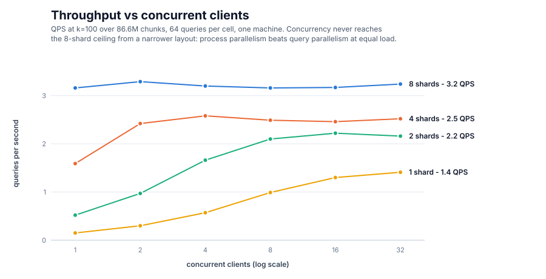
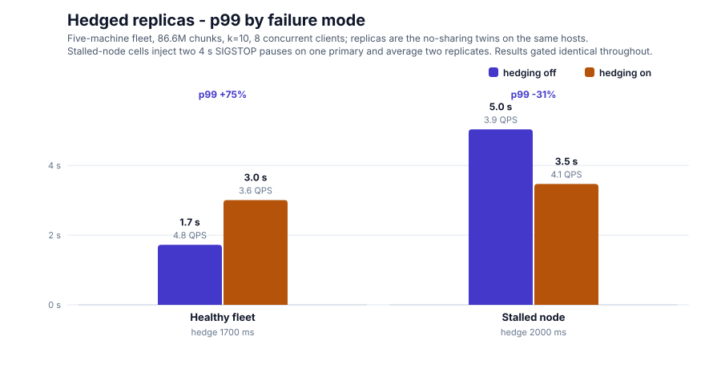

# Test results — CourtListener corpus, full-scale battery

First full-scale measurement round of pipestream-search: correctness,
latency scaling, collaborative pruning, and quantization recall over the
complete CourtListener opinion corpus. 2026-07-29/30.

## Setup

**Machine** (single host; every cluster layout ran on it):

| Component | Value |
|---|---|
| CPU | AMD Ryzen 9 9950X3D — 16 cores / 32 threads, up to 5.75 GHz, 128 MiB L3 |
| RAM | 128 GB (121 GiB usable), 64 GiB swap |
| Storage | Samsung 990 PRO NVMe (4 TB + 2 TB), Crucial T710 2 TB |
| OS | Linux 7.0.0-28-generic |

**Corpus**: 9,740,254 court opinions (CourtListener bulk data, HTML
stripped to plain text), chunked to 86,633,399 passages. Embeddings:
dim-256 unit vectors from a static-table (Model2Vec-style) model with
token-weighted mean pooling; one sidecar analysis call per opinion.

**Index**: 4-bit TQ+ (turbovec), one calibration fitted on a 289k-vector
stride sample and broadcast to every shard before ingest, so all layouts
encode identically. Vector codes: ~128 B/vector, 11.1 GB total. BM25
sidecar files (postings + doc store + offsets): ~45 GB/shard, ~365 GB
total. Serving heap: vector codes resident, BM25 memory-mapped.

**Cluster layouts** (same corpus, same calibration):

- 8 shards × 10,829,174 chunks, floor sharing on (WAL-logged ingest)
- 8-shard replica set over the same files, floor sharing off
- 4-, 2-, and 1-shard layouts (vector leg only), block-routed

## Methodology

**Latency / pruning sweeps** (`examples/cluster_sweep`): for each
configuration, 5 discarded warmup probes then 40 timed single-client
queries at each k in {10, 100, 1000, 10000}. Probe vectors are drawn
from the corpus embeddings file, so queries live in the real embedding
space. Reported: wall p50/p90/p99, QPS, candidates collected, floors
published/applied. Per-node scan chunk: 8192 SIMD blocks (262k vectors);
an initial run at the 64-block default was dominated by per-chunk
overhead (5,288 chunked calls per shard per query, ~15 s p50) and was
rerun after raising the chunk size.

**Correctness gates**: the A/B sweep asserts identical hit signatures
(ids, scores, order) between the sharing and non-sharing clusters at
every k before reporting any number. `examples/layout_equivalence`
compares top-100 score multisets between the 8-shard cluster and the
monolithic layout (ids differ by slot offsets; scores are the
signature) over 20 probes.

**Recall** (`examples/fp32_recall`): ground truth is an exact fp32
brute-force top-1000 over all 86.6M raw vectors (single streaming pass,
~137 s for 20 probes). The quantized cluster's top-1000 for the same
probes is compared raw, and again after reranking that pool by exact
fp32 scores fetched by seek reads from the fixed-stride vector file.

**Limitations**: 40 queries per configuration (coarse tail percentiles);
probes come from the corpus distribution rather than user queries; one
machine, loopback networking, warm page cache. A larger battery (10k+
random queries, concurrent clients, multi-host) is planned — see Next
steps.

## Results

| Shards | p50 @ k=10 | p50 @ k=10000 | Mean/query (1/QPS) | Speedup vs 1 |
|---|---|---|---|---|
| 1 | 6,592 ms | 6,839 ms | ~6.6 s | — |
| 2 | 1,943 ms | 2,164 ms | ~2.0 s | 3.4x |
| 4 | 626 ms | 846 ms | ~630 ms | 10.5x |
| 8 | 313 ms | 531 ms | ~313 ms | 21x |

Latency is nearly flat in k up to 1000 and rises modestly at k=10000
(merge and heap work). Distributions are tight: at 8 shards / k=10,
min 302 ms, p99 322 ms over 40 queries.

| Measure | recall@10 | recall@100 | recall@1000 |
|---|---|---|---|
| Quantized scan | 0.830 | 0.827 | 0.838 |
| + fp32 rerank of quantized top-1000 | 1.000 | 1.000 | (pool depth) |

| k | Candidates/query, sharing on | off | Reduction |
|---|---|---|---|
| 10 | 209 | 392 | 47% |
| 100 | 2,542 | 4,055 | 37% |
| 1,000 | 28,631 | 41,460 | 31% |
| 10,000 | 247,442 | 646,560 | 62% |

Wall time was statistically indistinguishable between sharing on and
off at every k.

Concurrency grid (k=100, 64 queries per cell), QPS:

| Shards | c=1 | c=2 | c=4 | c=8 | c=16 | c=32 |
|---|---|---|---|---|---|---|
| 1 | 0.15 | 0.30 | 0.57 | 0.99 | 1.30 | 1.41 |
| 2 | 0.52 | 0.97 | 1.66 | 2.10 | 2.22 | 2.16 |
| 4 | 1.59 | 2.42 | 2.58 | 2.49 | 2.46 | 2.52 |
| 8 | 3.16 | 3.29 | 3.20 | 3.16 | 3.17 | 3.24 |

Once a layout reaches its plateau, p50 grows linearly with client count
(Little's law: latency ~ concurrency / QPS), e.g. 8 shards: 315 ms at
c=1, 9.9 s at c=32, throughput unchanged.

Raw records: `sweep-8x-cb8192.jsonl`, `sweep-ladder.jsonl`,
`sweep-concurrency.jsonl`; charts regenerate from
`docs/benchmarks/make_charts.py`.

## Findings

1. **The distributed engine is exact.** Sharing on/off returned
   identical results at every k (160/160 query-configurations), and the
   8-shard layout's top-100 scores are bitwise-identical to the
   monolithic index's. Sharding and collaboration add zero retrieval
   loss.
2. **Latency scales super-linearly with shard count on one machine**
   (21x at 8 shards) because each node scans its shard chunk-serially;
   shard processes are the parallelism mechanism, and a monolithic
   layout under-uses the hardware.
3. **The scan is memory-bandwidth-bound.** Eight concurrent shard scans
   stream ~35 GB/s, the machine's effective ceiling; per-query cost
   tracks bytes scanned, giving QPS ≈ bandwidth / index size (~3.2
   measured). Adding machines adds bandwidth; adding processes beyond
   the ceiling does not.
4. **Floor sharing prunes 31–62% of candidates but does not reduce wall
   time in this regime**, because the kernel still scores every block —
   pruning saves heap work, not bytes read. Converting the pruning into
   latency requires per-block score upper bounds so a floor can skip
   reading provably-dead blocks.
5. **4-bit quantization costs a flat ~17% of true-top-k membership at
   every measured depth, and the loss is fully recoverable**: reranking
   the quantized top-1000 by exact fp32 (~1 ms/query) restored
   recall 1.000 at k=10 and k=100.
6. **Scan-chunk size must scale with shard size.** The 64-block default
   cost 47x at 10.8M vectors/shard (15 s → 313 ms after raising it);
   chunking granularity is a floor-reactivity vs overhead trade that
   should be derived from shard size, not fixed.
7. **Concurrency cannot substitute for sharding.** Each layout has its
   own throughput plateau (8 shards: 3.2 QPS from the first client;
   4: ~2.5; 2: ~2.2; 1: ~1.4 even at 32 clients) — the monolith with 32
   queries in flight reaches less than half the 8-shard ceiling.
   Process-level parallelism beats query-level parallelism at equal
   load, and past the plateau added clients only add queueing delay,
   linearly.
8. **Live sample queries caught a real format defect no unit test
   could**: BM25 directory blob offsets were absolute u32 file
   positions, silently wrapping past 4 GiB and zeroing every lexical
   score on 45 GB shards. Fixed as format v4 (blob-relative offsets)
   with an in-place repair; the byte-identity test between the two
   builders held throughout.

## Round 2: scan-call granularity isolated

A follow-up isolated the node's scan-chunking overhead from real
scaling. Giving the kernel the whole shard in ONE call (chunk-blocks
above the shard's block count) instead of 8192-block chunks, k=100,
same probes:

| Configuration | p50 | QPS |
|---|---|---|
| Monolith, 8192-block chunking (Round 1) | 6,592 ms | 0.15 |
| 8 shards, 8192-block chunking (Round 1) | 313 ms | 3.2 |
| Monolith, whole-shard call | 239 ms | 4.2 |
| 8 shards, whole-shard calls | 220 ms | 4.5 |

This **corrects Finding 2**: the "21x scaling" in Round 1 measured the
node's chunked-scan overhead shrinking with shard size, not intrinsic
scaling. Properly configured, shard count on one machine is nearly
flat (220 vs 239 ms): the machine is one bandwidth-bound resource
however it is partitioned, and the kernel's internal range parallelism
uses it well on its own. Sharding's real value is across machines
(added bandwidth) plus collaboration; on one box the corrected
configuration is also the new best result (220 ms p50, 4.5 QPS, 42%
faster than Round 1's best).

Node chunking existed to give floor sharing mid-query reactivity; the
correction shows that reactivity was bought with the dominant cost in
the system. The follow-up direction (kernel-internal shared floors at
sub-chunk granularity, then block-max bounds so floors skip reads) is
measured on a separate branch; a first cell shows the shared floor
alone does not move wall time, consistent with the bandwidth model,
positioning it as the enabler for block-max rather than a win by
itself.

## Round 3: two machines

First cross-machine measurement: the corpus split into two 43.3M-chunk
shards, one served locally, one on a second host over the LAN
(coordinator co-located with shard 0), with a no-sharing twin pair for
the A/B. k=10,000:

| Clients | Sharing | Candidates/query | p50 | QPS |
|---|---|---|---|---|
| 1 | on | 116,465 | 2,085 ms | 0.5 |
| 1 | off | 133,625 | 1,796 ms | 0.6 |
| 8 | on | 114,101 | 2,782 ms | 2.7 |
| 8 | off | 132,846 | 2,608 ms | 3.0 |

The correctness gate passed at both load levels: distributed results
are bitwise-identical across physical machines, sharing on or off.
Machine bandwidth pools aggregate as the model predicts (0.6 to 3.0
QPS as concurrency fills the second machine; the same two shards on
one machine plateaued at 2.2).

**Negative result**: floor sharing cost 7-16% wall time over the real
network, against a 13% candidate reduction (two shards have little to
teach each other; the same reduction was 62% at eight shards). Both
ends of the floor path are non-blocking by design (fire-and-forget
try_send, watch-channel adoption; verified in code during follow-up),
so the cost is second-order: per-message processing during the scan,
the floor-application paths that only an active floor exercises, or
transport flow control. A chunk-size isolation run will separate
message count from application count; delta-gated and coalesced floor
publishing are the identified mitigations. The cost per node is
constant in fleet size while the pruning benefit grows with shard
count, so the economics improve with scale, but that claim now
requires the fleet test rather than extrapolation.

## Round 4: five machines, two architectures

Bandwidth-proportional shards (35.25M / 30.2M / 7.06M / 7.06M / 7.06M
chunks) across one x86 desktop, one x86 server, and three Raspberry
Pi 5s (NEON kernels, first live run), with no-sharing twins on every
host. Data-plane connections pin IPv4: hostname resolution through the
Pis' multi-homed IPv6 routed one gRPC channel to the wrong machine
during setup, caught by the ingest count check.

| Config | Sharing | Candidates/query | p50 | p99 | QPS |
|---|---|---|---|---|---|
| k=10000, c=1 | on | 132,764 | 1,327 ms | 1,360 ms | 0.8 |
| k=10000, c=1 | off | 269,596 | 1,340 ms | 1,376 ms | 0.8 |
| k=10000, c=8 | on | 132,711 | 1,977 ms | 2,575 ms | 3.8 |
| k=10000, c=8 | off | 267,047 | 1,955 ms | 2,837 ms | 3.8 |
| k=100, c=1 | on | 1,630 | 1,148 ms | 1,159 ms | 0.9 |
| k=100, c=1 | off | 2,735 | 1,142 ms | 1,154 ms | 0.9 |

The correctness gate passed at every configuration: identical results
across five machines and two instruction sets simultaneously.

Findings: at five shards the sharing ledger flips. Candidate reduction
doubles to 51% (from 13% at two shards), the network cost measured in
Round 3 washes out to parity, and sharing improves p99 under load by
9% (tail compression: slow shards adopt fast shards' floors). The
trend across 2 to 5 nodes supports the fleet thesis; each added shard
raises the benefit while per-node message cost stays constant.

The fleet's absolute latency (1.15 s at k=100) is Round 2's lesson
recurring: the two big shards scan chunked for floor reactivity and
straggle while the Pis idle. Kernel-internal shared floors (measured
in isolation on a branch) would let large shards run whole-shard calls
without losing reactivity, putting the projected fleet p50 near 250 ms
at an aggregate-bandwidth QPS around 9.

## Round 5: hedged replicas on the fleet

The maturity round added replica failover and hedged retries: a shard
whose primary has not answered within `hedge_delay_ms` gets the same
search opened on its replica, and the first success wins. Because the
search is exact, the two answers are interchangeable, so the only
question is what hedging costs and what it buys. The fleet's
no-sharing twins (`:59701`, the same shard files on the same hosts)
were registered as replicas and the delay swept at eight concurrent
clients, k=10, 200 probes per cell. The hit signature of every cell is
gated against the un-hedged cell.

Two counters were added to the fan-out for this round — hedge legs
launched and hedge legs that beat their primary — because otherwise a
null result cannot be told apart from a hedge that never fired.

**Healthy fleet.** Baseline p50 1,634 ms / p99 1,721 ms at 4.9 QPS:
a p99/p50 ratio of 1.05, which is to say no straggler tail at all.

| Hedge delay | Legs hedged | Won | p50 | p99 | QPS |
|---|---|---|---|---|---|
| off | 0 | 0 | 1,657 ms | 1,721 ms | 4.8 |
| 100 ms | 1000 (all) | 92 | 2,738 ms | 2,840 ms | 2.9 |
| 800 ms | 431 | 0 | 2,748 ms | 2,924 ms | 2.9 |
| 1500 ms | 199 | 0 | 2,722 ms | 2,912 ms | 3.0 |
| 1700 ms | 109 | 0 | 2,504 ms | 3,005 ms | 3.6 |

Negative result, and a strong one: hedging a healthy bandwidth-bound
fleet is harmful at every delay. The 100 ms cell doubles cluster work
and pays for it almost exactly, dropping throughput 40%. The
interesting cell is 1700 ms, where only 109 of 1,000 shard legs hedge
— 11% more work for a 25% throughput loss and a 51% worse p50. The
damage is disproportionate because a latency-triggered hedge *selects
for the bottleneck*: the only legs slow enough to trip the timer are
the ones already on the critical path, so the remedy adds duplicate
work exactly where the query is already waiting.

Selective replicas isolate this directly. Hedging only the three small
Pi shards fires zero legs at a 1700 ms delay (they finish long before
the timer) and costs nothing. Hedging only the two large shards
reproduces essentially the entire penalty of the full configuration:

| Replicas | Legs hedged | Won | p50 | p99 | QPS |
|---|---|---|---|---|---|
| none (reference) | 0 | 0 | 1,678 ms | 1,760 ms | 4.8 |
| 3 small shards only | 0 | 0 | 1,678 ms | 1,765 ms | 4.8 |
| 2 large shards only | 190 | 0 | 2,731 ms | 2,885 ms | 3.0 |

Zero wins in either large-shard cell: a copy started 1.7 s late on a
machine already at its bandwidth ceiling never catches the original.

**Stalled node.** Hedging is insurance against a stall, not against
saturation, so the case it exists for was measured too. One Pi's
primary was paused (`SIGSTOP`) twice for 4 s during each run; its
`:59701` twin is a separate process over the same shard file, so it
stayed live and could serve the hedge. Two replicates of each cell:

| Hedge | Legs hedged | Won | p50 | p90 | p99 | max | QPS |
|---|---|---|---|---|---|---|---|
| off | 0 | 0 | 1,718 ms | 1,855 ms | 5,037 ms | 5,121 ms | 3.9 |
| 2000 ms | 33 | 32 | 1,677 ms | 2,841 ms | 3,740 ms | 3,851 ms | 4.1 |
| off | 0 | 0 | 1,679 ms | 2,247 ms | 5,032 ms | 5,065 ms | 3.9 |
| 2000 ms | 36 | 21 | 1,721 ms | 2,775 ms | 3,194 ms | 3,226 ms | 4.1 |

Here the hedge earns its keep: p99 falls 26% and 37% across the two
replicates, the maximum falls with it, p50 and throughput are
unchanged, and the hedge legs win 97% and 58% of their races — the
timer is landing on precisely the stalled queries rather than on
healthy ones. p90 rises, which is the trade being made: queries that
would have waited out the full stall are pulled forward to roughly
`hedge_delay + one scan`, compressing the extreme tail into the upper
middle rather than eliminating it.

Findings. Hedging is not a latency optimization; it is a stall
mitigation, and the two cases have opposite signs on the same fleet.
The delay must sit above the healthy p99 (2000 ms here, against a
1,721 ms p99) or the timer fires on ordinary bottleneck legs and the
duplicate work compounds the saturation it was meant to escape. A
replica co-located with its primary insures against process-level and
connection-level stalls, which is what the pooled-channel design makes
most likely to matter — every concurrent query to a node shares one
HTTP/2 channel, so one stuck channel stalls all of them and the hedge
opens a different connection. It cannot insure against a machine
running out of bandwidth; that needs a replica on separate hardware.
The defaults stay off, which these numbers support.

## Round 6: request coalescing, and the 2-bit question answered

Two single-box rounds against the two levers a bandwidth-bound scan
actually has: share each pass over the packed codes between queries
(coalescing), or halve the bytes per pass (2-bit codes).

### Request coalescing into the multi-query kernel

turbovec's scan kernel already scores up to FOUR queries per pass over
each block — but every `SearchShard` RPC ran alone, so concurrent
queries each paid a full sweep. The node now queues scans behind a
bounded set of scan slots (`--scan-parallel`, default half the cores)
and each freed slot drains up to four waiting queries into one batched
chunked scan. Exactness is structural: the batch's kernel calls share
one threshold, so it is seeded with the MINIMUM of the per-query
floors (a lower floor only collects more), and each query's own floor
re-applies at its merge — per-query hits and published floor sequences
are bitwise identical to solo scans, gated by tests at both the scan
and the RPC layer. `--coalesce=false` is the A/B baseline.

1M x dim-256 4-bit corpus, k=10, in-process node (8 queries per client
on the 32-core rows, 4 on the taskset rows):

| cores | clients | solo QPS | coalesced QPS | solo mean latency | coalesced mean latency |
|---|---:|---:|---:|---:|---:|
| 32 | 16 | 81.1 | 78.0 | 195 ms | 202 ms |
| 32 | 32 | 109.5 | 114.6 | 283 ms | 238 ms |
| 4 (taskset) | 8 | 40.2 | 40.5 | 194 ms | 170 ms |
| 4 (taskset) | 32 | 42.5 | **96.5** | 736 ms | **303 ms** |

The regime matters and the numbers say so honestly: with idle cores
(32-core box, light load) batches never form — a free slot takes every
query solo, and coalescing is neutral by design. When concurrency
exceeds cores (the Pi fleet's shape: 4 cores, 32 clients), batches
average 3.7 of the kernel's maximum 4 and throughput MORE THAN DOUBLES
(2.27x) while mean latency drops 2.4x. Reproduce:
`cargo run --release --example coalesce_bench`.

### 2-bit + rerank: measured, and the answer is no

The bytes lever: 2-bit codes halve the scan traffic on the same SIMD
path (the LUT build takes `bits`; packing is `8/bits`). The question
was whether an exact f32 rerank of the top k' recovers the recall the
coarser codes lose. Real corpus embeddings (1M chunks, 64 held-out
query embeddings, exact f32 ground truth):

| config | recall@10 |
|---|---:|
| raw 4-bit | 0.8406 |
| raw 2-bit | 0.4109 |
| 2-bit + f32 rerank of top 50 | 0.8734 |
| **4-bit + f32 rerank of top 100** | **1.0000** |
| 2-bit + f32 rerank of top 100 | 0.9422 |
| 2-bit + f32 rerank of top 200 | 0.9672 |
| 2-bit + f32 rerank of top 500 | 0.9875 |
| 2-bit + f32 rerank of top 1000 | 0.9984 |

The scan is exactly the promised 2x (0.79 ms vs 1.64 ms median full
sweep at 1M) — and it is not worth it. 4-bit + rerank of the top 100
is EXACT on this corpus, which is the production configuration's
measured behavior at cluster scale. 2-bit never gets there: even
reranking the top 1000 (10x the rerank fetches per shard) still loses
a hit in six hundred, and every practical k' loses more. The
production answer stays 4-bit + rerank@100; the bytes lever costs
recall we refuse to pay. Negative result, posted as measured.
Reproduce: `cargo run --release --example twobit_rerank`.

## Next steps

The ceiling-raising directions below — block-max-style bounds adapted
from the lexical world, index segmentation/layout, and query-path
caching — were suggested by krickert on reviewing this round's
findings; they are listed at summary level pending measurement.

- **Large-query battery**: 10k–100k probes, including off-corpus query
  text embedded at query time, for statistically strong percentiles and
  recall estimates.
- **Uniform vs block routing**: replay the 8 WALs into a hash-uniform
  8-shard cluster (`reshard --logs=... --split=8`) and rerun the sweep
  on identical data.
- **Two-machine topology**: shards on one host, coordinator on another;
  measures what real network latency does to floor propagation and
  pruning.
- **Block-max pruning for the vector scan** (upstream kernel
  candidate): Lucene's Block-Max WAND skips whole postings blocks via
  per-block score maxima; the same shape applies to quantized vector
  scans, letting shared floors skip reading provably-dead regions and
  converting the measured 31–62% candidate pruning into wall-time and
  bandwidth savings.
- **Query-path caching**: result and pagination-pool caches around the
  scan (the scan itself has no exploitable locality; caching applies
  above it).
- **Domain vocabulary → better embeddings** (two-phase train): the BM25
  index already holds per-term document frequencies for 10–17M terms
  per shard. Mine corpus-distinctive unigrams by frequency ratio
  against a general-English reference, and 2-/3-gram terms of art by
  collocation statistics (PMI / log-likelihood) — legal vocabulary like
  "summary judgment" or "assumption of risk" is collocational, not
  named-entity-shaped, so statistical mining is the primary tool and
  NER is the complement for case names, courts, and statute citations.
  Add the mined vocabulary to the tokenizer, then re-distill the static
  embedding table from a teacher model over court text so the new
  tokens get real vectors. Re-index and rerun this battery for the
  before/after.

## Round 7: live TEI rerank vs the lossless counterfactual (2026-07-31)

**Question**: does re-embedding turbovec's quantized top-k' with the REAL
transformer (TEI, all-MiniLM-L6-v2 — the teacher family of the static
model2vec index embeddings) and reranking recover the loss from 4-bit
quantization? **Measurement** (`examples/tei_rerank.rs`, full 86.6M-chunk
live cluster): per query, (a) quantized pool = Search k' against the
fleet; (b) exact pool = fp32 model2vec top-k' from one streaming pass
over the 89.75 GB embeddings file (the no-quantization counterfactual;
17s wall, all cores); (c) both pools' texts fetched from the owning
shards, re-embedded through TEI, reranked by cosine; (d) recall@k =
overlap of the two TEI-reranked top-k lists. Five legal query texts.

| pool k' | pool overlap | TEI recall@10 | TEI recall@100 |
|---------|-------------|---------------|----------------|
| 1,000   | 0.9186      | 0.9000        | 0.9420         |
| 10,000  | 0.9287      | 0.9800        | 0.9740         |

At k'=10,000, four of five queries hit 1.0000@10. Recovery is NEARLY
full, not exactly full: the rerank cannot resurrect docs the quantized
scan never surfaced, so recall is bounded by pool membership — the
lever is pool depth, and @10 goes 0.90 -> 0.98 for a 10x deeper pool.
**Cost of the live rerank**: TEI on CPU embeds ~9,500 chunks/s over one
shared h2 channel (52,381 chunks in 5.5s), so a k'=1000 rerank is
~100ms of embedding plus one GetDocuments per owning shard.

Ops notes: (1) the embeddings file has a 12-byte file header (magic +
dim) — earlier `twobit_rerank` runs read from byte 0, shifting every
parsed vector by 12 bytes; the codec comparison stayed internally
consistent (all codecs and the ground truth saw identical vectors), so
the 2-bit verdict stands, but the reader is now fixed in both examples.
(2) A connect-per-text client at 50k+ texts resets TEI exactly like it
reset the analysis sidecar (share one channel), and one multi-MB
outlier chunk can tear down the shared h2 connection — inputs are
truncated client-side to 4000 chars (MiniLM truncates at 256 tokens
regardless, so scores are unchanged).

**Round 7 addendum, the falloff sweep** (15 queries, pools to 20k, one
run: smaller pools are prefixes of the largest, so the whole matrix
costs one measurement; raw data `docs/benchmarks/tei-falloff.csv`).
Instead of spot recalls, measure recall@k for a dense k grid per pool
k', and derive TRUSTED DEPTH per quality bar tau: how deep the
reranked list stays >= tau, contiguous from the top.

| pool k' | trusted depth @0.98 | recall@10 | recall@100 | recall@1000 |
|---------|--------------------|-----------|------------|-------------|
| 1,000   | 0                  | 0.927     | 0.941      | 0.926       |
| 2,000   | 7                  | 0.967     | 0.947      | 0.942       |
| 5,000   | 10                 | 0.980     | 0.971      | 0.953       |
| 10,000  | 15                 | 0.980     | 0.965      | 0.948       |
| 20,000  | 100                | 0.993     | 0.981      | 0.970       |

Read-offs: trusting the top-10 at 0.98 needs a ~5k pool; trusting the
top-100 needs ~20k. Every curve decays toward its pool-overlap floor
(0.92-0.93) as k approaches k'. Cost scales linearly and stays small:
~100ms of CPU TEI per 1000 pooled chunks.

**Round 7 correction, the 500-query rerun (NEGATIVE)**. The 15-query
tree did not survive scale. Same test with 500 unique queries (15
topical seeds + 485 span samples drawn from random corpus chunks;
9.1M pool texts through TEI, ~18 min): mean agreement@10 drops to
0.87-0.91 (was 0.93-0.99 on seeds alone), 11-14% of queries FLIP THEIR
TOP-1 vs lossless and pool depth barely moves that (0.856 at k'=1000
-> 0.888 at 20000), p10@1 = 0 for every pool, one query has ZERO
top-100 overlap at a 20k pool, and the 0.98 bar is unreachable at any
depth. Pool-overlap floors drop to 0.86-0.89; "full pool" now starts
at tau ~0.84-0.86. Raw data docs/benchmarks/tei-falloff-500.csv.

Interpretation, not yet proven: depth-insensitive top-1 flips are the
signature of exact ties being reshuffled, and corpus-drawn span
queries land in boilerplate-dense neighborhoods (near-verbatim legal
formulas, tiny chunks - the known corpus pathologies) where thousands
of chunks score near-identically, so id-agreement punishes
interchangeable results. The decisive follow-up is SCORE REGRET:
compare the TEI cosine served at each rank by the quantized pool vs
the lossless pool. Regret ~0 with id agreement 0.87 = ties, harmless;
material regret = real quality loss from quantization. Not yet run.

Also: the topical-seed numbers remain true for topical queries; what
died is their generalization to an unbiased query mix.

**Round 7 resolution: SCORE REGRET ~ ZERO, tie hypothesis CONFIRMED.**
Same 500-query run with the decisive column: at each rank compare the
TEI cosine the quantized pool SERVES vs what the lossless pool serves.
Mean regret@10 is NEGATIVE (-0.0013 to -0.0016 cosine points across
all pool depths) and p90 regret is +0.001 to +0.004: three thousandths
of a cosine point, i.e. nothing, and on average the quantized pool's
reranked top-10 serves marginally HIGHER TEI scores than the exact
pool's (quantization noise promotes different but equally good
near-duplicates). Verdict: the 0.87-0.91 id agreement is tie-shuffling
among interchangeable results, NOT quality loss. After the TEI rerank,
the 4-bit quantized model2vec index delivers results score-equivalent
to a lossless index. Raw: docs/benchmarks/tei-regret-500.csv.

Consequences: (1) re-embedding the corpus is NOT justified by
quantization loss; the TEI corpus embedding still gets built as the
stored rescore space (multi-space plan) to kill live-embed latency;
(2) the real perceived-quality lever remains the corpus hygiene pass
(tiny chunks, boilerplate dedup, case normalization); (3) the honest
claim for the rerank story: id churn 9-13% at the top, served-score
parity within +/-0.003 cosine (p90).
