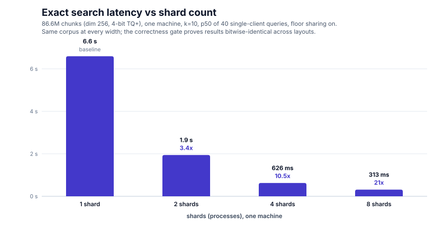
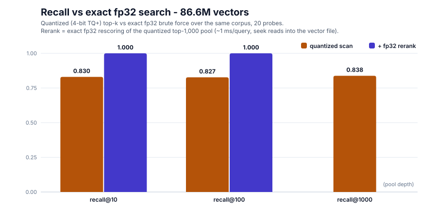
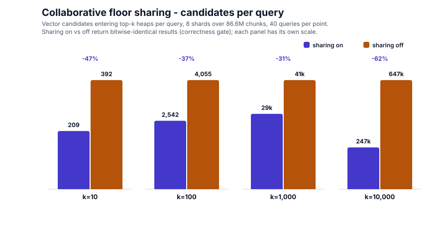

# Test results — CourtListener corpus, full-scale battery

First full-scale measurement round of turbovec-search: correctness,
latency scaling, collaborative pruning, and quantization recall over the
complete CourtListener opinion corpus. 2026-07-29/30.

## Setup

**Machine** (single host; every cluster layout ran on it):

| Component | Value |
|---|---|
| CPU | AMD Ryzen 9 9950X3D — 16 cores / 32 threads, up to 5.75 GHz, 128 MiB L3 |
| RAM | 128 GB (121 GiB usable), 64 GiB swap |
| Storage | Samsung 990 PRO NVMe (4 TB + 2 TB), Crucial T710 2 TB |
| OS | Linux 7.0.0-28-generic |

**Corpus**: 9,740,254 court opinions (CourtListener bulk data, HTML
stripped to plain text), chunked to 86,633,399 passages. Embeddings:
dim-256 unit vectors from a static-table (Model2Vec-style) model with
token-weighted mean pooling; one sidecar analysis call per opinion.

**Index**: 4-bit TQ+ (turbovec), one calibration fitted on a 289k-vector
stride sample and broadcast to every shard before ingest, so all layouts
encode identically. Vector codes: ~128 B/vector, 11.1 GB total. BM25
sidecar files (postings + doc store + offsets): ~45 GB/shard, ~365 GB
total. Serving heap: vector codes resident, BM25 memory-mapped.

**Cluster layouts** (same corpus, same calibration):

- 8 shards × 10,829,174 chunks, floor sharing on (WAL-logged ingest)
- 8-shard replica set over the same files, floor sharing off
- 4-, 2-, and 1-shard layouts (vector leg only), block-routed

## Methodology

**Latency / pruning sweeps** (`examples/cluster_sweep`): for each
configuration, 5 discarded warmup probes then 40 timed single-client
queries at each k in {10, 100, 1000, 10000}. Probe vectors are drawn
from the corpus embeddings file, so queries live in the real embedding
space. Reported: wall p50/p90/p99, QPS, candidates collected, floors
published/applied. Per-node scan chunk: 8192 SIMD blocks (262k vectors);
an initial run at the 64-block default was dominated by per-chunk
overhead (5,288 chunked calls per shard per query, ~15 s p50) and was
rerun after raising the chunk size.

**Correctness gates**: the A/B sweep asserts identical hit signatures
(ids, scores, order) between the sharing and non-sharing clusters at
every k before reporting any number. `examples/layout_equivalence`
compares top-100 score multisets between the 8-shard cluster and the
monolithic layout (ids differ by slot offsets; scores are the
signature) over 20 probes.

**Recall** (`examples/fp32_recall`): ground truth is an exact fp32
brute-force top-1000 over all 86.6M raw vectors (single streaming pass,
~137 s for 20 probes). The quantized cluster's top-1000 for the same
probes is compared raw, and again after reranking that pool by exact
fp32 scores fetched by seek reads from the fixed-stride vector file.

**Limitations**: 40 queries per configuration (coarse tail percentiles);
probes come from the corpus distribution rather than user queries; one
machine, loopback networking, warm page cache. A larger battery (10k+
random queries, concurrent clients, multi-host) is planned — see Next
steps.

## Results

| Shards | p50 @ k=10 | p50 @ k=10000 | Mean/query (1/QPS) | Speedup vs 1 |
|---|---|---|---|---|
| 1 | 6,592 ms | 6,839 ms | ~6.6 s | — |
| 2 | 1,943 ms | 2,164 ms | ~2.0 s | 3.4x |
| 4 | 626 ms | 846 ms | ~630 ms | 10.5x |
| 8 | 313 ms | 531 ms | ~313 ms | 21x |

Latency is nearly flat in k up to 1000 and rises modestly at k=10000
(merge and heap work). Distributions are tight: at 8 shards / k=10,
min 302 ms, p99 322 ms over 40 queries.

| Measure | recall@10 | recall@100 | recall@1000 |
|---|---|---|---|
| Quantized scan | 0.830 | 0.827 | 0.838 |
| + fp32 rerank of quantized top-1000 | 1.000 | 1.000 | (pool depth) |

| k | Candidates/query, sharing on | off | Reduction |
|---|---|---|---|
| 10 | 209 | 392 | 47% |
| 100 | 2,542 | 4,055 | 37% |
| 1,000 | 28,631 | 41,460 | 31% |
| 10,000 | 247,442 | 646,560 | 62% |

Wall time was statistically indistinguishable between sharing on and
off at every k. Raw records: `sweep-8x-cb8192.jsonl`,
`sweep-ladder.jsonl`; charts regenerate from
`docs/benchmarks/make_charts.py`.

## Findings

1. **The distributed engine is exact.** Sharing on/off returned
   identical results at every k (160/160 query-configurations), and the
   8-shard layout's top-100 scores are bitwise-identical to the
   monolithic index's. Sharding and collaboration add zero retrieval
   loss.
2. **Latency scales super-linearly with shard count on one machine**
   (21x at 8 shards) because each node scans its shard chunk-serially;
   shard processes are the parallelism mechanism, and a monolithic
   layout under-uses the hardware.
3. **The scan is memory-bandwidth-bound.** Eight concurrent shard scans
   stream ~35 GB/s, the machine's effective ceiling; per-query cost
   tracks bytes scanned, giving QPS ≈ bandwidth / index size (~3.2
   measured). Adding machines adds bandwidth; adding processes beyond
   the ceiling does not.
4. **Floor sharing prunes 31–62% of candidates but does not reduce wall
   time in this regime**, because the kernel still scores every block —
   pruning saves heap work, not bytes read. Converting the pruning into
   latency requires per-block score upper bounds so a floor can skip
   reading provably-dead blocks.
5. **4-bit quantization costs a flat ~17% of true-top-k membership at
   every measured depth, and the loss is fully recoverable**: reranking
   the quantized top-1000 by exact fp32 (~1 ms/query) restored
   recall 1.000 at k=10 and k=100.
6. **Scan-chunk size must scale with shard size.** The 64-block default
   cost 47x at 10.8M vectors/shard (15 s → 313 ms after raising it);
   chunking granularity is a floor-reactivity vs overhead trade that
   should be derived from shard size, not fixed.
7. **Live sample queries caught a real format defect no unit test
   could**: BM25 directory blob offsets were absolute u32 file
   positions, silently wrapping past 4 GiB and zeroing every lexical
   score on 45 GB shards. Fixed as format v4 (blob-relative offsets)
   with an in-place repair; the byte-identity test between the two
   builders held throughout.

## Next steps

The ceiling-raising directions below — block-max-style bounds adapted
from the lexical world, index segmentation/layout, and query-path
caching — were suggested by krickert on reviewing this round's
findings; they are listed at summary level pending measurement.

- **Concurrency battery**: QPS and tail latency vs concurrent clients
  (1–32) on the 8-shard cluster. The bandwidth model predicts sub-linear
  scaling to a ~3–4 QPS ceiling; measuring where it flattens, and what
  it does to p99, is the point.
- **Large-query battery**: 10k–100k probes, including off-corpus query
  text embedded at query time, for statistically strong percentiles and
  recall estimates.
- **Uniform vs block routing**: replay the 8 WALs into a hash-uniform
  8-shard cluster (`reshard --logs=... --split=8`) and rerun the sweep
  on identical data.
- **Two-machine topology**: shards on one host, coordinator on another;
  measures what real network latency does to floor propagation and
  pruning.
- **Block-max pruning for the vector scan** (upstream kernel
  candidate): Lucene's Block-Max WAND skips whole postings blocks via
  per-block score maxima; the same shape applies to quantized vector
  scans, letting shared floors skip reading provably-dead regions and
  converting the measured 31–62% candidate pruning into wall-time and
  bandwidth savings.
- **Query-path caching**: result and pagination-pool caches around the
  scan (the scan itself has no exploitable locality; caching applies
  above it).
- **Domain vocabulary → better embeddings** (two-phase train): the BM25
  index already holds per-term document frequencies for 10–17M terms
  per shard. Mine corpus-distinctive unigrams by frequency ratio
  against a general-English reference, and 2-/3-gram terms of art by
  collocation statistics (PMI / log-likelihood) — legal vocabulary like
  "summary judgment" or "assumption of risk" is collocational, not
  named-entity-shaped, so statistical mining is the primary tool and
  NER is the complement for case names, courts, and statute citations.
  Add the mined vocabulary to the tokenizer, then re-distill the static
  embedding table from a teacher model over court text so the new
  tokens get real vectors. Re-index and rerun this battery for the
  before/after.
