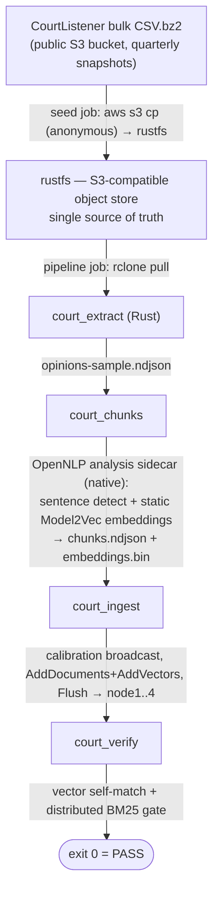

# Court end-to-end demo

Full pipeline from public bulk data to a queried 4-shard pipestream-search
cluster, as a reproducible installer **and** an end-to-end test. No
Python anywhere: data movement is the AWS CLI, extraction is Rust,
embedding/serving is Rust + the GraalVM-native OpenNLP sidecar.



## Quickstart

```bash
cp .env.example .env          # defaults are fine for a first run
docker compose --env-file .env up --build --abort-on-container-exit --exit-code-from pipeline
```

Exit code 0 from `pipeline` means the whole chain worked end to end.
Tear down (and wipe all data) with:

```bash
docker compose down -v
```

After the run, the cluster is still up: the coordinator listens on
`localhost:50050`, rustfs on `localhost:19000` (console on `:19001`,
rustfsadmin/rustfsadmin).

## What each piece is

| Service       | Image / build | Role |
| ------------- | ------------- | ---- |
| `rustfs`      | `rustfs/rustfs` | S3-compatible object store holding the corpus |
| `seed`        | `./seed` (`amazon/aws-cli`) | one-shot: `aws s3 cp` the bulk file from the public CourtListener bucket into rustfs |
| `model`       | `./model` (`curlimages/curl`) | one-shot: downloads a Model2Vec static table from HuggingFace (default `minishlab/potion-retrieval-32M`) |
| `analysis`    | builds `grpc-opennlp-analysis` (sibling repo, GraalVM native) | sentence detection, term vectors, static embeddings |
| `node1`–`node4` | repo-root `Dockerfile` | shard owners (`NodeService`), slot offsets 0/10M/20M/30M |
| `coordinator` | repo-root `Dockerfile` | client-facing `SearchService` (vector, BM25, hybrid) |
| `pipeline`    | repo-root `Dockerfile` | one-shot driver: pull → extract → chunk/embed → ingest → verify |

## Scale knobs (`.env`)

The seed always syncs the full bulk file into rustfs (~45 GB for
2024-12-31). Corpus size is governed at extraction (`court_extract`,
Rust): `EXTRACT_CAP=50000` opinions within `EXTRACT_PREFIX_GB=4` GiB of
compressed input — a few hundred MB of embeddings and a chunk+embed
stage measured in tens of minutes depending on CPU. Set both to `0` for
the full corpus (~250 GB decompressed; bring disk and time).

The prefix sample is biased: the bulk CSV is id-ordered (roughly
chronological, jurisdiction-clumped). Fine for a test; use `0`/`0` for
real evaluation.

## The embedding model

The default table is `minishlab/potion-retrieval-32M` (256d static
Model2Vec, MIT) — the OpenNLP sidecar reads the Model2Vec layout
natively, so the model job is a plain download. The longer-term target
is a bge-m3 distillation (multilingual, longer effective dimensionality)
produced by the Java distiller in the `opennlp-embeddings` module
(`static-embeddings` branch); swap it in via `MODEL_REPO`/`MODEL_FILES`
once published.

## Requirements

- Docker with the compose plugin; ~60 GB free disk for a default run
  (the synced bulk file dominates), ~250 GB more for the full corpus.
- The `grpc-opennlp-analysis` repository checked out next to this one
  (override with `OPENNLP_ANALYSIS_REPO`). Building it runs a GraalVM
  native-image build — first build is slow (10–20 min), then cached.
- Outbound network access to `s3.amazonaws.com` (CourtListener bucket)
  and `huggingface.co` (embedding table).

## Slot offsets

Nodes use fixed slot offsets 0/25M/50M/75M, so each shard can hold up to
25M docs before ranges touch (100M cluster-wide). Raise the spacing (or lower `EXTRACT_CAP`)
if you change either side of that.
