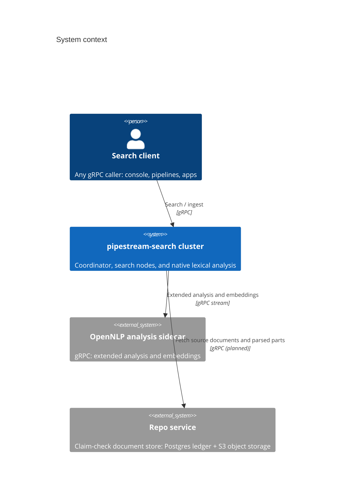
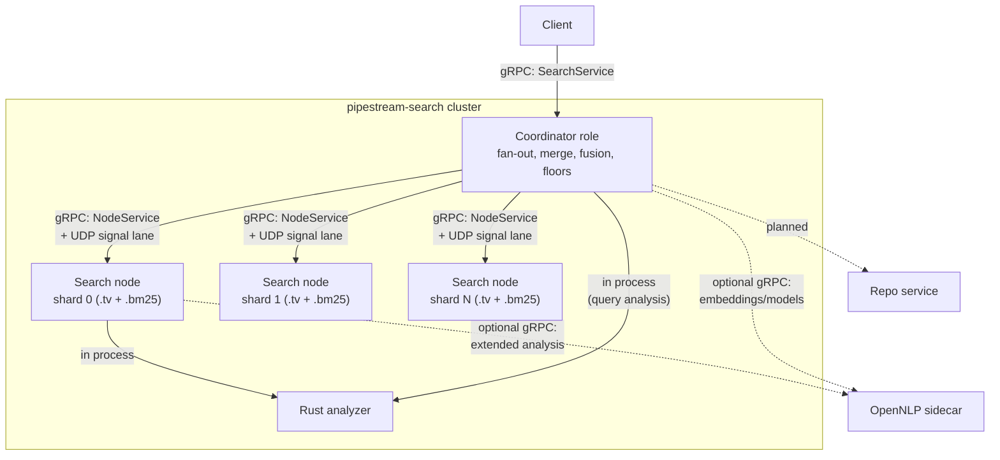

# pipestream-search: Architecture

Status: living document. The coordination model between nodes is settled and
tested; the index shape is close but not final; the repo service integration
is planned but expected to move. Sections that describe settled behavior say
so, and everything still in motion carries a TODO rather than a guess.

This document reads top down. It starts with the system as a whole, then
walks each layer: the search engine library, the server and its roles, the
coordinator, the search nodes, the NLP engine, the index, and the repo
service. Protocol details appear only where a line between two boxes needs a
name. Wire formats, field tables, and vocabularies belong in the appendix,
which is deliberately still placeholders.

## 1. Overall architecture

The system is a distributed search cluster built from four kinds of parts.
At the center is turbovec, an embedded vector search library, not a server.
Around it we built pipestream-search: a single binary that can serve as a
search node, as a coordinator, or as both at once. Product lexical analysis
can run inside that process; extended OpenNLP analysis and embeddings live in
a separate sidecar. Document storage is headed toward a repo service that
holds source material and derived data the index itself should not carry.
Clients talk to a coordinator over gRPC; cluster traffic is also gRPC, with
one deliberate exception described later (a UDP fast lane for typed stream
signals).

The responsibilities split cleanly. The engine library scores vectors and
nothing else. The server owns everything distributed: sharding, fan-out,
merging, floors, fusion, and the lexical (BM25) index, which is ours rather
than the library's. The product owns the persisted term-identity contract.
Its native Rust provider implements the production lexical subset in-process;
the OpenNLP sidecar implements the wider language, model, and embedding
surface. The repo service owns bytes at rest that are not needed to rank:
source documents, parser output, and annotation payloads. The index stays lean
because anything recoverable from the repo service does not have to live on
the search path.

### 1.1 The parts and the lines between them

Membership is static in this phase: the coordinator's node list and each
node's shard set are fixed at startup, and changing topology means editing
configs and restarting. That is deliberate. TODO: discovery, membership
changes without restart, and transport security are open items.

## 2. The search engine: turbovec

turbovec is an upstream Rust library, developed independently of this
project, and we consume it as a crate dependency. It is worth being precise
about what it is not: it is not a server, it opens no sockets, and it knows
nothing about shards, documents, or text. It holds quantized vector codes in
memory, scores query vectors against them exactly and deterministically, and
returns top-k results. Determinism matters to us more than raw speed,
because the distributed layer's correctness argument depends on a node
returning bitwise identical scores no matter how work is batched or
threaded.

The library is moving toward a per-block calibration format (v7) in which
each block of vectors carries its own quantization fit. For us that has one
large consequence: scores become comparable across shards by construction,
which removes most of the calibration plumbing the server currently carries.
We track the upstream branch closely and keep our own patches small and
additive: a seeded score threshold for search, and a streaming collector
that emits candidates above a live floor instead of holding a top-k heap.
Both exist to serve the coordination model in section 4.

## 3. The server and its roles

pipestream-search is one binary with one configuration file, and a process
takes on one of three roles: node, coordinator, or both. A node serves
shards. A coordinator fans queries out to nodes and merges. A process
running both does each with no special casing, which is what single-machine
development, tests, and small deployments use. Nothing about a node makes it
unable to coordinate; the roles are configuration, not different software.
In the current production layout the coordinator role runs on one process
and the nodes on eight, but that is an operational choice, not an
architectural one.

Configuration follows one precedence rule everywhere: CLI flag, then
environment variable, then TOML file, then built-in default. Every knob
mentioned in this document resolves that way.

## 4. The coordinator

The coordinator is where the system's central idea lives, so it gets the
longest discussion. Classic distributed top-k asks every shard for k
results and merges. Ours instead scales the engine's own internal
cooperation up one level: inside turbovec, parallel workers share a score
cutoff so that work provably below the current top-k is skipped. The
coordinator does the same across machines. It holds the only top-k heap in
the whole query. Nodes never receive a result quota; they stream candidates
and prune against a shared floor score that the coordinator raises as
better results arrive.

Stream signals travel two ways. The authoritative path is the open gRPC
stream each node holds for the query. Beside it runs a UDP fast lane: typed
datagrams on the same host and port carry monotonic floor raises or advisory
cancellation. Every UDP signal has a gRPC twin. A lost or reordered floor
costs extra work; a lost cancellation delays abandonment. Neither can change
a successful result, which is why this narrow lane is allowed to be UDP.

The result is still exact, and that claim is structural rather than
statistical. Every node ends its stream with a node-issued completion frame,
the coordinator answers only after all frames arrive with `completed=true`,
and candidates that were emitted before a floor passed them are filtered at
the merge. Cancellation always yields `completed=false`. The distributed
answer is bitwise identical to running the same query on one machine, and the
test suite pins that equivalence.

Cancellation is not early completion. A node may eventually finish before
visiting every remaining vector block only when the engine can prove that an
upper bound over every unvisited block is below the current inclusive floor:

\[
\max UB(\text{unvisited blocks}) < floor
\]

That proof is node-local and would still produce a node-issued
`completed=true`. The current TurboVec streaming API exposes live floor control
but no remaining-range bound, so nodes currently traverse every logical scan
chunk unless cancelled. UDP `CANCEL` can never substitute for this proof.

The same ownership model now applies to ordinary lexical search. BM25 shards
stream compact `(document id, score)` candidates, block-max scorers consume the
coordinator's inclusive live floor, and terminal certificates bind all shards
to one score space. The shard-local terminal top-k enriches global winners with
offsets and projections; it never substitutes for the coordinator heap.

Beyond plain vector search, the coordinator owns:

- fusion: hybrid queries run a vector leg and a BM25 leg and fuse them,
  with several fusion modes and a document-collapse mode that groups chunk
  hits under their parent documents
- the A/B surface: variant search runs several query configurations at the
  same depth, diffs the rankings, and can interleave two arms for online
  evaluation; exactness is what makes a single query usable as evidence
- guardrails: a configurable max_k bounds every client-facing depth, and a
  request above it is refused with both numbers named rather than clamped;
  per-shard deadlines and hedged replica retries bound tail latency

The public `Query` API owns selection, boosts, generic scoring, projections,
and paging. `QueryStream` runs that same contract while exposing replacement
revisions from exact lexical and dense collectors. Its last successful
revision is bit-identical to unary `Query`; a separate terminal message says
whether every shard completed and carries the observed score-space
fingerprints. Facets, categories, and broader aggregation vocabulary can grow
without weakening that completion rule.

## 5. Search nodes

A node serves one or more shards, and a shard is a pair of files: a `.tv`
vector index owned by the turbovec library, and a `.bm25` lexical index
owned by us, side by side on disk and covering the same documents. The node
wraps both behind one gRPC service. For vector queries it runs the engine's
streaming scan and emits candidates above the current floor. For ordinary
lexical queries it runs flat or fused multi-field block-max BM25, emits compact
candidates, adopts inclusive live-floor raises, and finishes with a completion
certificate plus scoring fingerprint. Phrase-aware lexical scoring currently
uses the unary exact route. Ingestion also lands here: documents arrive over a stream, each
field's text goes to the configured native or OpenNLP analyzer, and the
returned terms are written into the lexical index while embeddings land in
the vector index. A write-ahead log makes ingestion restartable.

Document identity is positional. A document's id is its shard slot plus the
shard's configured offset, which makes ids dense, cheap, and stable for the
life of an index build, and it is why rebuilds are the unit of change here:
we rebuild indexes rather than migrate them in place. The corpus and every
derived artifact are kept so that a rebuild is always possible.

## 6. The NLP engine

All text analysis happens in a separate process: a JVM sidecar exposing
Apache OpenNLP through gRPC. The server never tokenizes text itself.
Whatever the sidecar says a field's terms are, at ingest and at query time,
is the truth, and the two must match for search to mean anything. That
contract is enforced rather than assumed: each analyzer configuration
hashes to a fingerprint, the fingerprint is stored per field in the index,
and a query arriving under a different analyzer is refused with the
mismatch named. A wrong ranking that looks confident is the failure mode we
refuse to ship.

An analyzer is described in industry terms: optional character filters
(Unicode normalization, accent folding, case folding), a tokenizer, and
token filters such as stemming. The wire protocol is a bidirectional
stream, one per analyzer configuration, so a document with several fields
rides a handful of persistent streams instead of paying one RPC per field.
The sidecar is allowed to hold a response until more work arrives, and the
client side is written for that.

The sidecar is also where richer NLP will come from: sentence boundaries,
named entities, and part-of-speech tags are available from the same models.
TODO: whether entity and annotation output becomes index columns, repo
service payloads, or both is an open design question (see section 7).

## 7. The index

A shard's lexical index is our own format, currently v6, and this section
stays at the shape level because the details are still settling. The file
carries an explicit section table: per-field postings with per-field
analysis fingerprints, document lengths, the stored chunk texts with an
index over them, and lineage records tying each chunk back to its source
document and position. Multiple fields score independently with their own
weights, which is what makes A/B comparisons of term identity affordable:
two analyzer treatments of the same text are just two columns in one file.

What the index will eventually hold beyond that is deliberately open:

- TODO: sparse annotation columns (entities, sentence structure) priced at
  roughly the cost of a small extra field
- TODO: alternate term-identity columns as first-class A/B arms
- TODO: positional or bigram data for phrase scoring
- TODO: fast fields for filtering and faceting (court, date, category)

The vector side of a shard is turbovec's own format and moves with the
upstream library; the pending change there is the per-block v7 format,
which for us is a rebuild event, not a migration.

## 8. The repo service

Search indexes are the wrong home for source documents, parser output, and
bulk annotation payloads, so those are headed to a repo service: a
claim-check store where a Postgres ledger holds each document's manifest
and the bytes live in S3-compatible object storage. A document is a set of
parts (core record, original blobs, chunk sets, parsed representations),
and the part structure exists so that different chunkings and different
parser outputs of the same document can coexist. That coexistence is the
point: the store was designed for A/B work, where an experiment needs a
second version of some derived part without disturbing the first.

The search cluster's relationship to it is simple: the index keeps what
ranking needs, the repo service keeps everything else, and results carry
enough lineage to fetch the rest on demand. That gives two document
shapes on purpose. A search hit is lean: identity, score, the chunk
text, and lineage. The full record, with every annotation layer the
sidecar produced, is fetched from the repo service by that lineage. The
lean shape is what ranking and paging need; the full shape is what
someone analyzing the corpus needs, and making them the same object
would put analysis payloads on the query path.

### 8.1 Capturing NLP output

The sidecar produces sixteen annotation layers and the index consumes
two of them: term vectors and embeddings. The rest (sentences, POS,
entities, lemmas, coreference, dependencies, relations, geography,
noise, artifacts, PII, glossary matches) are computed only if asked for
and otherwise never exist. Holding them in the repo service is the
decided direction, since they are retrievable rather than rankable.

The cost question is when to ask. Analysis is by far the most expensive
part of a corpus build, so capturing annotations during the rebuild that
is already happening is much cheaper than a second pass over the corpus
later. But the layers are not equally priced. Measured against the live
sidecar on real chunks, relative to a term-vectors-only pass:

- near free, within measurement noise: sentence detection, noise,
  artifacts, and lemmatization
- roughly seven to eight times the baseline pass: POS tagging, named
  entity recognition, and geography (the latter two also require the
  sentence layer and refuse without it)
- roughly fourteen times: coreference resolution

So the cheap layers can ride the rebuild without changing its shape,
while the expensive ones are their own decision and probably their own
pass. TODO: which set the rebuild actually enables.

Two constraints on the design, both learned rather than assumed. First,
annotations must be keyed by stable document identity (source document
and chunk ordinal), never by the index's document id, which is a
storage position that changes whenever the corpus is resharded. Second,
a failed annotation write must not fail the index build, but it also
must not vanish: coverage belongs in the ledger so that "which chunks
lack annotations" is a question with an answer.

TODO: the integration is planned but not wired, the proto shape is
expected to change, and the bulk-analytics access pattern (counting
across the corpus rather than fetching one document) is unsolved. A
per-document object store answers the second question well and the
first one badly.

## 9. Protocols, briefly

Everything speaks gRPC except the one UDP lane. Client to coordinator is
the SearchService: public query and query stream, search, BM25 search, hybrid
search, variant search, and ingest administration. Coordinator to node is the
NodeService: vector and lexical candidate streams with their floor relays,
rescoring,
document ingestion, and snapshot install. Node and coordinator to sidecar
is the analysis stream. The UDP signal lane shares the node's listen address
and carries typed monotonic floor hints or advisory cancellation. The same
signal also travels over gRPC, and correctness never depends on a datagram
arriving. This section intentionally stops here; message-level detail belongs
to the proto files and the appendix.

## Appendix

Placeholders until the shapes stop moving. Filling these in early would
create drift against sections 7 and 8, so they wait.

### A. Data dictionary

TODO: per-field definitions for the index sections, lineage records, and
repo service parts.

### B. Schemas

TODO: the settled proto surface, the index section table layout, and the
repo service ledger schema.

### C. Vocabularies

TODO: analyzer configuration names, field names, fusion mode names, and
the terminology mapping between our proto and Lucene/OpenNLP usage.

### D. Operational notes

TODO: deployment topology, rebuild runbook, monitoring.
