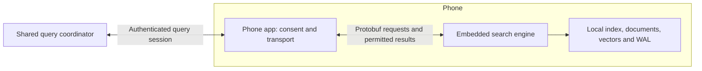

# Device-owned collaborative shards

Review and proposed integration contract, 2026-09-05. Based on local
`feat/five-items-2026-09` at `ded76ef`; the sort/collapse worktree was inventoried
but is not the base of this change. This document describes the next integration,
not a shipped federation service or a tested phone deployment.

## Intended behavior

An iOS or Android phone owns its shard and executes searches against it locally.
Its documents, index images, postings, stored vectors, WAL, and snapshots stay
on that phone. Participation lets authorized queries reach the device and lets
explicitly permitted result metadata return. Keeping the shard local does not
make returned scores, identifiers, or snippets private: the app must define
which of these it releases. Default to no document text or stored vectors in
collaboration responses until that policy is agreed.

Keep the existing embedded library without networking. A separate opt-in host
transport owns the connection, authentication, session state, and release policy.
The Android AAR's lack of INTERNET permission and the embedded dependency gate
remain useful guarantees about the engine package; a collaborating application
will need its own networking configuration. Apple uses the same Rust byte ABI
through its C/Swift wrapper.

## What exists and what is missing

| Surface | Verified implementation | Remaining work |
|---|---|---|
| Local engine | `src/embedded.rs`, JNI/C ABI in `crates/protomolt-search-embedded/src/mobile.rs` | App integration and physical-device validation |
| Protobuf ingest | Descriptor-derived `PlanIndex`, fingerprint-bound `IngestMapped` | Expose planning through the mobile byte ABI; it currently exposes mapped ingest but not PlanIndex |
| Local search | `Query`, pull-based `QueryStream`, flush and close | A separate shard execution bridge for collaborative collectors |
| Vector collaboration | `NodeService.StreamSearch`: start, floor updates, stop, candidates, completion | Route these operations over a device-initiated session to the local shard |
| Lexical collaboration | Global BM25 statistics and `Bm25QueryStream` certificates | Session routing for both statistics and candidate phases |
| Model2Vec | Server sidecar embeddings; embedded engine accepts caller-supplied vectors | On-device model runner and cross-platform embedding conformance |
| Membership | Server node leases and replica placement | Device participation with no replica, snapshot export, or placement actions |

The shipped mobile `QueryStream` wraps a complete local coordinator query.
Merging those local query responses does not by itself implement global BM25,
hybrid fusion, or shared floors. The collaboration bridge must reach the shard
collector operations through the same Rust handlers, rather than reproducing
ranking in Kotlin or Swift. Do not expose arbitrary NodeService admin methods
through a generic RPC forwarding endpoint.

## Session contract to implement

Use a versioned protobuf service with a device-initiated bidirectional session.
This avoids assuming a phone has a reachable listening address. Reuse existing
search messages inside typed `oneof` envelopes, with an explicit allowlist of
read/query operations. Keep this separate from `ClusterControl`: its current
COPY_REPLICA worker exports snapshots and tails WAL, violating this ownership
contract. Device disappearance means unavailable data, never a replica request.

Each session needs an authenticated device/shard identity, a fresh session epoch,
protocol capabilities, and a bounded number of in-flight requests. Each query
needs a request id, pinned participant set, index generation, deadline, result
budget, and explicit cancel. Reject messages from expired sessions and stale
generations. Reconnect starts a fresh session; it must not resume an old heap or
reuse its floor. Backpressure must bound queued requests, candidate bytes, and
memory even when either peer stops reading.

Reuse the engine's provider/scoring and analyzer fingerprints. Add a separately
verified embedding identity covering the exact model artifact, tokenizer,
pooling, normalization, dimension, and numeric behavior. TurboQuant calibration
alone does not prove that two Model2Vec implementations produce comparable
vectors. Fit the agreed provider state once and provision it to participating
shards before ingest; do not independently fit each phone and merge its scores.
A changed model or analyzer needs explicit compatibility evaluation and, when
incompatible, a new local generation.

Use stable device/shard plus source-document/chunk identity in released results.
Local row numbers are generation-scoped and change during compaction. Pin each
query to its generation and refuse stale fetch or pagination requests.

## Availability and correctness

Start with an explicitly active, user-enabled participation session. Apple
controls when scheduled background tasks run, and Android Doze restricts network
and CPU access. An always-available phone shard is therefore not an assumption
this protocol can make. See Apple's [background strategy guidance](https://developer.apple.com/documentation/backgroundtasks/choosing-background-strategies-for-your-app)
and Android's [Doze and App Standby documentation](https://developer.android.com/training/monitoring-device-state/doze-standby).

Pin the participating devices before collecting statistics or creating floors.
An exact response requires completion from every pinned participant. If one
suspends, disconnects, changes generation, or exceeds its deadline, return an
incomplete result under the existing failure semantics. Never quietly remove
it and retain floors or BM25 statistics derived from its contribution. A retry
against a smaller explicitly selected participant set starts a new computation.
A future partial-results mode must name the coverage and cannot claim an exact
answer over every registered phone.

Global BM25 requires shared statistics for the pinned corpus. Those statistics
also reveal information about the local corpus. If the release policy forbids
them, do not claim globally comparable BM25; define a separate federated ranking
contract. Likewise, limits that truncate a candidate stream must report an
incomplete scan, not a successful completion certificate.

## First acceptance gate

1. Build both packages and run existing device lifecycle tests. Execute Model2Vec
   on both platforms against fixed text/vector fixtures; establish the accepted
   numeric tolerance and identical preprocessing before distributed ingest.
2. Connect two device sessions to a test coordinator with a fixed corpus and
   shared provider state. Compare vector ids, scores and ordering with the
   monolithic engine, including boundary ties and filtered results.
3. Add global-statistics BM25 and then hybrid paths, comparing against the
   corresponding monolithic computation. Local top-k response merging is not
   sufficient evidence.
4. Interrupt a participant after it raises a floor, disconnect during statistics,
   reconnect with a new epoch, compact during a query, and stall a consumer.
   Require bounded resources, cancellation, and no false completion.
5. Inspect outbound message fixtures: no shard files, WAL, stored vectors,
   source text, or unapproved projections. Refuse admin/replication operations.
6. Measure first result, completion latency, transmitted bytes, resident memory,
   index size, thermal behavior and energy on physical iOS and Android devices.
   The Raspberry Pi/server measurements are not phone performance results.

## Performance review

The fleet table supplied for this review makes reranking the first measurement
priority at large candidate depths. At k=1,000, expanding from 1x to 2x raises
measured mean recall from 0.889 to 0.998 while p50 total changes from 293 to
296 ms. At k=10,000, moving from 2x to 5x raises measured mean recall from
0.9995 to 1.000 while total p50 rises from 1,141 to 2,185 ms. The 5x rerank
alone is 1,605 ms. These are supplied fleet measurements, not rerun results.

Keep the measured quality profile authoritative. A 1.000 result on its query
set is not a proof of perfect FP32 recall on unseen queries. Test on-device
candidate rescoring and release only the permitted winning metadata as a
collaboration optimization, with the same global candidate-selection contract.
Do not move original stored vectors to the coordinator for convenience. Measure
page faults, candidate bytes, and device energy before changing the existing
rerank concurrency or expansion defaults. Phase medians need not sum to the
total median.

## This review's code change

The shared mobile ABI previously removed a stream from its registry while a
blocking `next` call ran. A concurrent stream close could miss it; runtime close
could miss it too, and the read could later restore the closed handle. Streams
now remain registered while reads wait, a second read is refused, and close
signals cancellation to the blocked reader. A stream opened concurrently with
runtime close also rechecks its owner before registration. Unit tests cover
blocked-read cancellation by both stream close and owner close, receiver release,
and the absence of a restored handle. Native device tests remain a separate gate.

Validation on this checkout after the change: 342 product library tests, 379
integration tests across all 65 integration targets, seven mobile ABI tests,
and the embedded no-network dependency gate passed. One live OpenNLP oracle
integration test remains ignored by default. The integration run needed local
loopback listener permission and used six-target groups with two build jobs
and four test threads. All five targets in `scripts/check-mobile.sh` passed
Rust compilation. No AAR/XCFramework packaging, physical-device execution,
fleet benchmark, deployment, or publication was performed in this review.
