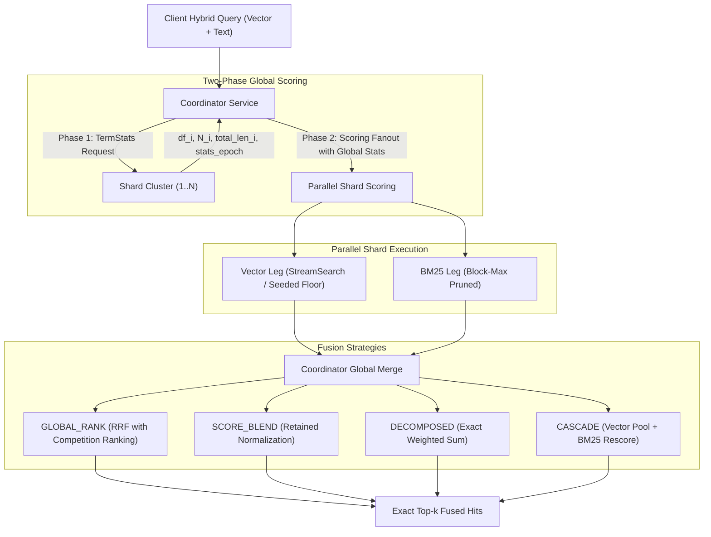
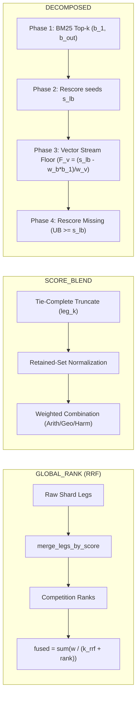

# Hybrid Retrieval and Lexical-Semantic Fusion

Status: Reference Architecture & Specification.

## Introduction

TurboVec hybrid retrieval marries the dense semantic search capabilities of
quantized vector embeddings (TurboQuant 4-bit) with the precision of lexical
sparse scoring (BM25 with block-max pruning). In a distributed environment,
combining these two fundamentally different retrieval legs across multiple
independent shards introduces substantial mathematical and architectural
challenges:

1. **Incomparable Scales**: Raw dense vector dot-products and sparse BM25 scores
   occupy unrelated score spaces.
2. **Partition Invariance**: A distributed search cluster must guarantee that
   partitioning an index into $N$ separate shards produces the exact same top-$k$
   results, ranks, and total ordering as a single monolithic index.
3. **Efficiency at Scale**: Evaluating both legs exhaustively across all shards
   would erase the benefits of horizontal sharding; pruning and floor propagation
   must skip unpromising candidates across both dense and sparse indices without
   compromising exactness.

This document fixes the architectural contract, storage layouts, global
statistics protocols, and fusion strategies implemented in `turbovec-search` and
specified for `turbovec-grpc`.

---

## 1. The Core Invariant: Exactness or Refusal

The cardinal rule of the engine is that **distributed search must equal the
monolithic computation under a total order**. 

- Two shards must never score a document with differing interpretations of what
  a term or vector dimension is worth.
- Results must never degrade silently into heuristic approximations.
- If a shard fails or if analysis/statistical drift is detected, the query
  fails loud by name.

---

## 2. BM25 Indexing Pipeline & Global Statistics

### A. Occurrence Split & Block-Max Layout

The BM25 index format (`TVBM2508`) separates indexing data into distinct tiers:

1. **Occurrence Split**: Document IDs and term frequencies $(d, \text{tf})$ are
   stored independently from term positional offsets. Scoring walks touch only
   the frequency postings; positions are loaded only when phrase or proximity
   verification is requested on hits that have survived top-$k$.
2. **Block-Max Impacts**: Postings are grouped into SIMD blocks with
   precomputed maximum score upper bounds. During a scan holding a floor
   $F$, entire blocks whose theoretical maximum contribution cannot lift the
   candidate score above $F$ are skipped without reading or decompressing.

### B. Global Statistics with Epoch Enforcement

A classical failure mode of distributed search is scoring shards using local
document frequency $\text{df}$ and average field length $\text{avgdl}$. Shard-local scoring
destroys score comparability and distorts rank merges.

The engine enforces a strict two-phase statistics protocol:

1. **Phase 1 (Resolve Global Statistics)**:
   The coordinator broadcasts a `TermStats` request for the query terms to all
   nodes. Each node reports its local $(\text{df}_i, N_i, \text{total\_length}_i)$ and
   its current $\text{stats\_epoch}$. The coordinator aggregates these into global
   corpus statistics:

   $$\text{IDF}(t) = \ln\left(1 + \frac{N - \text{df}(t) + 0.5}{\text{df}(t) + 0.5}\right), \quad \text{avgdl} = \frac{\sum_{d \in D} |d|}{N}$$

   $$\text{score}_{\text{BM25}}(d, q) = \sum_{t \in q} \text{IDF}(t) \cdot \frac{\text{tf}(t, d) \cdot (k_1 + 1)}{\text{tf}(t, d) + k_1 \cdot \left(1 - b + b \cdot \frac{|d|}{\text{avgdl}}\right)}$$

2. **Phase 2 (Scoring Fan-out with Expected Epoch)**:
   Scoring requests carry the computed global statistics and the expected
   `stats_epoch`. Shards apply the statistics directly; they never compute their
   own.
3. **Stale-Epoch Invalidation**:
   If an ingest commit or flush advances a shard's `stats_epoch` between Phase 1
   and Phase 2, the shard refuses the scoring request (`stale_stats`). The
   coordinator invalidates its `StatsCache` and retries atomically.

---

## 3. Semantic Retrieval & Shared Calibration

On the dense semantic leg:
* **Explicit Global Calibration**: All shards share an identical TurboQuant $TQ^+$
  calibration pair committed deterministically from an initial sample.
* **Deterministic Vector Quantization**: Quantizing a vector into 4-bit codes and
  scale factors is a pure per-vector function. The same vector yields identical
  binary codes whether indexed on Node A or Node B.
* **Live Floor Propagation**: During vector scans, shards stream candidates
  against monotonically rising floors (`StreamSearch` / `initial_threshold`),
  pruning sub-floor candidates early at SIMD block boundaries.

---

## 4. Hybrid Joining & Fusion Modes

The engine provides four primary joining strategies in `fusion.rs` and
`coordinator.rs`:

### Mode 1: Global Rank Fusion (`FUSION_MODE_GLOBAL_RANK`)

This is the standard, layout-invariant reciprocal rank fusion (RRF) mode.

1. **Raw Leg Retrieval**: Shards evaluate vector and BM25 legs in parallel,
   returning the top $k_{\text{leg}}$ raw hits per leg.
2. **Global Merge & Total Order**: The coordinator merges each leg across shards
   into a single ranked sequence sorted deterministically by:
   $$\text{Total Order: } (\text{score } \downarrow, \text{shard\_id } \uparrow, \text{doc\_id } \uparrow)$$
3. **Competition Ranking**: Tied raw scores share the exact same rank:
   $$\text{rank}(d) = 1 + \big|\{d' \in \text{leg} : \text{score}(d') > \text{score}(d)\}\big|$$
   Subsequent ranks skip accordingly (e.g., scores $[1.0, 0.8, 0.8, 0.5]$ receive
   ranks $[1, 2, 2, 4]$).
4. **RRF Calculation**:
   $$\text{score}_{\text{RRF}}(d) = \sum_{\ell \in \text{legs}} \frac{w_\ell}{k_{\text{rrf}} + \text{rank}_\ell(d)}$$
5. **Exactness Property**: Because competition ranks are derived from the unified
   global list, **a partitioned cluster yields identical ranks and fused scores
   to a monolithic index for all $k \le k_{\text{leg}}$**.

### Mode 2: Score Blending (`FUSION_MODE_SCORE_BLEND`)

For use cases requiring preservation of raw score gaps rather than ordinal rank
distances:

1. **Tie-Complete Truncation**: Each leg is truncated to $k_{\text{leg}}$, including the
   full boundary tie group so truncation is score-defined rather than
   layout-defined.
2. **Retained-Set Normalization**: Normalization ($\text{MinMax}$ or $\text{Z-Score}$)
   is calculated strictly over the retained set:
   $$\text{MinMax}(s) = \frac{s - s_{\min}}{s_{\max} - s_{\min}}, \quad \text{ZScore}(s) = \frac{s - \mu}{\sigma}$$
   Outliers or stragglers outside the qualifying pool cannot distort the normalization parameters.
3. **Combination**: Normalized leg scores are combined via weighted Arithmetic,
   Geometric, or Harmonic mean:
   $$\text{Combined}_{\text{arith}}(d) = \frac{\sum_{\ell} w_\ell \cdot s_{\ell,\text{norm}}(d)}{\sum_{\ell} w_\ell}$$

### Mode 3: Decomposed Exact Weighted Sum (`FUSION_MODE_DECOMPOSED`)

Computes the exact globally scored weighted sum:
$$\text{score}_{\text{decomposed}}(d) = w_v \cdot v(d) + w_b \cdot b(d)$$

1. **Phase 1 (BM25 Retrieval)**: Computes global BM25 top-$k$, determining
   global maximum $b_1$ and the leg boundary $b_{\text{out}}$.
2. **Phase 2 (Seed Lower Bound)**: Evaluates vector rescore (`fanout_vector_rescore`)
   for the top BM25 hits to establish an initial known fused lower bound $s_{\text{lb}}$.
3. **Phase 3 (Streaming Vector Search with Decomposed Floor)**:
   Starts vector streaming with the decomposed floor:
   $$F_v = \frac{s_{\text{lb}} - w_b \cdot b_1}{w_v}$$
   As vector candidates arrive at the coordinator, $s_{\text{lb}}$ monotonically
   rises and raises the active vector floor $F_v$ on scanning shards.
4. **Phase 4 (Close-out & Rescoring)**:
   Vector candidates missing from the BM25 leg hold $b(d) \in [0, b_{\text{out}}]$.
   If the upper bound:
   $$\text{UB}(d) = w_v \cdot v(d) + w_b \cdot b_{\text{out}} + \epsilon \ge s_{\text{lb}}$$
   a candidate BM25 rescore is executed to obtain the exact score; otherwise, it
   is safely pruned without rescoring.

### Mode 4: Cascade Reranking (`FUSION_MODE_CASCADE`)

1. **Phase 1**: Vector retrieval runs first, returning the top-$k$ tie-complete
   candidate pool.
2. **Phase 2**: Candidates are routed to their owning shards for targeted BM25
   rescoring using global corpus statistics.
3. **Reranking**: The pool is reranked by $(\text{BM25 } \downarrow, \text{vector } \downarrow, \text{doc\_id } \uparrow)$.

---

## 5. Numerical Discipline & Invariant Checklist

| Mechanism | Implementation Detail | Invariant Guaranteed |
|---|---|---|
| **ULP Floor Shift** | `kth_best.next_down()` in `bm25::floor_seed` | Prevents float rounding up on `f32` wire transfers from dropping boundary hits: $F_{\text{seed}} = F_{\text{wire}} - 1\,\text{ULP}$. |
| **Vector-Floor Filtering** | Drop non-qualifying hits before fusion in `coordinator.rs` | Ensures `min_vector_score` acts as an exact gate, promoting deeper valid candidates. |
| **Concurrency Offloading** | CPU-bound scoring in `tokio::task::spawn_blocking` | Prevents async worker runtime starvation during large postings walks. |
| **Analysis Fingerprinting** | Byte-identical analyzer spec validation | Prohibits silent divergence between ingest tokenization and query analysis. |
| **Unfilled Leg Short-Circuit** | `!filled` check in decomposed mode | Directly pins $b(d) = 0$ when the BM25 leg contains fewer than $k_{\text{leg}}$ total matches. |
