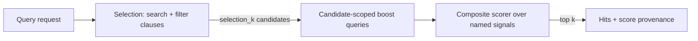

# Public query contract

Simple lexical selection returns the imported `DocumentIdentity` with each hit
when present on the scored row. The terminal `QueryStream` response carries the
same identity. It is read with the score, without a later positional-ID lookup.
`doc_id` is still a generation-local locator. Dense, hybrid, Boolean, browse and
provisional candidates do not expose logical identity yet; see
[document writes](document-writes.md) for the remaining publication contract.

Status: `SearchService.Query` and its certified streaming form
`SearchService.QueryStream` are IMPLEMENTED. Increment 1 landed on 2026-08-24:
`Query` executes the shapes in the mapping table below by delegating to `Search`,
`Bm25Search`, and `HybridSearch` (`src/query.rs`, `tests/query_api.rs`),
with per-signal provenance and by-name refusal of everything else. The
generic composite scorer is IMPLEMENTED (2026-08-26, `src/ltr.rs`,
`tests/ltr.rs`): all six operations, per-dimension normalization and
missing policies, and per-dimension provenance (`QueryHit.dimensions`)
precise enough to recompute every final score client-side — the
reconstruction guarantee is a test, not a promise. The boost phase is
GENERALIZED (2026-08-26): boosts are lexical or dense (the `Bm25Rescore`
and `VectorRescore` seams), serve any scored selection including
single-leaf shapes, and combine through the scorer when there is more
than one — without a scorer, exactly one boost is served and its
`base_weight`/`boost_weight` reorder is the combination. Stored-value
dimensions are IMPLEMENTED (2026-08-26): `ScoreSignal.bounded_value`
carries a score stage evaluated at its IDENTITY score per candidate
(the factor for the multiplicative ops — exp decay, log boost, geo
decay — the addend for `ADD_LINEAR`) through the candidate-scoped
`NodeService.FetchValues` seam, with the stage admission rules and the
column typo rule exactly as on the lexical route; a candidate without
the value is a missing signal under the dimension's policy. The same
seam serves `QueryRequest.projections` on every shape
(`docs/cel-values.md`). `profile` is served (2026-08-26):
`QueryResponse.profile` reports per-phase timings (selection, boost,
values, scorer, projection, total) and never alters results — the
suite holds profiled hits bitwise to unprofiled ones. With that, every
response requirement in this document is met. Recursive boolean selection
landed on 2026-09-01: exact `must`/`should`/`must_not` membership,
`minimum_should_match`, dense and lexical signals, CEL/geo filters, boosts,
the generic scorer, projections, full-match-set aggregation, paging, and the
same terminal response over `QueryStream`. The phase split, boost contract,
and refusal rules in this document are the binding contract.

`QueryStream` landed on 2026-08-31. It runs the same adapter and produces the
same terminal `QueryResponse`, while exact lexical and dense collectors can
publish provisional replacement snapshots. See
[`streaming-query.md`](streaming-query.md) for revision, cancellation,
deadline, and completion semantics.

The public model separates three things that are easy to conflate:

1. A **search/filter query** decides which documents enter the candidate set
   and produces the base relevance signals.
2. A **boost query** scores only that fixed candidate set. It may reorder
   candidates, but it never admits a document.
3. A **composite search strategy** defines boolean membership and how the
   first-stage search signals establish the base order. A separate generic
   composite scorer combines named base and boost signals after boosting.



This ordering is part of the contract. A boost is not a `should` clause in
disguise, and a filter is not a zero-weight scoring query.

If matching a would-be boost must affect `AND`/`OR` membership, that query is a
`SearchQuery` in the selection tree. Its relevance signal may still be reused
by the composite scorer. Calling it a boost cannot grant it permission to add
or remove candidates after selection.

## Selection

A selection tree contains four node kinds:

- `SearchQuery`: a scoring leaf such as BM25 or dense vector relevance. Every
  search leaf has a request-unique `id`, and its raw relevance score is a named
  signal.
- `FilterQuery`: a membership-only leaf, initially CEL and the typed geo
  predicates it compiles to. It never contributes a relevance score.
- `CompositeSearchStrategy`: `AND` or `OR` over child selection nodes plus an
  explicit strategy for the scoring leaves.
- `BooleanQuery`: recursive `must`, `should`, and `must_not` clause lists plus
  `minimum_should_match`.

`AND` and `OR` apply to membership:

- `AND` admits a document only when every child admits it.
- `OR` admits a document when at least one child admits it.
- A lexical search admits documents that match its analyzed terms.
- A dense search admits every vector at or above its explicit score floor. With
  no floor, a dense leaf admits every document carrying that vector space.
- A filter admits documents for which its predicate is true. Under `OR`, a
  filter-only match may enter with no search relevance and therefore needs a
  scorer or deterministic tie order.

The boolean tree and scoring strategy are distinct. For example, `AND` says a
document must match both lexical and vector gates; it does not say whether the
two relevance scores combine through RRF, normalization, a raw weighted sum,
or a cascade.

The first public strategy vocabulary should reuse the algorithms already in
`FusionMode`:

- single scoring query;
- global-rank RRF;
- retained-set score blend;
- exact decomposed weighted sum;
- cascade, where one search is the candidate gate and another is the reranker.

Every strategy names its exactness domain. An implementation must reject a
shape it cannot certify. It must not translate an unsupported `AND` into a
union, apply a filter to only one hybrid leg, replace a decomposed sum with a
truncated blend, or return a partial shard set.

### Recursive boolean execution

`BooleanQuery` is the exact recursive form. Every node in `must` must match,
no node in `must_not` may match, and at least `minimum_should_match` nodes in
`should` must match. A zero minimum resolves to one when there are only SHOULD
clauses and to zero when a MUST clause already establishes membership. A value
larger than the SHOULD list is invalid.

The coordinator compiles the tree once and the shards evaluate it. Each
lexical clause is analyzed once and its global statistics are read from the
term-stats cache; each filter clause is compiled once into the predicate IR;
a dense clause carries its vector. The planned tree goes to every consulted
shard in one `EvaluateBoolean` call, with the leaves in traversal order (a
group's MUST, SHOULD, then MUST_NOT clauses, a nested group inline). A shard
resolves each leaf over its own bitmaps (a filter through the same allowlist
the vector scan gates with, a lexical clause as the union of its terms'
postings, a dense clause as the universe of rows with a vector), applies the
group rule below on the words, scores the members for every scoring clause,
and answers its best `depth` members by summed score, doc id ascending on
ties, each with its per-clause signals and the clauses whose membership holds
it. The coordinator merges the shards' lists by the same order and cuts them
to `depth`. No membership crosses the wire: what a filter excludes is never
materialized anywhere but in a shard's own bitmap, and the coordinator holds
at most `depth` candidates per shard. Until 2026-09-06 every clause's
membership came back as a bitmap and the coordinator held the match set as an
id set, which at 66 million members took 50 GB and minutes
(`docs/benchmarks/fleet-placement-2026-09.md`).

`depth` is the page's absolute end (the cursor's rank plus `k`), or, when a
scorer or a boost reorders, the pool they reorder: `selection_k`, the
coordinator's `max_k` when zero, with `k <= selection_k <= max_k` and a
cursor that must stay inside it. Without a scorer or a boost `selection_k`
must stay zero.

The group rule: MUST intersects required membership sets. With no MUST,
SHOULD membership counts establish the minimum; a negative-only group starts
from live document rows. MUST_NOT subtracts its actual membership. A zero
minimum resolves to one with only SHOULD clauses. Dense membership includes
live vector-only rows when no document view is required. Scoring and provenance
use the intersection of the final group members with each individual leaf.
BM25 uses the same global statistics as the ordinary lexical route, under
the same stats-epoch claim: a shard whose store moved between the stats read
and the evaluation refuses, the coordinator refetches fresh and repeats the
round once with a fresh complete epoch/incarnation claim, and a second refusal fails the request rather
than combining generations.

The shared [membership boundary](membership-visibility.md) now carries an
independent mandatory document view and validates its response fingerprint and
physical version before merging bits. Public query read sets reject changed
membership immediately. Restricted public Query remains gated until its other
phases also enforce the authority.

Dense membership remains an explicit, field-bound bitmap built from actual
vector image ranges; document-only segment gaps are excluded. A vector-only row
can belong to a dense leaf without belonging to a lexical leaf; a document can
lack a vector. Treating dense membership as the entire live-document universe
would change SHOULD and MUST_NOT semantics. Membership receipts also prove the
field binding and authority view before the set participates in Boolean algebra.

Scoring on the shard is member-scoped on both kinds of clause. A lexical
clause walks its postings against the sorted members (the `Bm25Rescore`
walk, without the offsets), then the score stages. A dense clause is one
streaming pass of the provider index under the members as the allowlist,
the same kernel and the same calibrated products a full search emits, with
the sealed parts and SIMD blocks no member sits in left unread; when the
dense clause is the only scoring clause the pass raises its own floor and
answers the top `depth` directly, ties at the floor included. An FP32 clause
scores the members in `signal_batch` pieces under the coordinator's byte
ceiling (`--signal-batch`, default 10,000, live as a coordinator knob); the
knob has no other use since the shards score their own members
(`tests/boolean_masked.rs` pins that the answer does not depend on it).

Placement (`docs/placement.md`): the root group's MUST filter clauses are the
AND spine the placement tree prunes by. A shard the spine excludes is not
asked, and a clause a shard's placement leaf implies is dropped from that
shard's copy of the leaf, with the known-column handshake mapped back. A
filter clause anywhere else in the tree is sent whole.

Provenance: matching positive search-clause scores sum in leaf order unless
the request supplies the generic composite scorer. Filter clauses and
negative search clauses contribute membership and provenance but no score;
a member no positive scoring clause matches has a zero score, no signal,
and follows the scored members in id order. Dense and lexical clauses in
the same boolean group are the recursive hybrid form; the older
`CompositeSearchStrategy` remains a top-level compatibility route for RRF,
score blend, decomposed, and cascade. ANN cannot certify recursive
membership and is refused.

An optional `BooleanQuery.aggregate` folds on each shard over that shard's
match set, in the same call, and merges at the coordinator as the
`Aggregate` route merges; the percentile rounds send the planned tree back
to the shards, which resolve the membership again per round. Its own filter
and geo fields must be empty because the boolean tree already owns
membership. Nested aggregations are refused. Through a relay coordinator
the aggregate is refused by name (`docs/relay-coordinators.md`); the
query without it relays.

## Boost phase

A `BoostQuery` contains a normal scoring query and an `id`. It runs against the
selection's top `selection_k` documents, never the corpus. Its query relevance
becomes another named signal. The selected candidate set is immutable during
this phase.

`selection_k` and output `k` are deliberately separate:

\[
k \leq selection\_k
\]

`selection_k` is coordinator-owned. Streaming vector nodes remain completely
k-blind: they receive a query and a monotonically rising score floor, emit
every qualifying candidate, and issue their own completion certificate. The
coordinator uses `selection_k` for its first-stage global heap and later trims
the post-boost result to `k`.

The initial implementation may reuse the coordinator's existing `max_k`
guardrail, making request validation `k <= selection_k <= max_k`. A later
separate selection-depth cap is an operational choice, not node protocol.

The final response is the best `k` documents under the post-boost scorer from
that candidate set. It is not represented as the global top-k of the boosted
formula unless the selection strategy itself included the boost signal and
proved that stronger claim.

This is the honest form of the existing rescore-window behavior. A caller that
needs more recall under a strong boost increases `selection_k`; the server does
not silently over-fetch by an undocumented factor.

## Dense execution modes

`DenseQuery.execution_mode` separates the traversal contract from scoring:

- `UNSPECIFIED` preserves the historical exact behavior. It resolves to
  `EXACT`, and fails if the live generation cannot prove exhaustive native
  scoring and completion.
- `EXACT` makes that requirement explicit.
- `ANN` accepts a provider's configured approximate traversal. It fails on the
  current embedded TurboVec provider because that provider exposes exhaustive
  traversal, not a configured ANN path.
- `AUTO` asks the coordinator to choose, and it chooses only through
  evidence. An exhaustive provider resolves to `EXACT`, bitwise the same
  response as `EXACT`. A configured ANN provider resolves to `ANN` only
  through the generation-bound policy installed with
  `--dense-execution-policy` (`docs/dense-execution-policy.md`): the policy's
  identity (embedding model, corpus generation and row count, dimensions,
  provider kind, scoring fingerprint) must match the live cluster, and the
  request must match a measured point exactly on `k`, the filter's live
  selectivity band, and the candidate depth. No policy, a mismatched
  identity, or an unmeasured key refuses by name; nothing is interpolated
  and no provider control is hidden behind a default.

Every successful selection containing a dense leaf returns
`QueryResponse.dense_execution`. It records the requested and resolved modes,
provider kind, provider quality contract, scoring fingerprint, exhaustive
completion status, and planner reason, and — when AUTO went through a
policy — the policy id and fingerprint, the point it matched, the live
filter selectivity, and the candidate depth the providers were asked for.
An `ANN` resolution stays `ANN` under `DENSE_SCORE_MODE_FP32_RERANK`: the
rerank rescores the candidate pool, it does not widen it. Mixed provider kinds, scoring spaces,
dimensions, quality contracts, or completion capabilities across shards fail
preflight. An approximate response therefore cannot be confused with a
corpus-wide exact result.

Execution mode and score mode are orthogonal. `execution_mode` chooses the
candidate traversal; `score_mode = FP32_RERANK` replaces scores only inside the
returned candidate pool. FP32 reranking never upgrades an ANN pool to a global
exact-top-k guarantee.

One rule joins them (2026-09-04): `AUTO` with `FP32_RERANK`, no
`DenseQualityPolicy`, and `selection_k = 0` resolves the rerank depth through
the installed quality profile's `default_target_recall_ppm`, bitwise as an
explicit policy naming that target would, with `dense_quality` set and the
planner reason naming the profile and default
(`docs/dense-quality-profile.md`). Without a profile or a default it refuses:
"AUTO with FP32 rerank needs a measured quality profile with
default_target_recall_ppm, or an explicit DenseQualityPolicy or selection_k".
`EXACT` and `UNSPECIFIED` with `FP32_RERANK` and `selection_k = 0` keep the
pool at `k` — the caller chose the traversal, and `dense_quality` stays
absent.

## Dense FP32 rerank

A single dense leaf can set `DenseQuery.score_mode` to
`DENSE_SCORE_MODE_FP32_RERANK`. The provider still selects exactly
`selection_k` candidates. The coordinator then calls
`ExactVectorRescore` for those ids, replaces the dense signal with the
ordinary FP32 dot product over the original vectors, sorts by exact score
descending and document id ascending, and returns the best `k`.

This is exact within the fixed candidate pool. It is not a global exact-top-k
claim unless `selection_k` covers the corpus. Candidate depth is therefore the
recall knob, not a hidden expansion factor. The 100,000-vector, k=10,000
experiment found that the tested corpus needed 35,777 TurboQuant candidates
for 100% recall; that is evidence for that workload, not a universal default.
See
[`turboquant-exact-rerank-expansion-100k-k10000-2026-08-31.md`](ai-slop/turboquant-exact-rerank-expansion-100k-k10000-2026-08-31.md).

Original FP32 rows live in the product generation, one-for-one with provider
slots. `Flush` writes and reopens the sidecar through mmap; snapshot install
and offline resharding carry it with the provider image. A legacy generation
without the sidecar continues to serve native queries and fails FP32 rerank
with `FAILED_PRECONDITION`. Clustered TurboVec uses the same terminal path:
stable provider labels route candidates back to product shards that own the
aligned FP32 rows, so embedded, in-process clustered, and external clustered
transports produce the same reranked result. Composite dense leaves and dense
boosts remain provider-native for now.

Candidate depth can be request-explicit (`selection_k`), measured through a
`DenseQualityPolicy`, or — under `AUTO` — measured through the profile's
default target. A `DenseQualityPolicy` supplies `(k, target_recall_ppm)` and
the coordinator resolves that exact point from the TOML file configured by
`--dense-quality-profile` (`docs/dense-quality-profile.md`). The profile is
bound to embedding model, corpus generation and row count, dimensions,
provider kind, and scoring fingerprint. Any mismatch, unmeasured target,
fingerprint pin mismatch, or request cap is a hard error. There is no
interpolation or fallback multiplier. The response's `dense_quality` records
the selected profile and depth. The profile describes an all-live
generation: any tombstone refuses the measured policy until compaction
produces a new generation and that generation is remeasured.

Exact rows are scheduled by 4 KiB page and scored through a bounded worker
pool shared across concurrent requests (`--rerank-parallel`, automatic and
capped at four by default; explicit values stop at 64), then restored to
request order. Each dot product retains scalar accumulation order, so parallel
and serial score bits match. `--max-rerank-mib` (256 MiB by default) bounds
logical FP32 row bytes before fan-out; shard deadlines apply to every rescore
RPC. Query profiles report rows, logical bytes, mmap pages, and tasks.

The configured file uses this strict shape (unknown keys are refused;
`format_version = 1` files with points only still load):

```toml
format_version = 2
profile_id = "court-held-out-v1"
embedding_model = "bge-m3"
corpus_generation = 42
corpus_rows = 1000000
dimensions = 1024
provider_backend = "embedded-turbovec"
scoring_fingerprint = "<GetVectorBackend descriptor fingerprint>"
measured_queries = 128
default_target_recall_ppm = 990000

[[measurements]]
k = 10000
candidates = 20850
queries = 128
mean_recall_ppm = 996100
min_recall_ppm = 990500
p50_total_ms = 61.2
p50_selection_ms = 38.0
p50_rerank_ms = 21.4

[[points]]
k = 10000
target_recall_ppm = 990000
candidates = 20850
```

Each point is the smallest measured depth whose worst held-out query met the
target, and must be justified by a `[[measurements]]` rung at that depth.
`examples/dense_profile.rs` measures the ladder through this route and writes
the file; the format, the tool, and the AUTO rule are in
`docs/dense-quality-profile.md`.

## Composite scorer

Implemented 2026-08-26 (`src/ltr.rs`): the scorer runs on the
coordinator over the fixed `selection_k` candidate pool, after the
selection strategy and after boost signals are computed. Decisions
pinned at implementation time:

- `UNSPECIFIED` normalization resolves to `MIN_MAX` and `UNSPECIFIED`
  missing policy to `ZERO` (the engine-wide defaults, matching the
  blend); the operation itself has no default and refuses unset.
- Normalization statistics are fitted over the pool's PRESENT values;
  a `ZERO`-policy miss contributes a normalized zero, not the
  normalization of a raw zero. Degenerate pools follow the blend
  rules (min-max 1.0, z-score 0.0).
- A negative weight is admitted under `weighted_sum` alone (a penalty
  term); an explicit zero weight is evaluated and reported but
  excluded from combination. Geometric and harmonic means keep the
  blend's positive-value skip rule.
- Scorer arithmetic is f64 in dimension list order; ties in the final
  order break on the f32 wire score, then doc id — exactly what the
  client sees, never hidden f64 residue.
- Because normalization statistics move with the pool, a scored query
  pages WITHIN its fixed `selection_k` pool (the composite rule);
  `selection_k` is therefore meaningful on single-leaf shapes when a
  scorer is present.
- With a scorer present a boost is signal-only: `window`,
  `base_weight`, and `boost_weight` refuse by name, and the whole
  pool is scored.

The scorer follows ProtoMolt quality scoring's useful shape: stable dimension
ids, explicit weights, deterministic combination, and per-dimension reporting.
Search adds two requirements because its raw signals do not naturally share a
`[0, 1]` scale:

- each dimension names its normalization or explicitly selects raw identity;
- missing-signal behavior is explicit (`ZERO`, `SKIP`, or `ERROR`).

A dimension can source:

- the first-stage composite base score;
- a search query's raw relevance by query id;
- a boost query's raw relevance by query id;
- a bounded stored-value score function when the backend supports it.

The initial combination vocabulary should be weighted sum, weighted mean,
maximum, product, geometric mean, and harmonic mean. For weighted mean:

\[
S(d) = \frac{\sum_i w_i s_i(d)}{\sum_i w_i}
\]

Dimensions skipped under the missing policy are absent from both sums. A zero
weight is an explicit disable, not an unset default. All weights and produced
scores must be finite.

The response reports the normalized value and weighted contribution for every
dimension. A client must be able to explain the final score without
reimplementing server arithmetic.

The generic scorer runs after candidate selection, so it cannot invalidate a
first-stage pruning certificate. A score function that must influence corpus
search belongs in the composite search strategy and is admitted only when the
engine has a safe upper-bound rule. This preserves the existing rule that CEL
selects while bounded functions score; arbitrary CEL scoring must not make
block-max or live-floor pruning unsound.

## Protobuf shape

The excerpt below explains the public model. The compiled contract in
`proto/ai/protomolt/search/v1/search.proto` is authoritative for field numbers
and includes later paging, projection, scoring, and streaming additions.

```proto
message QueryRequest {
  string request_id = 1;
  uint32 k = 2;
  uint32 selection_k = 3;
  SelectionQuery selection = 4;
  repeated BoostQuery boosts = 5;
  CompositeScorer scorer = 6;
  bool profile = 7;
}

message SelectionQuery {
  oneof node {
    SearchQuery search = 1;
    FilterQuery filter = 2;
    CompositeSearchStrategy composite = 3;
  }
}

message SearchQuery {
  string id = 1;
  oneof query {
    LexicalQuery lexical = 2;
    DenseQuery dense = 3;
  }
}

message DenseQuery {
  repeated float vector = 1;
  DenseScoreMode score_mode = 2;
  DenseQualityPolicy quality = 3;
  DenseExecutionMode execution_mode = 4;
}

message FilterQuery {
  string id = 1;
  oneof predicate {
    string cel = 2;
    GeoFilter geo = 3;
  }
}

message CompositeSearchStrategy {
  SelectionOperator operator = 1;
  repeated SelectionQuery clauses = 2;
  SelectionScoreStrategy scoring = 3;
}

enum SelectionOperator {
  SELECTION_OPERATOR_UNSPECIFIED = 0;
  SELECTION_OPERATOR_AND = 1;
  SELECTION_OPERATOR_OR = 2;
}

message SelectionScoreStrategy {
  oneof strategy {
    SingleScore single = 1;
    RrfScore rrf = 2;
    ScoreBlend score_blend = 3;
    DecomposedScore decomposed = 4;
    CascadeScore cascade = 5;
  }
}

message BoostQuery {
  SearchQuery query = 1;
  uint32 window = 2;
}

message CompositeScorer {
  CompositeScoreOperation operation = 1;
  repeated ScoreDimension dimensions = 2;
}

message ScoreDimension {
  string id = 1;
  optional double weight = 2;
  ScoreSignal source = 3;
  ScoreNormalization normalization = 4;
  MissingScorePolicy missing = 5;
}

message ScoreSignal {
  oneof source {
    BaseRelevance base = 1;
    string query_relevance_id = 2;
    ScoreStage bounded_value = 3;
  }
}
```

`query_relevance_id` may reference a selection search or a boost query. It may
not reference a filter. IDs are unique across the whole request, which makes
score provenance and validation unambiguous.

## Mapping to the current engine

Increment 1 of the adapter executes exactly these shapes (each delegating
to the route named, bitwise — `tests/query_api.rs` holds it to that):

| Public shape | Route |
|---|---|
| one lexical leaf (+ AND filters, + score stages) | `Bm25Search` |
| one dense leaf (+ AND filters) | `Search` |
| one dense leaf with FP32 rerank | `Search` at `selection_k`, then `ExactVectorRescore` over the fixed pool |
| `OR(dense, lexical)` + rrf | `HybridSearch` GLOBAL_RANK |
| `OR(dense, lexical)` + score_blend | `HybridSearch` SCORE_BLEND |
| `OR(dense, lexical)` + decomposed | `HybridSearch` DECOMPOSED |
| cascade(gate = dense) over {dense, lexical} | `HybridSearch` CASCADE |
| one lexical boost on a composite selection, no scorer | `BoostRescore` (bitwise the original path) |
| boosts otherwise (dense, single-leaf shapes, several under a scorer) | `Bm25Rescore` / `VectorRescore` candidate-scoped seams, adapter-side |
| filters only (browse, id order, `after`-floor paging) | `BrowseShard` fan-out |
| browse + `sort` (i64/f64/facet columns, lineage keys; several keys) | `BrowseShard` key-ordered heap, merged key by key |
| one lexical leaf + `sort` | `BrowseShard` over the leaf's analyzed terms as an OR membership predicate (the `ResolveLexicalBitmap` rule), no scores |
| `collapse` on any scored shape | the route above at the pool depth, then the coordinator-side grouping (`collapse_keys`: `ResolveParents` for lineage keys, `FetchValues` for a column) |
| projections on one lexical leaf | `Bm25Search.projections` (`docs/cel-values.md`) |
| projections on dense/composite/browse | `FetchValues` post-selection fetch, same semantics |
| any scored shape + composite scorer | the route above, then the coordinator-side scorer (`src/ltr.rs`) |
| projections on any other shape; stored-value dimensions | `FetchValues` candidate-scoped fan-out, post-selection |
| recursive boolean selection | exact shard membership bitmaps plus candidate-scoped BM25/vector scoring |
| root boolean aggregation | `AggregateShard` with an explicit exact id allowlist |

`selection_k` maps to the hybrid leg depth or the FP32 rerank pool; the
response is the best `k` of that candidate set (`k <= selection_k` enforced;
a `selection_k` that no candidate-scoped phase uses is refused as a silent
no-op). Cascade
requires the composite operator UNSPECIFIED — membership is the gate's,
and neither AND nor OR describes it.

The underlying routes:

| Public concept | Existing implementation |
|---|---|
| One dense search | `Search` |
| One lexical search plus CEL/geo filters | `Bm25Search` |
| One dense search plus CEL/geo filters | `Search` (`docs/vector-filters.md`) |
| Dense plus lexical composite scoring | `HybridSearch` and `FusionMode` |
| One candidate-scoped lexical boost | `BoostRescore` |
| Bounded value functions during lexical selection | `ScoreStage` |
| Named raw leg provenance | `HybridHit.vector_score`, `bm25_score`, and `boost_score` |
| Autocomplete over one field's dictionary, ranked by summed df | `Suggest` (`docs/suggest.md`), outside `Query`: it returns terms, not hits |

The adapter must execute those ordinary paths rather than fork their scoring
logic. Vector-plus-CEL has since acquired its ordinary path
(`docs/vector-filters.md`): `SearchRequest` and `HybridSearchRequest` both
carry `geo_filters` and a CEL `filter`, and every fusion mode applies them to
both legs. Legacy composites cannot be nested inside `BooleanQuery`: callers
express the same dense/lexical membership as boolean clauses. Unsupported ANN
membership, nested aggregation, and column sorting of boolean relevance return
`INVALID_ARGUMENT`; compatibility never authorizes a heuristic substitute.

## Sorting

`QueryRequest.sort` orders the result by columns instead of by
relevance: most significant key first, ties broken by the next key, then
by doc id. A key names an i64, u64 or f64 column, a facet column (ordered by
the term's bytes), or one of the lineage keys `parent_id` / `group_id`.
A document without a value for any key is excluded, the same stance the
filters take: absence has no honest position in a column order.

Two selections serve it. A **browse** (filters only) walks its admitted
set on every shard with a k-bounded heap over the keys, and the
coordinator merges the shards' rows key by key (numbers travel as
order-preserving bits, complemented for a descending key; facet terms
travel as text and the comparison is reversed for a descending key). A
**single lexical leaf** is served the same way over its exact term
membership — the documents holding at least one of the leaf's analyzed
terms, the BM25 positive-score set that `ResolveLexicalBitmap` answers —
walked without scoring. Nothing is pruned, so no pruning certificate is
involved; the hits carry `score = 0`, the leaf id in `matched`, and
`executed = browse_shard:lexical`. A relevance shape on such a leaf
(phrase, prefixes, score stages, a boost, the scorer, highlighting) would
be a silent no-op and refuses by name. A dense or composite selection has
no membership to order (every document is a candidate) and refuses:
a column order over it would be a relevance cut in disguise.

Each hit reports `sort_values` (one typed value per key) and keeps
`sort_key` as the first key's numeric view. A sorted page's cursor
carries the boundary's keys; a column no shard declares refuses by
name (the typo rule), and a shard without the column contributes no
rows.

Unsigned columns and lineage keys use `SortKey.unsigned_bits` and report
`SortValue.unsigned_integer`; zero and values through `u64::MAX` retain all bits.
The legacy `sort_key` double is a display value and may round large integers;
it is never used to order or resume the query. Unsigned cursor components use
`u` plus hexadecimal bits, so a signed/double component cannot resume an
unsigned column. Old lineage-sort cursors must restart from the first page.
Compaction can renumber row slots; these tests start fresh pages after a
compaction and do not establish cursor validity across generation changes.

Each shard reports its resolved column types even when no rows match. The
coordinator checks vector widths, known flags, type agreement and each row's
wire types before merging. A column declared differently across shards refuses
with `FAILED_PRECONDITION`. Candidate-scoped value fetches carry the same type
metadata, so those fetched projections and collapse cannot silently mix signed,
unsigned, floating-point, string or boolean results. This check covers sorted
browse and `FetchValues`; the native `Bm25Search` projection merge remains a
separate type-consistency audit. Matching node/coordinator builds are
required: missing type metadata refuses instead of implying a compatible type.
Sorted lexical selections also fetch requested projections after selecting the
page, exactly like filter-only browse.

## Collapse

`QueryRequest.collapse` returns one representative per key value: `k`
means `k` groups, each represented by its best hit in the selection's
order, with `groups[i]` alongside `hits[i]` carrying the key, the group's
top `inner_hits` hits (the representative first, ranks counting within
the group), how many hits the group had in the candidate pool, and
whether the list is provably complete. The key is an i64, u64 or facet
column, or `parent_id` / `group_id` from the document's lineage; a
document without a value forms no group. Lineage keys, including small IDs,
are now reported as unsigned values rather than through an i64 cast.

The collapse runs over the candidate pool the route fetched, so its
exactness statement is the pool's. A **single leaf** has a
depth-independent order (the exact top-k prefix property), so a deeper
pool can only append groups after the ones already found: the
coordinator starts at `selection_k` (default `k`), and while a full pool
holds fewer groups than the page needs it doubles the depth up to
`max_k`. A **fixed pool** — a composite strategy, the scorer, a boost, an
FP32 rerank, a policy depth — is never deepened, because its order moves
with the pool; a full pool short of the groups the page needs refuses
with `FAILED_PRECONDITION` naming `selection_k`. A pool that came back
short reached the end of the selection, and what it holds is served.

`complete` is true when the group has at least `inner_hits` hits in the
pool (any hit outside the pool scores at or below the pool's last, so
the listed ones are the group's best), or when the pool came back short
(nothing follows). A full pool with fewer listed hits than asked cannot
tell the end of the corpus from a cut and reports `false`. Paging
counts groups: the cursor is the last representative, and resumption
re-finds it in the group order. A browse has no order to pick a
representative by and refuses; collapse and sort do not combine, since
collapse picks representatives by relevance and a sorted query computes
none. `executed` gains a `+collapse` suffix; the profile reports
`collapse_ms`.

## Paging

`QueryRequest.cursor` / `QueryResponse.next_cursor` implement search-after
paging. Public tokens are opaque `pqc1:` envelopes: a canonical protobuf payload
and an HMAC-SHA256 tag. The envelope binds the internal rank/score/id or typed
sort boundary to the resolved collection, complete authorization decision
(principal, workspace, action and policy revision), topology generation, ordered
routes and the normalized query. It is not an authorization credential: every
page must independently pass the current policy.

Envelope format 2 additionally binds a separate digest of the physical read
versions. Request/authority/topology checks still run before shard access;
data-version validation follows the admission probes. Only the digests enter
the public token, not the shard incarnations or private policy details.

Repeat the query, page size, candidate depth, filters, projections, boosts,
sorting, collapse and aggregation on each page. Only the cursor itself, trace
`request_id`, observational `profile`, an equivalent collection default, and an
equivalent topology precondition may differ. Context mismatches fail with
FAILED_PRECONDITION before execution, even if the old boundary still has the
same score. Malformed tokens and old unsigned `tvq1:` / `tvqs2:` tokens require
restarting at the first page. Unary and streaming pages share the same context.

The cursor retains no historical index image. Any change in its bound physical
versions, including compaction or node replacement with identical IDs and
scores, requires a fresh first page. Old format-1 envelopes also require fresh
pagination. The existing score/id boundary check remains an additional refusal.
This prevents row reuse from being accepted as an old boundary; it does not
turn a row locator into stable document identity or supply MVCC. See
[query read versions](query-read-versions.md) for execution, replica and provider
boundaries. A topology change always invalidates the token. Tokens have a 64 KiB
protobuf payload limit and are integrity protected, not encrypted.

By default the signing key is generated lazily from operating-system entropy and
shared by clones of one coordinator. Dropping/restarting that coordinator loses
the key, so clients restart pagination. Library hosts may configure
`CoordinatorServiceImpl::with_cursor_signing_key` with a retained 32-byte secret
for equivalent serving instances. Those hosts must preserve the authority's
monotonic revision history; sharing a key does not waive context validation.
The command-line server currently uses ephemeral keys. See
[security](security.md#query-cursor-context).

Depth: a single-leaf query pages by fetching deeper (its order is
depth-independent by the exact top-k prefix property), capped by
`max_k`. A composite — and any query carrying the composite scorer,
whose normalization statistics move with the pool — pages within its
fixed `selection_k` pool: the fusion strategies' orders are
depth-dependent (RRF ranks, blend normalization, the cascade gate), so
the pool is never silently deepened; exhaustion refuses and names
`selection_k`. A full page
always mints `next_cursor`; a short page provably has nothing after it
at the served depth and mints none.

A sorted query's sealed boundary carries typed keys and resumes strictly
after them; a collapsed query's token is its last representative
and ranks count groups. A token from one shape refuses on another.

A recursive boolean query rebuilds its exact bitmap plan and score order on
every page and resumes at the same score/id boundary. Its optional aggregation is
therefore identical on every page and always describes the full match set,
not the returned slice.

## Response requirements

Every hit needs:

- stable product identity and optional chunk/parent identity, not only a local
  positional slot;
- final score and deterministic rank;
- raw score per matched search and boost query id;
- normalized value and weighted contribution per scorer dimension;
- which boolean clauses matched;
- the strategy and defaults actually selected;
- optional profile timings that do not alter results.

Filters appear in matched-clause provenance but never in score dimensions.
Unknown query ids, duplicate ids, non-finite weights, impossible strategy
combinations, analyzer drift, missing columns, mixed calibration, stale stats,
or incomplete shards are request failures.

### Explain

`explain = true` adds an `Explanation` tree to each hit: the arithmetic
that produced its score, with the root's value equal to the served score
and each node's description stating how its value follows from its
children. A lexical leaf reports every (field, term) contribution with
the BM25 inputs under it, expansions grouped under their prefix or source
term, then the score stages in order; a dense leaf its native or exact
FP32 score; a composite one node per leg with the fusion's formula; a
boolean root the sum of its clauses; a scorer its dimensions with the
selection tree kept as provenance. Results are unchanged with the flag
on. A browse, a sorted lexical leaf, and `QueryStream` refuse it by name.
Details: [The explain tree](explain.md).

### Segment pruning

With `profile` set, `QueryProfile.segments_total` and `segments_skipped`
report how many sealed segments the shards consulted for the selection
and how many they ruled out from their column summaries without opening
them, for a dense or lexical leaf under a filter, a browse, and a boolean
root. The counts describe work, never results: the hits and scores are the
same with `--segment-pruning=false`, and a test holds that on every route.
Details: [Segment pruning from summaries](segment-pruning.md).

## Aggregation

`QueryRequest.aggregate` folds an `AggregateRequest` over the candidate
pool the page was drawn from, on every pooled shape (a single leaf, a
composite, a scorer or boost pool, with or without a collapse) and over
the exact match set of a browse; a boolean root carries its aggregation
on `BooleanQuery.aggregate` instead. Naming an aggregation fixes the
pool at `selection_k`, so paging moves inside it and each page reports
the same fold. `AggregateResponse.matched` is the pool's size. The hits
are unchanged by the aggregation. Details, including CARDINALITY and
calendar histograms: `docs/aggregations.md`, sections 8 to 10.

The unsigned sort/collapse contract is covered by `tests/unsigned_order.rs`:
independent total-order expectations, both directions, text tie-breaks, paged
browse and lexical selections, group representatives and inner hits, source-key
reads after reopen and compaction on both layouts, and type disagreement with
empty and populated results. This work changes query messages and execution;
it introduces no persisted index format or mapping fingerprint change.


## Field grants

Private-shard Query and QueryStream enforce the authority's exact field grants
before reading shard versions or running selection. See [Field grants](field-grants.md)
for input checks, projections, sort/collapse keys, aggregate disclosure and
revocation. `QueryResponse.field_details_redacted` marks withheld automatic
identity, dictionary or stored-value dimension details. Scores and ranks remain
unchanged; the remaining dimensions may not suffice to reconstruct those scores.
The same rules cover collapse inner hits and streaming completion. Public queries
with a mandatory document view and network delegation remain gated.
